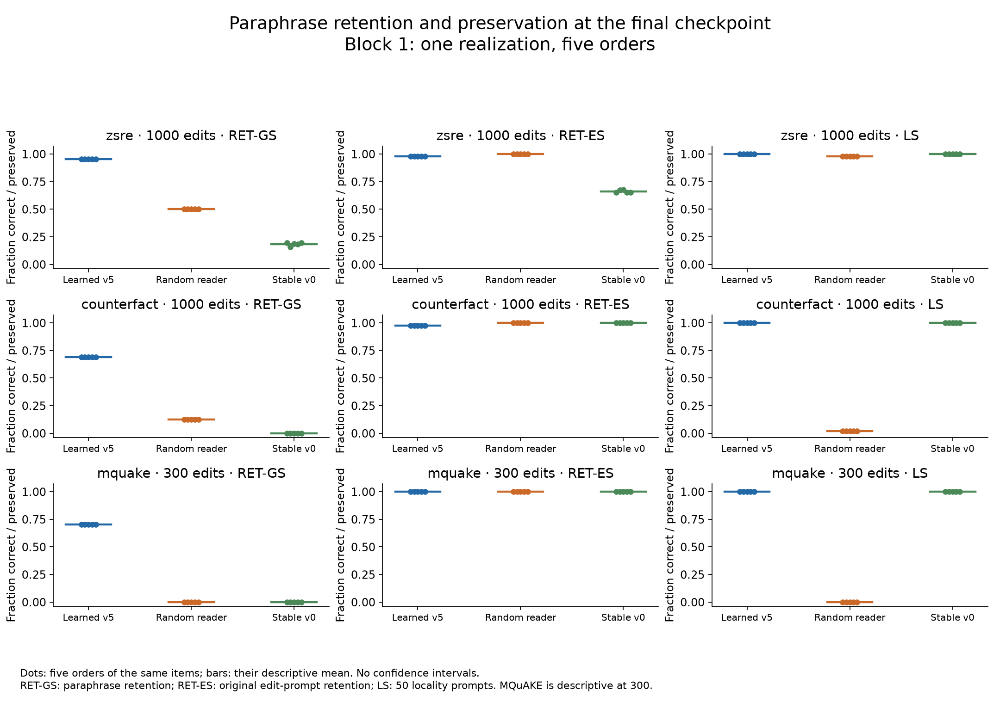
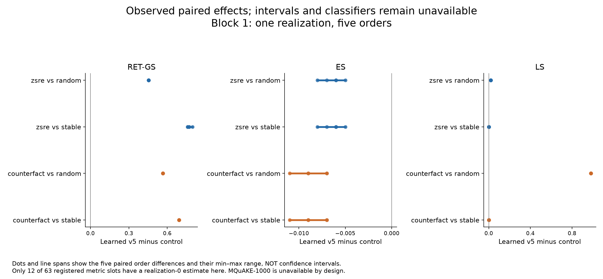
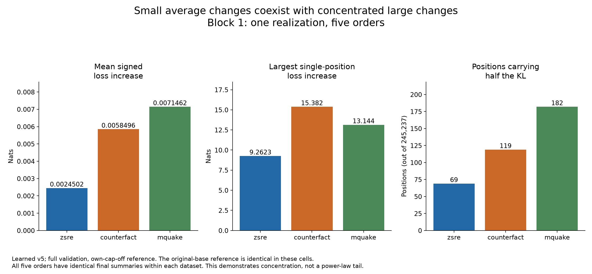

# Stage 4 block 1: first partial confirmation report

September 20, 2026 · R1-D14c / X22 · **One realization; descriptive results only.**

The learned v5 memory retained paraphrased edits substantially better than the random-reader and stable-v0 controls in the first reserved realization. It preserved all 50 locality prompts in each dataset, but failed the mean-KL fidelity benchmark in every learned-reader cell. zsRE also shows incomplete near-miss preservation. These are real reserved-data observations, not development or synthetic results. They do not yet support a registered classifier label or a population-level conclusion.

## Scope and methods

This report includes exactly **45 cells**: three conditions × three datasets × five orders, all realization 0, the registered first block. The process receipts span September 18 21:29 to September 19 21:15 UTC (about 23.77 elapsed hours). Later blocks are outside this snapshot even if they have since completed. The unchanged matrix still contains 330 planned cells; the 285 excluded cells are **not reported as current failures**.

A cell applies a stream of supplied factual edits to memory attached to a frozen GPT-2 model. zsRE and CounterFact reach 1,000 edits with checkpoints at 100, 300 and 1,000; MQuAKE reaches 300 with checkpoints at 100 and 300. Five orders permute the same realization's items. They measure sensitivity to order, not five independent experiments. Full fidelity assays score 245,237 token positions in 1,931 windows against both the original model and the same cell with its cap disabled; a fixed 16,256-position prefix is checked at every checkpoint.

**ES** measures immediate edit success as edits arrive; **RET-ES** measures original edit-prompt retention at a checkpoint; **RET-GS** measures paraphrase retention; **LS** is bounded decoded-text equality on 50 locality prompts. Keeping those names separate matters: the learned zsRE final RET-ES is 0.977, while its mean immediate ES is 0.9936. Near misses are separately reserved different-subject relation/template pairs, not semantic nearest neighbours. All planned denominators remain in the detailed tables.

The locked R1-49g / R1-75 computation runs unchanged. A local reporting wrapper scopes only the cell loader to block 1 while retaining the exact frozen matrix, all 63 registered primary metric slots and all 75 prospective omissions. The native no-result representation is used for later blocks and is explicitly qualified as out of scope here. No observations are imputed; thresholds, populations and model code are unchanged.

## Final-checkpoint behavior

Values below are descriptive means of five orders within realization 0. All orders and their min/max/sample-SD are retained in [summary.json](../logs/R1/reports/block1/summary.json) and the [checkpoint trajectory table](../logs/R1/reports/block1/appendix/trajectories.csv).

| Dataset | Condition | Edits | ES | RET-ES | RET-GS | LS |
|---|---|---|---|---|---|---|
| counterfact | Learned v5 | 1000 | 0.9914 | 0.974 | 0.6915 | 1 |
| counterfact | Random reader | 1000 | 1 | 1 | 0.126 | 0.02 |
| counterfact | Stable v0 | 1000 | 1 | 1 | 0 | 1 |
| mquake | Learned v5 | 300 | 1 | 1 | 0.70333 | 1 |
| mquake | Random reader | 300 | 1 | 1 | 0 | 0 |
| mquake | Stable v0 | 300 | 1 | 1 | 0 | 1 |
| zsre | Learned v5 | 1000 | 0.9936 | 0.977 | 0.955 | 1 |
| zsre | Random reader | 1000 | 1 | 1 | 0.502 | 0.98 |
| zsre | Stable v0 | 1000 | 1 | 0.66 | 0.1842 | 1 |

The learned reader's final paraphrase retention is 0.955 for zsRE, 0.6915 for CounterFact and 0.70333 for MQuAKE. Several final summaries are identical across its five orders; that is observed order stability on one population, not evidence of negligible uncertainty across fresh populations. The random reader retains some paraphrases but substantially changes CounterFact/MQuAKE locality and every measured near-miss response. Stable v0 preserves locality, with weaker paraphrase transfer and order-sensitive zsRE retention.

## Registered contrasts: realization-0 effects only

The table gives learned-v5 minus control at the registered 1,000-edit endpoint. SD and range describe the five paired order differences only. All registered intervals, the secondary t sensitivity, and classifier labels are **unavailable** with one realization. There are 12 observed realization-0 metric estimates; the complete [63-row table](../logs/R1/reports/block1/primary-realization0.csv) retains the other slots. MQuAKE's 21 registered 1,000-edit slots remain unavailable by design; its 300-edit behavior above cannot substitute.

| Dataset | Control | Metric | Realization-0 mean | Order minimum | Order maximum | Order sample SD |
|---|---|---|---|---|---|---|
| zsre | Random reader | RET-GS | 0.453 | 0.453 | 0.453 | 0 |
| zsre | Random reader | ES | -0.0064 | -0.008 | -0.005 | 0.00114018 |
| zsre | Random reader | LS | 0.02 | 0.02 | 0.02 | 0 |
| zsre | Stable v0 | RET-GS | 0.7708 | 0.758 | 0.797 | 0.0157544 |
| zsre | Stable v0 | ES | -0.0064 | -0.008 | -0.005 | 0.00114018 |
| zsre | Stable v0 | LS | 0 | 0 | 0 | 0 |
| counterfact | Random reader | RET-GS | 0.5655 | 0.5655 | 0.5655 | 0 |
| counterfact | Random reader | ES | -0.0086 | -0.011 | -0.007 | 0.00167332 |
| counterfact | Random reader | LS | 0.98 | 0.98 | 0.98 | 1.24127e-16 |
| counterfact | Stable v0 | RET-GS | 0.6915 | 0.6915 | 0.6915 | 0 |
| counterfact | Stable v0 | ES | -0.0086 | -0.011 | -0.007 | 0.00167332 |
| counterfact | Stable v0 | LS | 0 | 0 | 0 | 0 |

The remaining control comparisons and historical-v2 extension have no observations in this block. The original 63-slot multiplicity family is retained. DEC-069 qualifies even the eventual three-realization summaries as preliminary; neither familywise 95% control nor a population effect is established. Five orders must never supply the missing two realizations.

## Specificity, revisions and unavailable flags

| Dataset | Condition | Unseen firing | Near-miss preservation | Latest revision answer | Semantic revision |
|---|---|---|---|---|---|
| counterfact | Learned v5 | 0 | 1 | 1 | 1 |
| counterfact | Random reader | 1 | 0 | 1 | 1 |
| counterfact | Stable v0 | unavailable | 1 | 0 | unavailable |
| mquake | Learned v5 | 0 | 1 | 1 | 1 |
| mquake | Random reader | 1 | 0 | 1 | 1 |
| mquake | Stable v0 | unavailable | 1 | 0.02 | unavailable |
| zsre | Learned v5 | 0.09 | 0.86 | 0.98 | 0.98 |
| zsre | Random reader | 1 | 0 | 1 | 1 |
| zsre | Stable v0 | unavailable | 0.33 | 0.02 | unavailable |

Unseen firing has 100 planned prompts per cell, near misses 100 planned pairs, and revisions 50 planned cases. **Learned zsRE preserves 86/100 near misses and succeeds on 49/50 revisions in every order**, while locality remains 50/50. CounterFact and MQuAKE learned cells preserve 100/100 near misses and succeed on 50/50 revisions. These endpoints test different demands; perfect locality is not universal preservation.

Stable v0's semantic revision, old-record-retired, new-record-active and unseen-firing flag fields are unavailable in the installed analysis: the required adapter flags are absent (scored 0 of 50 revision flags / 100 firing flags). Its latest-answer and observed-answer-change fields are separately measurable. Do not turn absent flags into successful revisions or a zero firing rate. Composition reporting is also unavailable pending the separate X21-G6 adapter, even though composition phases were executed. Resource-ratio benchmarks lack an admitted-ceiling reporting adapter. These limitations do not corrupt the completed primary or fidelity measurements.

The [endpoint observations](../logs/R1/reports/block1/appendix/endpoint_observations.csv), [near-family inventory](../logs/R1/reports/block1/appendix/near_miss.csv), and [secondary benchmarks](../logs/R1/reports/block1/appendix/secondary_cells.csv) retain scored/planned counts, missing reasons, descriptive Wilson references and truncation diagnostics. For example, learned zsRE locality is 50/50 bounded-equal but only 49/50 terminated-and-equal; the remaining pair is equally truncated.

## Fidelity and concentrated harm

A mean KL above 0.001 nats or mean signed loss increase above 0.01 nats fails the secondary cap benchmark. Integrity and numerical fidelity are separate: all 45 cells pass the evidence/admission checks, but **29/45 breach at least one benchmark**. All 15 learned cells breach KL while remaining below the mean-loss bound. The table averages within-realization orders; pass counts use each cell's joint two-reference benchmark. Original and own-cap-off references coincide numerically for this triplet and are still reported separately in the [660-slot fidelity table](../logs/R1/reports/block1/appendix/fidelity.csv), with only 90 observed cell/reference rows.

| Dataset | Condition | Mean KL | Mean signed ΔNLL | Joint passes / 5 | Largest positive ΔNLL across orders |
|---|---|---|---|---|---|
| counterfact | Learned v5 | 0.005765378 | 0.005849626 | 0/5 | 15.3818 |
| counterfact | Random reader | 0.05977959 | 0.05952729 | 0/5 | 20.28337 |
| counterfact | Stable v0 | 0 | 0 | 5/5 | 0 |
| mquake | Learned v5 | 0.007123342 | 0.007146158 | 0/5 | 13.14428 |
| mquake | Random reader | 0.01217625 | 0.01204722 | 0/5 | 15.07216 |
| mquake | Stable v0 | 0 | 0 | 5/5 | 0 |
| zsre | Learned v5 | 0.002381492 | 0.002450226 | 0/5 | 9.262267 |
| zsre | Random reader | 0.0003145845 | 0.0003165613 | 5/5 | 5.660834 |
| zsre | Stable v0 | 0.001361451 | 0.001086517 | 1/5 | 27.68417 |

For learned zsRE, CounterFact and MQuAKE, respectively, **69, 119 and 182 positions carry half the KL** out of 245,237 scored positions. Their largest positive target-token loss increases are 9.26, 15.38 and 13.14 nats, despite much smaller means. The corresponding near-zero loss fractions and all per-cell concentration statistics are bound in [concentration.csv](../logs/R1/reports/block1/appendix/concentration.csv). This supports discussing concentrated harm at the October satellite session. It does not establish a power law, a tail exponent, a causal reader-firing mechanism or the effectiveness of a κ intervention.

The [420 tail rows](../logs/R1/reports/block1/appendix/tails.csv) distinguish full versus fixed-prefix validation and KL versus signed/positive loss. They include ES95/ES99, strict exceedances, maxima and locations, tie/zero-atom information where supplied, and exp(mean signed ΔNLL) with overflow flags. The [standard tail figure](../logs/R1/reports/block1/appendix/figures/full-validation-tails.png) displays per-cell summaries without pooling tokens into independent replicates.

## Fidelity watch

The immutable [watch prefix](../logs/R1/reports/block1/watch-block1.jsonl) contains 49 observations: four development baselines and all 45 block-1 cells. It yields 31 breach entries in total (two development plus 29 block-1 cells) and 5 block-1 creep-alert cells. Repeated breaches are not automatically new alerts; the rule compares running maxima and frozen development references. X22 reproduces each observation and the historical entry/alert/document hashes from its original journal prefix. This report does not send or acknowledge notifications.

[Watch entries](../logs/R1/reports/block1/appendix/watch_entries.csv), [alert reasons](../logs/R1/reports/block1/appendix/watch_alerts.csv), and [chronological figure](../logs/R1/reports/block1/appendix/figures/watch-sequence.png) retain reference, dataset, condition, realization and order. Later realization-1 watch events are deliberately excluded.

## DEC-052 inventory and execution accounting

| Block | Planned | Observed complete in this snapshot | Interpretation |
|---|---|---|---|
| 1 | 45 | 45 | Complete, realization 0 |
| 2 | 45 | 0 | Outside block-1 snapshot |
| 3 | 45 | 0 | Outside block-1 snapshot |
| 4 | 90 | 0 | Outside block-1 snapshot |
| 5 | 60 | 0 | Outside block-1 snapshot |
| 6 | 45 | 0 | Outside block-1 snapshot |

**46.805295 process-hours** were charged for 45 complete child-process envelopes. Every result had one attempt, no failure receipt, no unknown cost and no uncovered driver time. The contained driver times are diagnostics and are not added again. Both concurrent workers count toward process spending; this differs from 23.77 elapsed wall-hours. The block cost exactly reconciles with the saved D11 boundary report.

| Dataset | Condition | Processes | Charged hours | Mean seconds / process |
|---|---|---|---|---|
| counterfact | Learned v5 | 5 | 5.927068 | 4267.489 |
| counterfact | Random reader | 5 | 2.945294 | 2120.612 |
| counterfact | Stable v0 | 5 | 13.45019 | 9684.14 |
| mquake | Learned v5 | 5 | 2.917745 | 2100.777 |
| mquake | Random reader | 5 | 1.849073 | 1331.333 |
| mquake | Stable v0 | 5 | 4.00819 | 2885.897 |
| zsre | Learned v5 | 5 | 6.176142 | 4446.823 |
| zsre | Random reader | 5 | 2.994054 | 2155.719 |
| zsre | Stable v0 | 5 | 6.537534 | 4707.025 |

[Per-process accounting](../logs/R1/reports/block1/accounting-processes.csv) and [X22 audit](../logs/R1/reports/block1/receipt-audit.json) bind every start/finish/decision and checkpoint receipt. X22 checked 120 checkpoint receipts, 15 distinct opaque sealed-payload hashes, checkpoint snapshot hashes, and 69,660 phase records using the declared full or incremental integrity profile. It did not deserialize payloads/snapshots or rerun a model. No receipt defect was found.

The native formatter's global accounting field is explicitly unavailable because its D11/D13 adapter demands a replay against the current entire queue and watch. That would mix later blocks into this historical report. The verified block-only accounting above supplies the requested measured values without weakening that adapter or presenting the stale global D11 projection as current. Current global budget forecasts, the later ceiling amendment and cutover authority remain in the owner's operational records.

## Remaining work and interpretation

Complete realizations 1 and 2 of the triplet before displaying any registered primary classifier. Then retain the matched/live, S1 and historical-v2 comparisons in the adopted block order, subject to the unchanged budget and October 9 experimental stop. No comparison can borrow another arm, checkpoint or dataset to fill missing slots. The October 10–14 period remains reserved for locked-data analysis, figures and rehearsal before the October 15 presentation.

The next scientific question is whether the observed retention advantage, the zsRE near-miss weakness, and the mean/tail fidelity tradeoff recur across fresh realizations. Preserve these adverse outcomes alongside gains. Further CPU reporting work can expose composition and resource-ratio evidence once reviewed adapters exist, while keeping absent stable-v0 state flags unavailable. The full experiment has not yet isolated all architectural ingredients or established the broader coupled-free-energy/active-inference programme. The zsRE teacher population is predominantly empty baseline answers, and CounterFact retains its DEC-042 source exception; neither qualification disappears after a successful run.

## Complete tables, figures and reproducibility

The [filled native skeleton](../logs/R1/reports/block1/appendix/report.md) is the technical appendix. Its 'incomplete' rows for blocks 2–6 mean **not included in this snapshot**, not a statement about the current run. It contains all promised table slots and all six standard figures: [disposition](../logs/R1/reports/block1/appendix/figures/disposition.png), [registered intervals—all unavailable](../logs/R1/reports/block1/appendix/figures/primary-intervals.png), [checkpoint trajectories](../logs/R1/reports/block1/appendix/figures/checkpoint-trajectories.png), [fidelity](../logs/R1/reports/block1/appendix/figures/cap-fidelity.png), [tails](../logs/R1/reports/block1/appendix/figures/full-validation-tails.png), and [watch](../logs/R1/reports/block1/appendix/figures/watch-sequence.png). Three additional descriptive figures appear above; every figure has PNG, PDF and SVG exports. Six selected figures / 18 exports are copied to `assets/presentation-materials/figures/block1/`.

[Analysis JSON](../logs/R1/reports/block1/analysis.json) binds the frozen matrix and immutable report/vector sources; [report-data.json](../logs/R1/reports/block1/appendix/report-data.json) binds table fields to JSON pointers. The native outputs are preserved separately from scope annotations. Source and export hashes, tests and the final lock check are recorded in [completion.json](../logs/R1/reports/block1/completion.json). The accompanying [v6/session-v10 ledger supplement](talk_claim_ledger_v6_session_v10.md) preserves the historical development claims and adds the verified current-session signed cost and D.5 interpretation.

All work was CPU-only and read-only on the experiment. No model execution, queue control, live-file edit, source-lock change, new signature or commit was performed.
