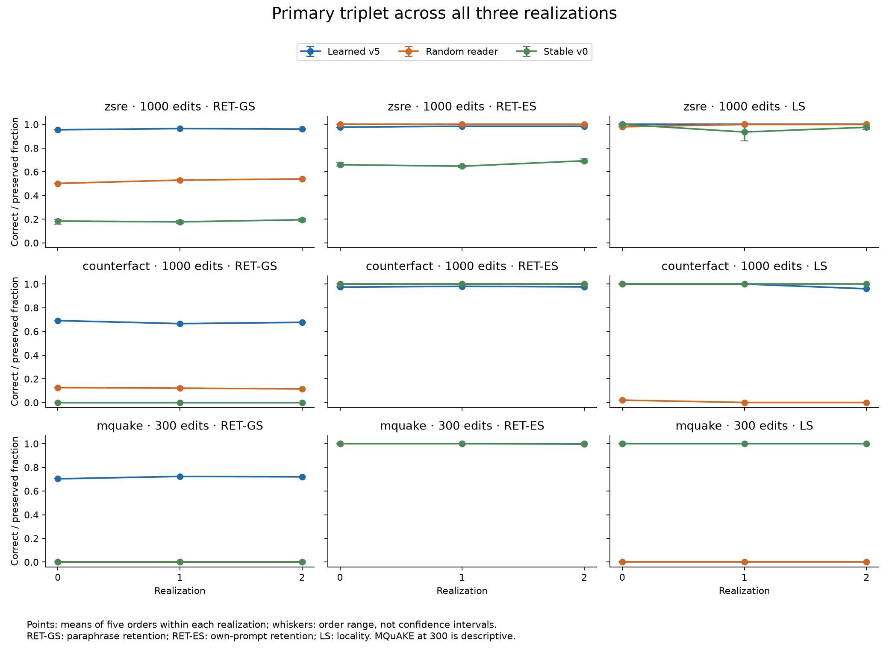

# R1 Stage 4: complete primary triplet

2026-09-24 — Capex. Read-only snapshot of blocks 1–3: **135 complete cells**, three realizations, five orders, three datasets. Registered D.5 analysis and classifications are unchanged. This report supersedes the realization-0-only tables in the block-1 partial report where all three triplet realizations are now available.

The comparison remains a BP-trained feedforward reader study. It does not contain the forthcoming corrected predictive-coding experiments. Current scheduling is DEC-074b: finish through queue position 270, then PC work; later comparator slots below are excluded from this triplet snapshot even where they have since finished.

The learned reader's mean final paraphrase retention across the three realizations is **0.9603 on zsRE**, **0.6780 on CounterFact**, and **0.7156 on MQuAKE** (the latter at 300 edits). The retention advantage recurs across the three tested populations. Three of the four available registered contrasts receive a preliminary positive label; learned versus stable v0 on CounterFact is **inconclusive**, because locality falls to 48/50 in realization 2 despite the large retention gain. These labels do not establish population-level superiority.

All **45 learned-reader cells fail the mean-KL benchmark**. The largest observed positive token-NLL change among them is **17.061 nats**. zsRE near-miss preservation is 86/100, 92/100 and 87/100 in realizations 0, 1 and 2, respectively, while its 50-prompt locality score remains perfect. Useful retention therefore coexists with specificity failures and concentrated ordinary-text harm.

## Final behavior by realization

Each entry averages five orders within one realization. ES is immediate acquisition; RET-ES and RET-GS are end-of-stream own-prompt and paraphrase retention. LS is bounded locality-text equality. zsRE and CounterFact end at 1,000 edits; MQuAKE ends at 300 and remains descriptive at that checkpoint.

| Dataset | Condition | Realization | ES | RET-ES | RET-GS | LS |
| --- | --- | --- | --- | --- | --- | --- |
| counterfact | R1_learned_ff | 0 | 0.99140 | 0.97400 | 0.69150 | 1.00000 |
| counterfact | R1_learned_ff | 1 | 0.99360 | 0.98100 | 0.66600 | 1.00000 |
| counterfact | R1_learned_ff | 2 | 0.99380 | 0.97600 | 0.67650 | 0.96000 |
| counterfact | R1_nonlearned | 0 | 1.00000 | 1.00000 | 0.12600 | 0.02000 |
| counterfact | R1_nonlearned | 1 | 1.00000 | 1.00000 | 0.12100 | 0.00000 |
| counterfact | R1_nonlearned | 2 | 1.00000 | 1.00000 | 0.11450 | 0.00000 |
| counterfact | v0_stable | 0 | 1.00000 | 1.00000 | 0.00000 | 1.00000 |
| counterfact | v0_stable | 1 | 1.00000 | 1.00000 | 0.00000 | 1.00000 |
| counterfact | v0_stable | 2 | 1.00000 | 1.00000 | 0.00000 | 1.00000 |
| mquake | R1_learned_ff | 0 | 1.00000 | 1.00000 | 0.70333 | 1.00000 |
| mquake | R1_learned_ff | 1 | 1.00000 | 1.00000 | 0.72333 | 1.00000 |
| mquake | R1_learned_ff | 2 | 1.00000 | 0.99667 | 0.72000 | 1.00000 |
| mquake | R1_nonlearned | 0 | 1.00000 | 1.00000 | 0.00000 | 0.00000 |
| mquake | R1_nonlearned | 1 | 1.00000 | 1.00000 | 0.00000 | 0.00000 |
| mquake | R1_nonlearned | 2 | 1.00000 | 1.00000 | 0.00000 | 0.00000 |
| mquake | v0_stable | 0 | 1.00000 | 1.00000 | 0.00000 | 1.00000 |
| mquake | v0_stable | 1 | 1.00000 | 1.00000 | 0.00000 | 1.00000 |
| mquake | v0_stable | 2 | 1.00000 | 1.00000 | 0.00000 | 1.00000 |
| zsre | R1_learned_ff | 0 | 0.99360 | 0.97700 | 0.95500 | 1.00000 |
| zsre | R1_learned_ff | 1 | 0.99480 | 0.98500 | 0.96500 | 1.00000 |
| zsre | R1_learned_ff | 2 | 0.99480 | 0.98500 | 0.96100 | 1.00000 |
| zsre | R1_nonlearned | 0 | 1.00000 | 1.00000 | 0.50200 | 0.98000 |
| zsre | R1_nonlearned | 1 | 1.00000 | 1.00000 | 0.53000 | 1.00000 |
| zsre | R1_nonlearned | 2 | 1.00000 | 1.00000 | 0.54000 | 1.00000 |
| zsre | v0_stable | 0 | 1.00000 | 0.66000 | 0.18420 | 1.00000 |
| zsre | v0_stable | 1 | 0.99960 | 0.64740 | 0.17740 | 0.93600 |
| zsre | v0_stable | 2 | 1.00000 | 0.69300 | 0.19520 | 0.97600 |

## Registered contrasts: estimates before labels

Three realization clusters supply the uncertainty. Orders share subjects and are not extra independent replications. The registered percentile intervals reduce to the observed range of realization means. They are preliminary decision summaries, not demonstrated 95% familywise coverage. The adjacent pointwise t sensitivity uses 2 degrees of freedom and assumes iid normal realization errors, uncheckable with three draws. It neither changes the classifier nor establishes simultaneous coverage. Zero observed variance does not establish certainty.

| Dataset | Contrast | Metric | Mean difference | r0, r1, r2 | Registered interval | t sensitivity | Preliminary class |
| --- | --- | --- | --- | --- | --- | --- | --- |
| zsre | primary-vs-R1_nonlearned | RET-GS | 0.43633 | 0.45300, 0.43500, 0.42100 | [0.42100, 0.45300] | [0.39648, 0.47618] | positive |
| zsre | primary-vs-R1_nonlearned | ES | -0.00560 | -0.00640, -0.00520, -0.00520 | [-0.00640, -0.00520] | [-0.00732, -0.00388] | positive |
| zsre | primary-vs-R1_nonlearned | LS | 0.00667 | 0.02000, 0.00000, 0.00000 | [0.00000, 0.02000] | [-0.02202, 0.03535] | positive |
| zsre | primary-vs-v0_stable | RET-GS | 0.77473 | 0.77080, 0.78760, 0.76580 | [0.76580, 0.78760] | [0.74636, 0.80310] | positive |
| zsre | primary-vs-v0_stable | ES | -0.00547 | -0.00640, -0.00480, -0.00520 | [-0.00640, -0.00480] | [-0.00754, -0.00340] | positive |
| zsre | primary-vs-v0_stable | LS | 0.02933 | 0.00000, 0.06400, 0.02400 | [0.00000, 0.06400] | [-0.05098, 0.10965] | positive |
| counterfact | primary-vs-R1_nonlearned | RET-GS | 0.55750 | 0.56550, 0.54500, 0.56200 | [0.54500, 0.56550] | [0.53026, 0.58474] | positive |
| counterfact | primary-vs-R1_nonlearned | ES | -0.00707 | -0.00860, -0.00640, -0.00620 | [-0.00860, -0.00620] | [-0.01037, -0.00376] | positive |
| counterfact | primary-vs-R1_nonlearned | LS | 0.98000 | 0.98000, 1.00000, 0.96000 | [0.96000, 1.00000] | [0.93032, 1.02968] | positive |
| counterfact | primary-vs-v0_stable | RET-GS | 0.67800 | 0.69150, 0.66600, 0.67650 | [0.66600, 0.69150] | [0.64616, 0.70984] | inconclusive |
| counterfact | primary-vs-v0_stable | ES | -0.00707 | -0.00860, -0.00640, -0.00620 | [-0.00860, -0.00620] | [-0.01037, -0.00376] | inconclusive |
| counterfact | primary-vs-v0_stable | LS | -0.01333 | 0.00000, 0.00000, -0.04000 | [-0.04000, 0.00000] | [-0.07070, 0.04404] | inconclusive |

All 63 primary metric slots remain in the [native appendix](../logs/R1/reports/triplet/appendix/report.md). Only triplet contrasts on zsRE/CounterFact are available at checkpoint 1,000. MQuAKE's 21 slots remain unavailable; its 300-edit outcomes are not substituted. Every realization's five paired order differences, minima, maxima and SD are in the appendix and analysis JSON.

## What changed from realization 0

| Learned reader | r0 RET-GS | r1, r2 RET-GS | Three-realization mean | Change vs r0-only |
| --- | --- | --- | --- | --- |
| zsre | 0.95500 | 0.96500, 0.96100 | 0.96033 | 0.00533 |
| counterfact | 0.69150 | 0.66600, 0.67650 | 0.67800 | -0.01350 |
| mquake | 0.70333 | 0.72333, 0.72000 | 0.71556 | 0.01222 |

## Fidelity and concentrated harm

Per-cell means, tails, concentration, both references and benchmark flags are in the bound appendix. The 0.001 KL / 0.01 signed-NLL limits are secondary cap benchmarks, not an admission veto. The full inventory has 245,237 positions. Large concentrated effects do not establish a power law. The table shows the mean of each realization's five cell means and the largest observed positive token-NLL change within that realization.

| Dataset | Condition | r | Mean KL | Mean signed ΔNLL | Largest positive ΔNLL | Benchmark passes / 5 |
| --- | --- | --- | --- | --- | --- | --- |
| counterfact | R1_learned_ff | 0 | 0.00577 | 0.00585 | 15.38180 | 0 |
| counterfact | R1_learned_ff | 1 | 0.00473 | 0.00462 | 11.36577 | 0 |
| counterfact | R1_learned_ff | 2 | 0.00578 | 0.00602 | 14.03078 | 0 |
| counterfact | R1_nonlearned | 0 | 0.05978 | 0.05953 | 20.28337 | 0 |
| counterfact | R1_nonlearned | 1 | 0.08934 | 0.08824 | 17.45152 | 0 |
| counterfact | R1_nonlearned | 2 | 0.06423 | 0.06412 | 16.29941 | 0 |
| counterfact | v0_stable | 0 | 0.00000 | 0.00000 | 0.00000 | 5 |
| counterfact | v0_stable | 1 | 0.00000 | 0.00000 | 0.00000 | 5 |
| counterfact | v0_stable | 2 | 0.00000 | 0.00000 | 0.00000 | 5 |
| mquake | R1_learned_ff | 0 | 0.00712 | 0.00715 | 13.14428 | 0 |
| mquake | R1_learned_ff | 1 | 0.00694 | 0.00694 | 17.06053 | 0 |
| mquake | R1_learned_ff | 2 | 0.00409 | 0.00414 | 10.25323 | 0 |
| mquake | R1_nonlearned | 0 | 0.01218 | 0.01205 | 15.07216 | 0 |
| mquake | R1_nonlearned | 1 | 0.01211 | 0.01209 | 12.77095 | 0 |
| mquake | R1_nonlearned | 2 | 0.01223 | 0.01217 | 14.87382 | 0 |
| mquake | v0_stable | 0 | 0.00000 | 0.00000 | 0.00000 | 5 |
| mquake | v0_stable | 1 | 0.00000 | 0.00000 | 0.00000 | 5 |
| mquake | v0_stable | 2 | 0.00000 | 0.00000 | 0.00000 | 5 |
| zsre | R1_learned_ff | 0 | 0.00238 | 0.00245 | 9.26227 | 0 |
| zsre | R1_learned_ff | 1 | 0.00245 | 0.00255 | 8.95399 | 0 |
| zsre | R1_learned_ff | 2 | 0.00233 | 0.00245 | 11.04775 | 0 |
| zsre | R1_nonlearned | 0 | 0.00031 | 0.00032 | 5.66083 | 5 |
| zsre | R1_nonlearned | 1 | 0.00074 | 0.00072 | 7.00099 | 5 |
| zsre | R1_nonlearned | 2 | 0.00039 | 0.00038 | 5.82137 | 5 |
| zsre | v0_stable | 0 | 0.00136 | 0.00109 | 27.68417 | 1 |
| zsre | v0_stable | 1 | 0.00188 | 0.00189 | 26.28762 | 0 |
| zsre | v0_stable | 2 | 0.00170 | 0.00164 | 23.53842 | 0 |

Historical watch prefix: 135 queue observations, 91 breach entries and 17 creep alerts, replayed from the original prefix ending with the triplet. These alerts are descriptive and do not veto admission.

## Execution accounting and limits

The 135 enclosing process receipts charge **140.970610 process-hours**, matching the saved block-3 boundary cell by cell. There are zero unknown costs, failures or retries within this snapshot. Covered driver time is not charged again. Process-hours include concurrent workers and are not elapsed GPU wall-hours.

2 parent decision records are absent at the documented Q21 cutover; their successful start/finish and driver results remain present and charged. This known interruption is disclosed in [accounting.json](../logs/R1/reports/triplet/accounting.json). No missing decision was manufactured. The native global accounting field stays explicitly unavailable: replaying the advancing whole queue would not describe a blocks-1–3 snapshot.

The matched/live/S1 controls remain outside this report's scope, and the historical extension is optional. DEC-074b leaves S1_literal CounterFact and the extension unrun. No absent comparison is imputed or removed from the original denominator. The study still does not isolate every architectural ingredient or supply a direct fine-tuning-on-edits baseline. CounterFact's source exception, the predominance of initially unanswered zsRE prompts, and the three-realization uncertainty limits remain relevant.

## Tables, figures and reproduction

[Native filled skeleton and all tables](../logs/R1/reports/triplet/appendix/report.md); [analysis with source hashes](../logs/R1/reports/triplet/analysis.json); [every realization's five orders](../logs/R1/reports/triplet/realization-summary.csv); [process accounting](../logs/R1/reports/triplet/accounting.csv). Reproducer: `python -m aw.triplet_report analyze`, then `python -m aw.triplet_report publish`, using new output paths rather than overwriting this historical snapshot. Standard plots: `python -m scripts.r1_d14_figures --data logs/R1/reports/triplet/appendix/report-data.json` in the existing plotting environment. Selected exports are copied to `assets/presentation-materials/figures/triplet/`.

No models, GPU execution, experimental re-scoring, source-lock edits, queue operations or commits were performed for this report.
