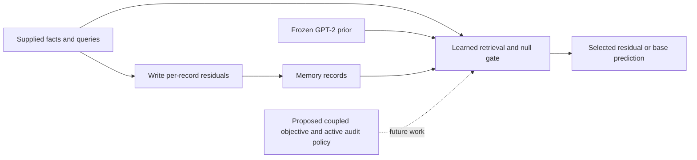

# October 15 talk — evidence-based outline v1

Charlie Derr and Matthew Iklé; prepared September 18, 2026 for the Binghamton satellite, **Thriving in the Extremes: Active Inference in Non-equilibrium Systems**. Preserve the submitted title, *Coupled Active Inference on a Frozen Transformer Prior: A Risk-Aware Residual Agent for Non-Equilibrium Regimes*, with a subtitle: **“Current experiments: controlled memory edits, concentrated harm, and a loss-level κ pilot.”** The local schedule puts the talk in Session 3; it does not establish an individual speaking duration. The suggested 18-minute outline below can be shortened by moving slides 5 and 7 to backup.

Canonical version: `/home/derp/cap/pc_cap/docs/presentation/talk_outline_v1.md`; presentation export: `/home/derp/cap/assets/presentation-materials/talk_outline_v1.md`. Unless an absolute path is given, evidence paths below are relative to `/home/derp/cap/pc_cap/`. No new experiment is represented by this outline or its new plots. Source hashes and export checks are in `logs/r1_round37/HT9-evidence-manifest.json`.

**Opening sentence:** “We are using a small adaptive memory on a frozen language model to measure where correction helps, where it intervenes wrongly, and what an average conceals about the worst consequences.”

The submitted abstract is the research programme, not a completed-results claim. The session's coupled free energy, generalized boundaries and correlated regimes supply the questions. The present experiments supply controlled measurements on GPT-2-scale JAX/BP-base editing. Expected-free-energy policy choice, coupled expectations, proved Markov blankets, frontier-scale transfer and a single-κ geometric equivalence remain proposed. Failure cases were selected for study by investigators; the agent did not autonomously choose informative failure.

## Slide-by-slide outline

### 1. From the abstract to a measurable question — 1 minute

**Claim:** A frozen prior plus a small editable memory lets us measure correction and unintended interference separately.

**Evidence / figure:** The submitted PDF at `/home/derp/cap/errata/presentation_details/Active_Inference_in_the_Extremes_Abstract_charlie_derr.pdf`; local `sattellite-schedule` in that directory; `docs/heavy_tail_counter_review.md` §§1, 8; ledger v5 A1–A3. Use the implementation/proposal diagram specified below.

**Qualification:** Present active-inference language as the motivation and programme; the current empirical system does not instantiate the abstract's complete coupled-free-energy agent. The earlier v0 study's negative/inconclusive findings remain in `docs/report.md`; revision development does not retrospectively confirm them.

### 2. What is actually implemented — 1.5 minutes

**Claim:** The fixed GPT-2 base is augmented by 3,348,228 trained reader/controller parameters and separate per-record state.

**Evidence / figure:** `logs/r1_round16/selection_audit.json`, `logs/review_r1_selection.md`, `src/pccap/revision_v1/learner.py`, `reader.py`, `adapt.py`, `memory.py`. Diagram: supplied fact → residual write; new query → learned retrieval/null decision → selected residual or unchanged base. Label the two interfaces as architectural analogies and put proposed active inference in dashed boxes.

**Qualification:** The 1,640,964 reader +1,707,264 controller parameters are about 2.7% of the stated 124M base; memory records add state. Query acceptance, nonzero residuals and changed answers are different events. Neither a blanket theorem nor universal preservation follows from freezing the weights.

### 3. Correction versus unintended intervention — 1.5 minutes

**Claim:** Common-population development selection exposes a retention–rejection trade-off and a clear selected operating point.

**Evidence / figure:** `logs/r1_round16/selection_retention_rejection.pdf` (PNG/SVG also available); `selection_audit.json`; `logs/review_r1_selection.md`; ledger O2. Label 42 candidates, 15 admissible, selected v5 RET-GS 0.8033 macro (.98 zsRE / .82 CounterFact / .61 MQuAKE), unseen gate acceptance 10/100.

**Qualification:** Adaptive development selection, not confirmation. The descriptive fixed-candidate Wilson interval is 5.52–17.44%; it does not certify a population rate below 10%, and is not selection-adjusted. The selected-seed 0.8033 differs from the κ pilot's ordinary three-seed mean 0.7961. Different historical occupancy probe populations do not establish a flat memory-size response.

### 4. Why the mean misses the consequence — 2 minutes

**Claim:** Small average ordinary-text drift coexists with rare positions suffering losses of several nats.

**Evidence / figure:** `logs/heavy_tail/audit-v5-round16-supplement/mean_vs_tail_v5.pdf` and `audit.json`; historical checkpoint sources are bound there. For v5 zsRE, mean signed ΔNLL .00220, ES95 positive harm .04396, maximum 8.69 nats; 17/16,256 positions exceed .1 nat. CounterFact maximum 7.31, 52/16,256 above .1.

**Explain:** NLL = −log probability assigned to the observed next token; a positive change means that token became less likely. ES95 averages the worst 5% of positive-part harms, including zeros where applicable. A loss increase of 8 nats means the target token is about 3,000 times less probable under the edited distribution for that scored prefix.

**Qualification:** Fixed 128-window development assay, dependent positions; different readers/edit histories are descriptive comparisons. Empirical concentration does not establish a power law or a tail exponent. These saved profiles are not independent replications. Use “rare concentrated harm,” not an unproved distributional-family claim.

### 5. The complete validation population changes the picture — 2 minutes

**Claim:** Full validation confirms concentration and shows that a passing mean benchmark can still conceal a large local loss.

**Evidence / figure:** `logs/r1_round35/ht6-final/{report.json,report.md,tail-survival.pdf}`; new `logs/r1_round37/presentation-figures-v2/full-fidelity-and-tail.pdf`. Show this four-cell table, all at 300 development edits and N=245,237:

| Cell | Mean KL | Signed mean ΔNLL | Max positive ΔNLL | Positions carrying half KL |
|---|---:|---:|---:|---:|
| MQuAKE primary v5 | .005544 | .005601 | 8.188 | 171 |
| zsRE primary v5 | .002270 | .002310 | 9.945 | 64 |
| MQuAKE v0 stable | 0 | 0 | 0 | undefined: zero total KL |
| zsRE v0 stable | .000789 | .000855 | 16.159 | 10 |

**Qualification:** DEC-064 makes cap mean KL ≤.001 and signed mean NLL increase ≤.01 **secondary benchmarks**, without vetoing primary comparisons. Both learned cells fail KL and pass NLL; zsRE v0 passes both despite its maximum. Original-base and own-cap-off references coincide numerically here but stay separately reported; S1 references need not coincide. Full validation covers 1,931 complete 128-token windows (245,237 next-token positions), with context reset per window. The earlier 128-window prefix is a dependent subset, not an iid sample. Matching overlap is a consistency check, not proof of representativeness. Near-zero target-token ΔNLL is not proof of an unchanged full distribution or of no reader firing. The continued-base certification gate is separate.

### 6. Three failures that improved the investigation — 1.5 minutes

**Claim:** Concrete failures changed the reader's rejection training and the measurements used to evaluate it.

**Evidence / figure:** A three-row methods timeline built from `docs/R1_stage2_notes.md` (own-prompt/null inversion, ordinary-text null training, R1-56 memory-rare overlap gate), `logs/review_r1_selection.md`, and the HT-1b/HT-6 sources above. Rows: generalized reader fires too widely → explicit null/rejection training; occupancy/source confounding → common-population qualification; benign-looking averages → per-position tails and complete validation.

**Qualification:** These are retrospective development lessons, not randomized estimates of each repair's isolated effect. Do not use the invalid Chain-M MQuAKE locality artifact as evidence of interference. This is investigators learning from failures, not observed expected-free-energy action selection.

### 7. A small, specified κ intervention — 1.5 minutes

**Claim:** The pilot changes the reader's loss and asks whether retention can be preserved while unintended intervention and drift tails improve.

**Evidence / figure:** `manifests/revision_v1/kappa_pilot_v3.json`; `logs/heavy_tail/HT-3b-objective-review.json`; `logs/r1_round22/ht3e-independent-review-v2.json`. Use a compact objective/decision-rule box: answer surprisal `(1 − p^κ)/κ`, ordinary limit −log p, κ .2/.5, ordinary control and clip-2 control, three seeds, fixed 150–300 checkpoint average. Cite the implemented repaired preservation divergence; do not copy the earlier counter-review's unrepaired divergence formula as the final objective.

**Qualification (DEC-054, on slide):** “Preliminary hints at what the architecture could provide; not the coupled free energy (no coupled expectation or changed inference distribution), not a coupled Markov blanket, and not a test of the one-κ conjecture that porosity and interference are the same parameter.” Only the answer surprisal is bounded; the whole objective and gradients are not uniformly bounded. Clip 2 matches κ=.5's answer-loss ceiling, not κ=.2's.

### 8. The κ result is a trade-off, not a declared gain — 2 minutes

**Claim:** Both κ arms reduce descriptive tail harm but fail the predeclared retention floor and tail-separation rule.

**Evidence / figure:** `logs/r1_round37/presentation-figures-v2/kappa-tradeoff.pdf`; source `logs/r1_round22/ht3e-independent-review-v2.json` (36 independently reproduced rows), with original aggregate `logs/r1_round18/ht3d-pilot-final-aliases.json`. Means ordinary / κ .2 / κ .5 / clip2: RET-GS .7961 / .7544 / .7478 / .7789; ES95 .2229 / .0836 / .0635 / .1033 nats. Mark floor .7761 and show individual seed macros, not invented confidence intervals.

**Qualification (DEC-054, on slide):** Repeat the framing sentence from slide 7. The reductions lie within the predeclared seed-spread thresholds. Clip2 meets retention but has a CounterFact false fire where ordinary has zero, and fails tail separation; it is a descriptive control, not proof of robust superiority. Three seeds and 32-window/4,064-position assays per dataset; no confirmatory κ claim and no selection of a favorable tail checkpoint.

### 9. Exact answers can survive while probability deteriorates — 1.5 minutes

**Claim:** Old-fact probability harm persisted through edit 100 despite all 20 old exact answers remaining correct.

**Evidence / figure:** `logs/r1_round37/presentation-figures-v2/stress-trajectories.pdf`; audited `stress` section of `logs/r1_round22/ht3e-independent-review-v2.json`; `manifests/revision_v1/ht_development_panel_v1.json`. CounterFact edit-100 mean positive ΔNLL .32379, maximum 12.53188; MQuAKE mean .112 approximately and maximum 6.6 approximately; zsRE zero. Show points only at measured edits 20/60/70/80/100; connecting lines do not identify the onset between probes.

**Qualification:** One seed, two tested schedules, three datasets. Their observed equality is not universal order invariance. Recovery was unobserved, not proved impossible or permanent. CounterFact first detected harm at 80 gives 20 observed later updates; MQuAKE detection at 60 gives 40. The registered censor from treatment end60 and time since first detected harm are different quantities. The tested memory lacks a revisiting mechanism, but that is an explanatory hypothesis, not an identified cause.

### 10. What the independent matrix can still establish — 1.5 minutes

**Claim:** The prospective matrix tests the selected editing treatments on reserved populations, with omissions and failures explicitly reported.

**Evidence / figure:** `manifests/revision_v1/run_matrix_v5_2_D_4.json`; `docs/R1_stage4_protocol_v5_2_D_4.md`; `docs/R1_U03_interpretation_memo.md`; planned completion inventory from `scripts/r1_d12_reprice.py`. Use a scope table: zsRE120 + CounterFact120 + MQuAKE45 =285 core; +45 optional; MQuAKE only primary, random reader and v0 stable in core. As of this outline, confirmation is pending signatures and actual population operations; show no invented success bars.

**Qualification:** Five MQuAKE arms/75 cells are prospectively not run, not measured zeros. MQuAKE stops at 300 and its 21 checkpoint-1000 intervals remain unavailable; retain all 63 declared intervals, without alpha redistribution or treating orders as independent realizations. S1 controls have certified historical bases, not a proved exact-v5 compute match. Most eligible zsRE teacher baselines are empty answers (6,036/6,084), so discuss acquisition/generalization rather than correction of initially answered facts. At the talk, replace status with the actual October 9 inventory and complete-block results; retain every incomplete cell.

### 11. Feasibility and the limits that remain — 1 minute

**Claim:** The reduced scope has explicit budget headroom, while completion depends on observed costs and the October 9 stop.

**Evidence / figure:** `docs/R1_execution_plan_v3.md`; `docs/tasks/R1-cost-admission-receipt-v4.json`; current D12 block plan when real data exist. Current scenarios:431.31 expected process hours,646.96 at all cell ceilings,750 shared cap; approximately227.30 elapsed hours under inherited1.65× throughput. Use a simple table, not a measured progress chart.

**Qualification:** Process hours sum simultaneous workers and failures; they are not elapsed hours. Transfers, full-assay memory and future concurrency are not all measured. Budget margin is not a completion guarantee. October 10–14 is for locked-data analysis, figures and rehearsal; no experiments after October 9. The cost receipt is unsigned at this snapshot.

### 12. The question for the room — 1 minute

**Claim:** The next scientific question is whether a correctly specified coupled objective improves the correction–tail-harm trade-off beyond ordinary robust losses and better rejection training.

**Evidence / figure:** Slides3–9, counter-review §8, submitted abstract. End with a measured/proposed split: measured sparse harm and loss-level trade-offs; proposed coupled expectations, correlated-regime adaptation and expected-free-energy choice of audits.

**Qualification (DEC-054):** Preliminary hints, not coupled free energy or a test of the one-κ conjecture. The present null does not refute the broader CFE programme, and the descriptive tail reduction does not confirm it. Invite a concrete comparison that could separate the coupled form from clipping while preserving retention.

## Figures, reproducibility and remaining production work

Ready figures are copied into `assets/presentation-materials/figures/ht9-v1/`; originals remain in the repository. The three new figures are descriptive renderings of existing audited JSON, not new experiments.

| Figure / use | Current source | Reproducer or exact next step |
|---|---|---|
| Selection scatter, slide 3 | `logs/r1_round16/selection_retention_rejection.{pdf,svg,png}` | Existing `scripts/r1_x12_selection_review.py`, `figure(report)`; configure a fresh output before rerendering. Prefer the checked figure for v1. |
| Mean versus tail, slide 4 | `logs/heavy_tail/audit-v5-round16-supplement/mean_vs_tail_v5.{pdf,svg,png}` | Existing `scripts/ht1b_plot_v5.py`, `plot(output)`; use a new directory and the supplement audit, preserving its original source bindings. |
| Full empirical survival, slide 5/backup | `logs/r1_round35/ht6-final/tail-survival.{pdf,png}` | Existing `scripts/ht6_plot.py --input logs/r1_round35/ht6-final/curve-series.json --output NEW_LOG_DIR`; create the directory first. No HT-6 assay or live-watch rebuild is needed to render stored curves. |
| κ seed comparison; stress trajectory; full mean/tail summary | `logs/r1_round37/presentation-figures-v2/` | New `scripts/ht9_presentation_figures.py --output NEW_LOG_DIR`; renders all three from existing audited sources and records figure data, hashes and plotting environment. |
| Two-interface conceptual diagram, slides1–2 | Mermaid source below | Still needs slide styling/export. Render this code in the slide editor; retain solid implemented arrows and dashed proposed relation. No empirical values or new script needed. |
| Three-failure timeline, slide 6 | Exact sources listed on slide 6 | Still needs slide layout; render the three-row text table directly, without suggesting quantitative effect sizes. |
| Confirmatory forest plot and completion panel, slide 10 | **No confirmatory values yet** | Still blocked on actual data. Existing `scripts/r1_49g_analyze.py` supplies registered intervals and `scripts/r1_75_analysis_stage4_v1.py` supplies cell inventory; `scripts/r1_d12_reprice.py` emits block cost/watch/DEC-052 attachments. A future plotting wrapper must read those outputs, preserve unavailable intervals and list incomplete cells. Do not plot a preview as a result. |

Plot-only command, using the existing non-JAX plotting environment:

```bash
PYTHONDONTWRITEBYTECODE=1 /home/derp/cap/assets/envs/status-paper-20260911/bin/python \
  -m scripts.ht9_presentation_figures --output logs/r1_round37/NEW_FIGURE_DIRECTORY
```



## Corrections to carry into slides

Read the four older records as provenance, with these current qualifications: `tail_drift_v5.md` predates the κ completion, full-validation assay and D.4 scope; `fidelity_concentration_v5.md` overstates “unchanged prediction” from small target-loss change and “v0 never fires” (zsRE v0 has nonzero KL and a 16.16-nat maximum); `stress_panel_v5.md`'s earlier permanent-harm/order-invariance claims are restricted by its later correction and the independent review; `kappa_pilot_v5.md`'s mechanism language is descriptive, and clip2's CounterFact false fire must remain visible. Historical claim-ledger v5 and v6-preview scope/cost/pending rows are superseded by D.4, plan v3 and the completed HT-6 report. The real final ledger v6 still awaits the signed v4 cost receipt.

Before final rehearsal: lock the October 9 inventory; regenerate only figures from locked outputs; substitute actual completion and cost data on slides 10–11; check denominators, population/reference labels, DEC-054 footers and all unavailable results. Existing development slides stand even if confirmation is incomplete. Keep backup slides for metric definitions, exact κ/preservation formula, original versus cap-off references, multiplicity/three-realization uncertainty, S1 accounting, source-population defects and the full missing-cell inventory.
