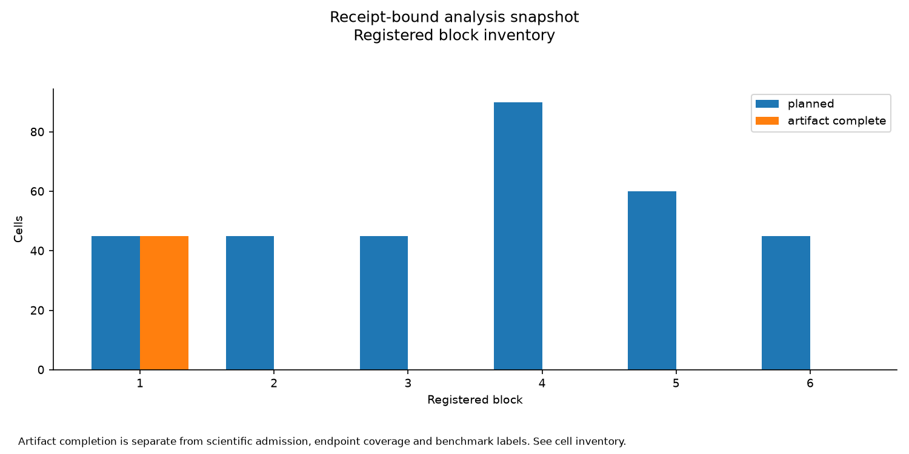
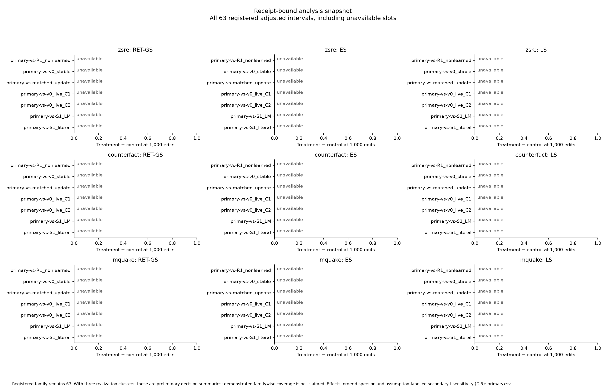
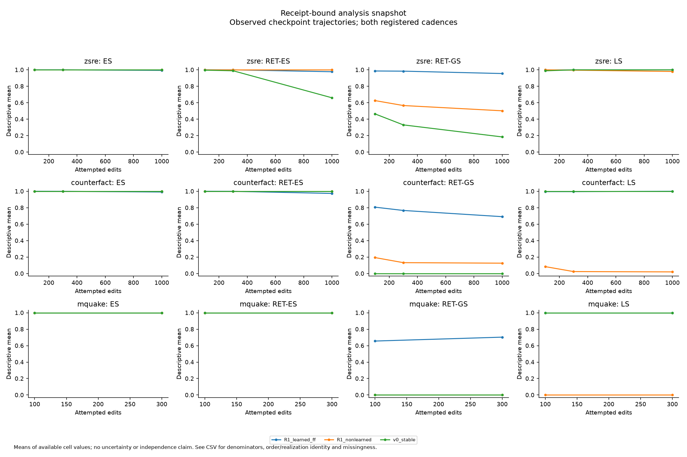
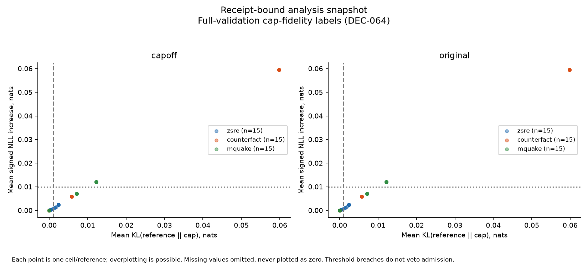
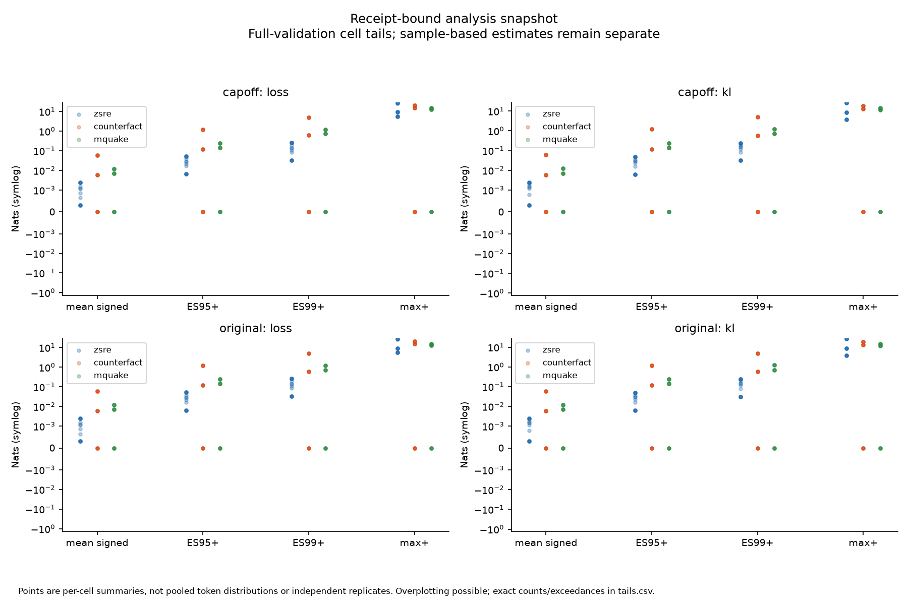
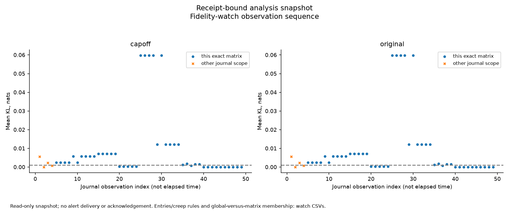

# Revision v1 Stage 4: correction, interference and concentrated harm

**Receipt-bound analysis snapshot; inspect completion and admission before interpretation.**

This is a fillable scientific report template. `scripts/r1_d14_report.py` replaces every named placeholder using the installed R1-49g/R1-75 analysis, preserving its point estimates, intervals, classifiers and unavailable results. A filled synthetic rehearsal demonstrates document plumbing only. The final report uses the locked October 9 inventory, not this fixture.

## Abstract and research question

We test whether a learned memory attached to a frozen language model retains supplied edits while preserving unrelated behavior. The primary endpoint compares the selected v5 treatment with seven declared controls on paraphrase retention (RET-GS), edit success (ES), and bounded text locality (LS). Small mean drift can coexist with concentrated per-position harm; full-validation tail statistics therefore supplement the registered primary comparisons. Report completion, all unavailable intervals and the separate secondary fidelity labels before making a scientific conclusion. This template deliberately contains no default positive conclusion.

## Methods and populations

The D.4/D.5 declaration contains 285 core cells and 45 optional extension cells. zsRE and CounterFact use 100/300/1,000 checkpoints; MQuAKE uses 100/300. The protocol signature's extension choice governs the executed inventory. Three realizations are the independent bootstrap clusters; five orders remain paired within each cluster. The nominal 63-interval family includes all seven comparisons × three metrics × three datasets. Unadjusted intervals are 97.5%; adjusted intervals use 1−0.05/63. Under D.5/DEC-069 the registered range intervals and classifier are preliminary decision summaries: three clusters establish neither 95% familywise control nor a population-level effect. Show effects, all realization estimates and within-realization order dispersions before category names. The secondary pointwise 95% t sensitivity uses 2 degrees of freedom and assumes independent normal realization errors; it never changes classification. Do not treat orders as independent realizations, shrink the family to observed cells, or redistribute alpha.

The real DEC-063 inventory is 1,931 complete 128-token windows / 245,237 scored positions, with 121 trailing tokens dropped. The first 128 windows / 16,256 positions are a fixed descriptive prefix, not an iid sample. Full validation occurs at the final checkpoint and sampled drift at every checkpoint. Report the actual bound contract below: the software rehearsal deliberately uses four full positions and two sampled positions. It preserves edit cadences and endpoint counts, not the real validation token population.

DEC-069: effects before preliminary category labels. The registered intervals are the three realization means' range; no demonstrated 95% familywise control or established population effect. Secondary pointwise 95% Student-t intervals (df=2) assume independent normal realization errors, are not simultaneous and never change the classifier. Order dispersions retain all five paired differences per realization.

Bound validation contract: `{"checkpoint_policy": "final_only_plus_sample_at_every_checkpoint", "complete_windows": 1931, "context_policy": "reset_every_window", "expected_positions": 245237, "kl_direction": "reference || cap", "policy": "DEC-063-complete-windows-final-both-references-v1", "references": ["own_capoff", "original_base"], "sample_windows": 128, "schema_version": 1, "source": {"path": "/home/derp/cap/assets/data/prepared/lm/drift_tokens.npy", "sha256": "aa9cc07ec22444b4da8a41f0babe1e27918f01cad42c29a91e61a95ba443bc23"}, "source_inventory": {"path": "/home/derp/cap/pc_cap/manifests/dev/lm_sets.json", "sha256": "e5dba907d67114f2ca41262520c51c893dc97e027de31adc4c7ed5f06cfdce1e"}, "source_tokens": 247289, "tail_policy": "drop_incomplete_trailing_window", "trailing_tokens_dropped": 121, "window_tokens": 128, "windows_int64le_sha256": "aa959510eb6e50ba3faeb6354cf1e38a89100a7b537bf79ebdc80a6e5df0886b"}`.

Primary family: `{"adjusted_confidence": 0.9992063492063492, "checkpoint": 1000, "clusters": 3, "coverage": "nominal approximate bootstrap; three clusters do not establish exact familywise coverage", "decision": "DEC-057", "draws": 10000, "dtype": "float64", "family_alpha": 0.05, "family_size": 63, "method": "Bonferroni_percentile_realization_clusters", "orders_per_cluster": 5, "pointwise_confidence": 0.975, "quantile_method": "linear", "seed": 0, "status": "admitted"}`.

Primary locality compares exact bounded decoded text with the original-base response, including for S1. Near-miss preservation compares the neighbour query with that neighbour's actual cell cap-off baseline (DEC-053/061). Retain termination/truncation diagnostics separately. Near-miss challenges use different-subject exact relation/template families, including multiple disjoint pairs per family (DEC-061/062); they are not semantic nearest neighbours. Unavailable planned slots remain in their denominators.

## Execution disposition and DEC-052 inventory

Table 1 reports each ordered block. Complete artifacts, complete primary metrics, complete endpoint populations, scientific admission and a passing benchmark are different properties. Later incomplete blocks remain visible even if an earlier block is complete. Actual retry/cost reconciliation is supplied by D11/D13; the scientific analyzer does not invent process costs or exhausted-retry status.

Full table: [blocks.csv](blocks.csv), 6 rows. 

| block_number | planned | artifact_complete | primary_metrics_complete | complete |
| --- | --- | --- | --- | --- |
| 1 | 45 | 45 | 45 | True |
| 2 | 45 | 0 | 0 | False |
| 3 | 45 | 0 | 0 | False |
| 4 | 90 | 0 | 0 | False |
| 5 | 60 | 0 | 0 | False |
| 6 | 45 | 0 | 0 | False |

Table 2 and its full cell appendix preserve every declared cell, missing checkpoint and invalid-evidence reason. An absent result is not a zero treatment effect. When none are incomplete, that statement derives from the bound inventory rather than deleting this section.

Full table: [incomplete.csv](incomplete.csv), 285 rows. First 8 rows shown in source order.

| cell_id | cell | block_number | status | missing_checkpoints |
| --- | --- | --- | --- | --- |
| 6b089d284c00a4418a1d3af4 | {"condition":"R1_learned_ff","dataset":"zsre","order":100,"realization":1} | 2 | missing_cell | [100,300,1000] |
| 47dac9d968ffe594faac0a14 | {"condition":"R1_learned_ff","dataset":"zsre","order":101,"realization":1} | 2 | missing_cell | [100,300,1000] |
| 4eda9e6155b2755508e13091 | {"condition":"R1_learned_ff","dataset":"zsre","order":102,"realization":1} | 2 | missing_cell | [100,300,1000] |
| ab774e229a65298fdc117c96 | {"condition":"R1_learned_ff","dataset":"zsre","order":103,"realization":1} | 2 | missing_cell | [100,300,1000] |
| b4e7dc307a1f895a8fec997a | {"condition":"R1_learned_ff","dataset":"zsre","order":104,"realization":1} | 2 | missing_cell | [100,300,1000] |
| 826332f387bd487a045d412f | {"condition":"R1_learned_ff","dataset":"counterfact","order":100,"realization":1} | 2 | missing_cell | [100,300,1000] |
| 14d45f0e87126104057518af | {"condition":"R1_learned_ff","dataset":"counterfact","order":101,"realization":1} | 2 | missing_cell | [100,300,1000] |
| 960d0adeb6cacfcfce93d546 | {"condition":"R1_learned_ff","dataset":"counterfact","order":102,"realization":1} | 2 | missing_cell | [100,300,1000] |

Full table: [cell_inventory.csv](cell_inventory.csv), 330 rows. First 8 rows shown in source order.

| cell_id | dataset | condition | realization | order | status | artifact_complete | missing_checkpoints | scientific_admission | endpoint_complete | invalid_reason | endpoint_complete_scope | primary_metrics_complete | full_validation_complete | sampled_drift_complete | unreceipted_checkpoints |
| --- | --- | --- | --- | --- | --- | --- | --- | --- | --- | --- | --- | --- | --- | --- | --- |
| 61348508e40d54351613ab14 | zsre | R1_learned_ff | 0 | 100 | complete_artifacts | True | [] | True | True | unavailable | full_validation AND sampled_drift only | True | True | True | [] |
| 88af67fa5945b642e8ba7974 | zsre | R1_learned_ff | 0 | 101 | complete_artifacts | True | [] | True | True | unavailable | full_validation AND sampled_drift only | True | True | True | [] |
| 915f97b05f3fa2a81de09cdf | zsre | R1_learned_ff | 0 | 102 | complete_artifacts | True | [] | True | True | unavailable | full_validation AND sampled_drift only | True | True | True | [] |
| 4aa4849ba414edab2504f56b | zsre | R1_learned_ff | 0 | 103 | complete_artifacts | True | [] | True | True | unavailable | full_validation AND sampled_drift only | True | True | True | [] |
| 9ebc93cc7912bd5d1c929418 | zsre | R1_learned_ff | 0 | 104 | complete_artifacts | True | [] | True | True | unavailable | full_validation AND sampled_drift only | True | True | True | [] |
| ce0d0ffc2a58a60e27c460d9 | counterfact | R1_learned_ff | 0 | 100 | complete_artifacts | True | [] | True | True | unavailable | full_validation AND sampled_drift only | True | True | True | [] |
| 95dfb24c6361b2d38dd60e9b | counterfact | R1_learned_ff | 0 | 101 | complete_artifacts | True | [] | True | True | unavailable | full_validation AND sampled_drift only | True | True | True | [] |
| 6d0915056b1e76d8ee8795ff | counterfact | R1_learned_ff | 0 | 102 | complete_artifacts | True | [] | True | True | unavailable | full_validation AND sampled_drift only | True | True | True | [] |

`endpoint_complete` covers **full validation and sampled drift only**. The cell inventory separately reports primary-metric completeness, full-validation completeness, sampled-drift completeness and unreceipted checkpoints. Near-miss, revision and other challenge inventories retain their own planned/scored/missing counts; a complete validation assay does not establish their completion. Composition results remain unavailable until the upstream reporting adapter exists (X21-G6).

The following execution-accounting section accepts a D11 or daily D13 snapshot, independently replays D11 against the same matrix and explicitly supplied queue receipt root, and binds the verified snapshot and source receipts. It retains both workers' process envelopes, uncovered driver costs, unknown-cost records, retries, explicit host-failure classifications and block reconciliation. Unknown cost is not zero; a processed boundary can still contain retry-exhausted incomplete cells. Without a supplied verified snapshot, this section is explicitly unavailable.

Full table: [accounting_summary.csv](accounting_summary.csv), 1 rows. 

| status | note | known_process_hours | unknown_cost_records | retries | host_failures | block_reconciliation |
| --- | --- | --- | --- | --- | --- | --- |
| unavailable_not_supplied | Execution accounting unavailable: no verified D11/D13 report supplied. Known spend, unknown costs, retries and host failures are not inferred from checkpoint timings. | unavailable | unavailable | unavailable | unavailable | unavailable |

## Registered primary comparisons

Table 3 contains all **21 dataset-specific comparisons × three metrics = 63 rows**, both interval types, three realization estimates, classifier labels, admission state and pairing issues. The seven MQuAKE checkpoint-1,000 comparisons / 21 intervals remain unavailable; measured 300-edit outcomes cannot replace them. Classifier labels apply to a comparison jointly across its three metrics, so their repetition across metric rows does not create extra decisions.

Full table: [primary.csv](primary.csv), 63 rows. 

| dataset | contrast | checkpoint | metric | status | estimate | realizations | pointwise_interval | adjusted_interval | order_dispersion | t_sensitivity | interpretation | classification | scientific_admission | pairing_issues |
| --- | --- | --- | --- | --- | --- | --- | --- | --- | --- | --- | --- | --- | --- | --- |
| zsre | primary-vs-R1_nonlearned | 1000 | RET-GS | incomplete | unavailable | [0.45299999999999996,null,null] | unavailable | unavailable | [{"complete":true,"maximum":0.45299999999999996,"mean":0.45299999999999996,"minimum":0.45299999999999996,"observed_orders":5,"order_values":[0.45299999999999996,0.45299999999999996,0.45299999999999996,0.45299999999999996,0.45299999999999996],"realization":0,"sample_sd":0.0},{"complete":false,"maximum":null,"mean":null,"minimum":null,"observed_orders":0,"order_values":[null,null,null,null,null],"realization":1,"sample_sd":null},{"complete":false,"maximum":null,"mean":null,"minimum":null,"observed_orders":0,"order_values":[null,null,null,null,null],"realization":2,"sample_sd":null}] | {"assumptions":"independent identically distributed normal realization errors; not checked with n=3","between_realization_sample_sd":null,"confidence":0.95,"critical_value":4.302652729696142,"degrees_of_freedom":2,"family_adjusted":false,"lower":null,"method":"Student_t","role":"secondary_sensitivity_not_classifier_input","status":"unavailable","upper":null,"zero_variance_caveat":null} | preliminary_decision_summary | unavailable | False | [] |
| zsre | primary-vs-R1_nonlearned | 1000 | ES | incomplete | unavailable | [-0.0064000000000000055,null,null] | unavailable | unavailable | [{"complete":true,"maximum":-0.0050000000000000044,"mean":-0.0064000000000000055,"minimum":-0.008000000000000007,"observed_orders":5,"order_values":[-0.006000000000000005,-0.0050000000000000044,-0.006000000000000005,-0.007000000000000006,-0.008000000000000007],"realization":0,"sample_sd":0.001140175425099139},{"complete":false,"maximum":null,"mean":null,"minimum":null,"observed_orders":0,"order_values":[null,null,null,null,null],"realization":1,"sample_sd":null},{"complete":false,"maximum":null,"mean":null,"minimum":null,"observed_orders":0,"order_values":[null,null,null,null,null],"realization":2,"sample_sd":null}] | {"assumptions":"independent identically distributed normal realization errors; not checked with n=3","between_realization_sample_sd":null,"confidence":0.95,"critical_value":4.302652729696142,"degrees_of_freedom":2,"family_adjusted":false,"lower":null,"method":"Student_t","role":"secondary_sensitivity_not_classifier_input","status":"unavailable","upper":null,"zero_variance_caveat":null} | preliminary_decision_summary | unavailable | False | [] |
| zsre | primary-vs-R1_nonlearned | 1000 | LS | incomplete | unavailable | [0.020000000000000018,null,null] | unavailable | unavailable | [{"complete":true,"maximum":0.020000000000000018,"mean":0.020000000000000018,"minimum":0.020000000000000018,"observed_orders":5,"order_values":[0.020000000000000018,0.020000000000000018,0.020000000000000018,0.020000000000000018,0.020000000000000018],"realization":0,"sample_sd":0.0},{"complete":false,"maximum":null,"mean":null,"minimum":null,"observed_orders":0,"order_values":[null,null,null,null,null],"realization":1,"sample_sd":null},{"complete":false,"maximum":null,"mean":null,"minimum":null,"observed_orders":0,"order_values":[null,null,null,null,null],"realization":2,"sample_sd":null}] | {"assumptions":"independent identically distributed normal realization errors; not checked with n=3","between_realization_sample_sd":null,"confidence":0.95,"critical_value":4.302652729696142,"degrees_of_freedom":2,"family_adjusted":false,"lower":null,"method":"Student_t","role":"secondary_sensitivity_not_classifier_input","status":"unavailable","upper":null,"zero_variance_caveat":null} | preliminary_decision_summary | unavailable | False | [] |
| zsre | primary-vs-v0_stable | 1000 | RET-GS | incomplete | unavailable | [0.7707999999999999,null,null] | unavailable | unavailable | [{"complete":true,"maximum":0.7969999999999999,"mean":0.7707999999999999,"minimum":0.758,"observed_orders":5,"order_values":[0.758,0.7969999999999999,0.7689999999999999,0.7709999999999999,0.7589999999999999],"realization":0,"sample_sd":0.015754364474646374},{"complete":false,"maximum":null,"mean":null,"minimum":null,"observed_orders":0,"order_values":[null,null,null,null,null],"realization":1,"sample_sd":null},{"complete":false,"maximum":null,"mean":null,"minimum":null,"observed_orders":0,"order_values":[null,null,null,null,null],"realization":2,"sample_sd":null}] | {"assumptions":"independent identically distributed normal realization errors; not checked with n=3","between_realization_sample_sd":null,"confidence":0.95,"critical_value":4.302652729696142,"degrees_of_freedom":2,"family_adjusted":false,"lower":null,"method":"Student_t","role":"secondary_sensitivity_not_classifier_input","status":"unavailable","upper":null,"zero_variance_caveat":null} | preliminary_decision_summary | unavailable | False | [] |
| zsre | primary-vs-v0_stable | 1000 | ES | incomplete | unavailable | [-0.0064000000000000055,null,null] | unavailable | unavailable | [{"complete":true,"maximum":-0.0050000000000000044,"mean":-0.0064000000000000055,"minimum":-0.008000000000000007,"observed_orders":5,"order_values":[-0.006000000000000005,-0.0050000000000000044,-0.006000000000000005,-0.007000000000000006,-0.008000000000000007],"realization":0,"sample_sd":0.001140175425099139},{"complete":false,"maximum":null,"mean":null,"minimum":null,"observed_orders":0,"order_values":[null,null,null,null,null],"realization":1,"sample_sd":null},{"complete":false,"maximum":null,"mean":null,"minimum":null,"observed_orders":0,"order_values":[null,null,null,null,null],"realization":2,"sample_sd":null}] | {"assumptions":"independent identically distributed normal realization errors; not checked with n=3","between_realization_sample_sd":null,"confidence":0.95,"critical_value":4.302652729696142,"degrees_of_freedom":2,"family_adjusted":false,"lower":null,"method":"Student_t","role":"secondary_sensitivity_not_classifier_input","status":"unavailable","upper":null,"zero_variance_caveat":null} | preliminary_decision_summary | unavailable | False | [] |
| zsre | primary-vs-v0_stable | 1000 | LS | incomplete | unavailable | [0.0,null,null] | unavailable | unavailable | [{"complete":true,"maximum":0.0,"mean":0.0,"minimum":0.0,"observed_orders":5,"order_values":[0.0,0.0,0.0,0.0,0.0],"realization":0,"sample_sd":0.0},{"complete":false,"maximum":null,"mean":null,"minimum":null,"observed_orders":0,"order_values":[null,null,null,null,null],"realization":1,"sample_sd":null},{"complete":false,"maximum":null,"mean":null,"minimum":null,"observed_orders":0,"order_values":[null,null,null,null,null],"realization":2,"sample_sd":null}] | {"assumptions":"independent identically distributed normal realization errors; not checked with n=3","between_realization_sample_sd":null,"confidence":0.95,"critical_value":4.302652729696142,"degrees_of_freedom":2,"family_adjusted":false,"lower":null,"method":"Student_t","role":"secondary_sensitivity_not_classifier_input","status":"unavailable","upper":null,"zero_variance_caveat":null} | preliminary_decision_summary | unavailable | False | [] |
| zsre | primary-vs-matched_update | 1000 | RET-GS | incomplete | unavailable | [null,null,null] | unavailable | unavailable | [{"complete":false,"maximum":null,"mean":null,"minimum":null,"observed_orders":0,"order_values":[null,null,null,null,null],"realization":0,"sample_sd":null},{"complete":false,"maximum":null,"mean":null,"minimum":null,"observed_orders":0,"order_values":[null,null,null,null,null],"realization":1,"sample_sd":null},{"complete":false,"maximum":null,"mean":null,"minimum":null,"observed_orders":0,"order_values":[null,null,null,null,null],"realization":2,"sample_sd":null}] | {"assumptions":"independent identically distributed normal realization errors; not checked with n=3","between_realization_sample_sd":null,"confidence":0.95,"critical_value":4.302652729696142,"degrees_of_freedom":2,"family_adjusted":false,"lower":null,"method":"Student_t","role":"secondary_sensitivity_not_classifier_input","status":"unavailable","upper":null,"zero_variance_caveat":null} | preliminary_decision_summary | unavailable | False | [] |
| zsre | primary-vs-matched_update | 1000 | ES | incomplete | unavailable | [null,null,null] | unavailable | unavailable | [{"complete":false,"maximum":null,"mean":null,"minimum":null,"observed_orders":0,"order_values":[null,null,null,null,null],"realization":0,"sample_sd":null},{"complete":false,"maximum":null,"mean":null,"minimum":null,"observed_orders":0,"order_values":[null,null,null,null,null],"realization":1,"sample_sd":null},{"complete":false,"maximum":null,"mean":null,"minimum":null,"observed_orders":0,"order_values":[null,null,null,null,null],"realization":2,"sample_sd":null}] | {"assumptions":"independent identically distributed normal realization errors; not checked with n=3","between_realization_sample_sd":null,"confidence":0.95,"critical_value":4.302652729696142,"degrees_of_freedom":2,"family_adjusted":false,"lower":null,"method":"Student_t","role":"secondary_sensitivity_not_classifier_input","status":"unavailable","upper":null,"zero_variance_caveat":null} | preliminary_decision_summary | unavailable | False | [] |
| zsre | primary-vs-matched_update | 1000 | LS | incomplete | unavailable | [null,null,null] | unavailable | unavailable | [{"complete":false,"maximum":null,"mean":null,"minimum":null,"observed_orders":0,"order_values":[null,null,null,null,null],"realization":0,"sample_sd":null},{"complete":false,"maximum":null,"mean":null,"minimum":null,"observed_orders":0,"order_values":[null,null,null,null,null],"realization":1,"sample_sd":null},{"complete":false,"maximum":null,"mean":null,"minimum":null,"observed_orders":0,"order_values":[null,null,null,null,null],"realization":2,"sample_sd":null}] | {"assumptions":"independent identically distributed normal realization errors; not checked with n=3","between_realization_sample_sd":null,"confidence":0.95,"critical_value":4.302652729696142,"degrees_of_freedom":2,"family_adjusted":false,"lower":null,"method":"Student_t","role":"secondary_sensitivity_not_classifier_input","status":"unavailable","upper":null,"zero_variance_caveat":null} | preliminary_decision_summary | unavailable | False | [] |
| zsre | primary-vs-v0_live_C1 | 1000 | RET-GS | incomplete | unavailable | [null,null,null] | unavailable | unavailable | [{"complete":false,"maximum":null,"mean":null,"minimum":null,"observed_orders":0,"order_values":[null,null,null,null,null],"realization":0,"sample_sd":null},{"complete":false,"maximum":null,"mean":null,"minimum":null,"observed_orders":0,"order_values":[null,null,null,null,null],"realization":1,"sample_sd":null},{"complete":false,"maximum":null,"mean":null,"minimum":null,"observed_orders":0,"order_values":[null,null,null,null,null],"realization":2,"sample_sd":null}] | {"assumptions":"independent identically distributed normal realization errors; not checked with n=3","between_realization_sample_sd":null,"confidence":0.95,"critical_value":4.302652729696142,"degrees_of_freedom":2,"family_adjusted":false,"lower":null,"method":"Student_t","role":"secondary_sensitivity_not_classifier_input","status":"unavailable","upper":null,"zero_variance_caveat":null} | preliminary_decision_summary | unavailable | False | [] |
| zsre | primary-vs-v0_live_C1 | 1000 | ES | incomplete | unavailable | [null,null,null] | unavailable | unavailable | [{"complete":false,"maximum":null,"mean":null,"minimum":null,"observed_orders":0,"order_values":[null,null,null,null,null],"realization":0,"sample_sd":null},{"complete":false,"maximum":null,"mean":null,"minimum":null,"observed_orders":0,"order_values":[null,null,null,null,null],"realization":1,"sample_sd":null},{"complete":false,"maximum":null,"mean":null,"minimum":null,"observed_orders":0,"order_values":[null,null,null,null,null],"realization":2,"sample_sd":null}] | {"assumptions":"independent identically distributed normal realization errors; not checked with n=3","between_realization_sample_sd":null,"confidence":0.95,"critical_value":4.302652729696142,"degrees_of_freedom":2,"family_adjusted":false,"lower":null,"method":"Student_t","role":"secondary_sensitivity_not_classifier_input","status":"unavailable","upper":null,"zero_variance_caveat":null} | preliminary_decision_summary | unavailable | False | [] |
| zsre | primary-vs-v0_live_C1 | 1000 | LS | incomplete | unavailable | [null,null,null] | unavailable | unavailable | [{"complete":false,"maximum":null,"mean":null,"minimum":null,"observed_orders":0,"order_values":[null,null,null,null,null],"realization":0,"sample_sd":null},{"complete":false,"maximum":null,"mean":null,"minimum":null,"observed_orders":0,"order_values":[null,null,null,null,null],"realization":1,"sample_sd":null},{"complete":false,"maximum":null,"mean":null,"minimum":null,"observed_orders":0,"order_values":[null,null,null,null,null],"realization":2,"sample_sd":null}] | {"assumptions":"independent identically distributed normal realization errors; not checked with n=3","between_realization_sample_sd":null,"confidence":0.95,"critical_value":4.302652729696142,"degrees_of_freedom":2,"family_adjusted":false,"lower":null,"method":"Student_t","role":"secondary_sensitivity_not_classifier_input","status":"unavailable","upper":null,"zero_variance_caveat":null} | preliminary_decision_summary | unavailable | False | [] |
| zsre | primary-vs-v0_live_C2 | 1000 | RET-GS | incomplete | unavailable | [null,null,null] | unavailable | unavailable | [{"complete":false,"maximum":null,"mean":null,"minimum":null,"observed_orders":0,"order_values":[null,null,null,null,null],"realization":0,"sample_sd":null},{"complete":false,"maximum":null,"mean":null,"minimum":null,"observed_orders":0,"order_values":[null,null,null,null,null],"realization":1,"sample_sd":null},{"complete":false,"maximum":null,"mean":null,"minimum":null,"observed_orders":0,"order_values":[null,null,null,null,null],"realization":2,"sample_sd":null}] | {"assumptions":"independent identically distributed normal realization errors; not checked with n=3","between_realization_sample_sd":null,"confidence":0.95,"critical_value":4.302652729696142,"degrees_of_freedom":2,"family_adjusted":false,"lower":null,"method":"Student_t","role":"secondary_sensitivity_not_classifier_input","status":"unavailable","upper":null,"zero_variance_caveat":null} | preliminary_decision_summary | unavailable | False | [] |
| zsre | primary-vs-v0_live_C2 | 1000 | ES | incomplete | unavailable | [null,null,null] | unavailable | unavailable | [{"complete":false,"maximum":null,"mean":null,"minimum":null,"observed_orders":0,"order_values":[null,null,null,null,null],"realization":0,"sample_sd":null},{"complete":false,"maximum":null,"mean":null,"minimum":null,"observed_orders":0,"order_values":[null,null,null,null,null],"realization":1,"sample_sd":null},{"complete":false,"maximum":null,"mean":null,"minimum":null,"observed_orders":0,"order_values":[null,null,null,null,null],"realization":2,"sample_sd":null}] | {"assumptions":"independent identically distributed normal realization errors; not checked with n=3","between_realization_sample_sd":null,"confidence":0.95,"critical_value":4.302652729696142,"degrees_of_freedom":2,"family_adjusted":false,"lower":null,"method":"Student_t","role":"secondary_sensitivity_not_classifier_input","status":"unavailable","upper":null,"zero_variance_caveat":null} | preliminary_decision_summary | unavailable | False | [] |
| zsre | primary-vs-v0_live_C2 | 1000 | LS | incomplete | unavailable | [null,null,null] | unavailable | unavailable | [{"complete":false,"maximum":null,"mean":null,"minimum":null,"observed_orders":0,"order_values":[null,null,null,null,null],"realization":0,"sample_sd":null},{"complete":false,"maximum":null,"mean":null,"minimum":null,"observed_orders":0,"order_values":[null,null,null,null,null],"realization":1,"sample_sd":null},{"complete":false,"maximum":null,"mean":null,"minimum":null,"observed_orders":0,"order_values":[null,null,null,null,null],"realization":2,"sample_sd":null}] | {"assumptions":"independent identically distributed normal realization errors; not checked with n=3","between_realization_sample_sd":null,"confidence":0.95,"critical_value":4.302652729696142,"degrees_of_freedom":2,"family_adjusted":false,"lower":null,"method":"Student_t","role":"secondary_sensitivity_not_classifier_input","status":"unavailable","upper":null,"zero_variance_caveat":null} | preliminary_decision_summary | unavailable | False | [] |
| zsre | primary-vs-S1_LM | 1000 | RET-GS | incomplete | unavailable | [null,null,null] | unavailable | unavailable | [{"complete":false,"maximum":null,"mean":null,"minimum":null,"observed_orders":0,"order_values":[null,null,null,null,null],"realization":0,"sample_sd":null},{"complete":false,"maximum":null,"mean":null,"minimum":null,"observed_orders":0,"order_values":[null,null,null,null,null],"realization":1,"sample_sd":null},{"complete":false,"maximum":null,"mean":null,"minimum":null,"observed_orders":0,"order_values":[null,null,null,null,null],"realization":2,"sample_sd":null}] | {"assumptions":"independent identically distributed normal realization errors; not checked with n=3","between_realization_sample_sd":null,"confidence":0.95,"critical_value":4.302652729696142,"degrees_of_freedom":2,"family_adjusted":false,"lower":null,"method":"Student_t","role":"secondary_sensitivity_not_classifier_input","status":"unavailable","upper":null,"zero_variance_caveat":null} | preliminary_decision_summary | unavailable | False | [] |
| zsre | primary-vs-S1_LM | 1000 | ES | incomplete | unavailable | [null,null,null] | unavailable | unavailable | [{"complete":false,"maximum":null,"mean":null,"minimum":null,"observed_orders":0,"order_values":[null,null,null,null,null],"realization":0,"sample_sd":null},{"complete":false,"maximum":null,"mean":null,"minimum":null,"observed_orders":0,"order_values":[null,null,null,null,null],"realization":1,"sample_sd":null},{"complete":false,"maximum":null,"mean":null,"minimum":null,"observed_orders":0,"order_values":[null,null,null,null,null],"realization":2,"sample_sd":null}] | {"assumptions":"independent identically distributed normal realization errors; not checked with n=3","between_realization_sample_sd":null,"confidence":0.95,"critical_value":4.302652729696142,"degrees_of_freedom":2,"family_adjusted":false,"lower":null,"method":"Student_t","role":"secondary_sensitivity_not_classifier_input","status":"unavailable","upper":null,"zero_variance_caveat":null} | preliminary_decision_summary | unavailable | False | [] |
| zsre | primary-vs-S1_LM | 1000 | LS | incomplete | unavailable | [null,null,null] | unavailable | unavailable | [{"complete":false,"maximum":null,"mean":null,"minimum":null,"observed_orders":0,"order_values":[null,null,null,null,null],"realization":0,"sample_sd":null},{"complete":false,"maximum":null,"mean":null,"minimum":null,"observed_orders":0,"order_values":[null,null,null,null,null],"realization":1,"sample_sd":null},{"complete":false,"maximum":null,"mean":null,"minimum":null,"observed_orders":0,"order_values":[null,null,null,null,null],"realization":2,"sample_sd":null}] | {"assumptions":"independent identically distributed normal realization errors; not checked with n=3","between_realization_sample_sd":null,"confidence":0.95,"critical_value":4.302652729696142,"degrees_of_freedom":2,"family_adjusted":false,"lower":null,"method":"Student_t","role":"secondary_sensitivity_not_classifier_input","status":"unavailable","upper":null,"zero_variance_caveat":null} | preliminary_decision_summary | unavailable | False | [] |
| zsre | primary-vs-S1_literal | 1000 | RET-GS | incomplete | unavailable | [null,null,null] | unavailable | unavailable | [{"complete":false,"maximum":null,"mean":null,"minimum":null,"observed_orders":0,"order_values":[null,null,null,null,null],"realization":0,"sample_sd":null},{"complete":false,"maximum":null,"mean":null,"minimum":null,"observed_orders":0,"order_values":[null,null,null,null,null],"realization":1,"sample_sd":null},{"complete":false,"maximum":null,"mean":null,"minimum":null,"observed_orders":0,"order_values":[null,null,null,null,null],"realization":2,"sample_sd":null}] | {"assumptions":"independent identically distributed normal realization errors; not checked with n=3","between_realization_sample_sd":null,"confidence":0.95,"critical_value":4.302652729696142,"degrees_of_freedom":2,"family_adjusted":false,"lower":null,"method":"Student_t","role":"secondary_sensitivity_not_classifier_input","status":"unavailable","upper":null,"zero_variance_caveat":null} | preliminary_decision_summary | unavailable | False | [] |
| zsre | primary-vs-S1_literal | 1000 | ES | incomplete | unavailable | [null,null,null] | unavailable | unavailable | [{"complete":false,"maximum":null,"mean":null,"minimum":null,"observed_orders":0,"order_values":[null,null,null,null,null],"realization":0,"sample_sd":null},{"complete":false,"maximum":null,"mean":null,"minimum":null,"observed_orders":0,"order_values":[null,null,null,null,null],"realization":1,"sample_sd":null},{"complete":false,"maximum":null,"mean":null,"minimum":null,"observed_orders":0,"order_values":[null,null,null,null,null],"realization":2,"sample_sd":null}] | {"assumptions":"independent identically distributed normal realization errors; not checked with n=3","between_realization_sample_sd":null,"confidence":0.95,"critical_value":4.302652729696142,"degrees_of_freedom":2,"family_adjusted":false,"lower":null,"method":"Student_t","role":"secondary_sensitivity_not_classifier_input","status":"unavailable","upper":null,"zero_variance_caveat":null} | preliminary_decision_summary | unavailable | False | [] |
| zsre | primary-vs-S1_literal | 1000 | LS | incomplete | unavailable | [null,null,null] | unavailable | unavailable | [{"complete":false,"maximum":null,"mean":null,"minimum":null,"observed_orders":0,"order_values":[null,null,null,null,null],"realization":0,"sample_sd":null},{"complete":false,"maximum":null,"mean":null,"minimum":null,"observed_orders":0,"order_values":[null,null,null,null,null],"realization":1,"sample_sd":null},{"complete":false,"maximum":null,"mean":null,"minimum":null,"observed_orders":0,"order_values":[null,null,null,null,null],"realization":2,"sample_sd":null}] | {"assumptions":"independent identically distributed normal realization errors; not checked with n=3","between_realization_sample_sd":null,"confidence":0.95,"critical_value":4.302652729696142,"degrees_of_freedom":2,"family_adjusted":false,"lower":null,"method":"Student_t","role":"secondary_sensitivity_not_classifier_input","status":"unavailable","upper":null,"zero_variance_caveat":null} | preliminary_decision_summary | unavailable | False | [] |
| counterfact | primary-vs-R1_nonlearned | 1000 | RET-GS | incomplete | unavailable | [0.5655,null,null] | unavailable | unavailable | [{"complete":true,"maximum":0.5655,"mean":0.5655,"minimum":0.5655,"observed_orders":5,"order_values":[0.5655,0.5655,0.5655,0.5655,0.5655],"realization":0,"sample_sd":0.0},{"complete":false,"maximum":null,"mean":null,"minimum":null,"observed_orders":0,"order_values":[null,null,null,null,null],"realization":1,"sample_sd":null},{"complete":false,"maximum":null,"mean":null,"minimum":null,"observed_orders":0,"order_values":[null,null,null,null,null],"realization":2,"sample_sd":null}] | {"assumptions":"independent identically distributed normal realization errors; not checked with n=3","between_realization_sample_sd":null,"confidence":0.95,"critical_value":4.302652729696142,"degrees_of_freedom":2,"family_adjusted":false,"lower":null,"method":"Student_t","role":"secondary_sensitivity_not_classifier_input","status":"unavailable","upper":null,"zero_variance_caveat":null} | preliminary_decision_summary | unavailable | False | [] |
| counterfact | primary-vs-R1_nonlearned | 1000 | ES | incomplete | unavailable | [-0.008600000000000007,null,null] | unavailable | unavailable | [{"complete":true,"maximum":-0.007000000000000006,"mean":-0.008600000000000007,"minimum":-0.01100000000000001,"observed_orders":5,"order_values":[-0.01100000000000001,-0.007000000000000006,-0.007000000000000006,-0.009000000000000008,-0.009000000000000008],"realization":0,"sample_sd":0.0016733200530681524},{"complete":false,"maximum":null,"mean":null,"minimum":null,"observed_orders":0,"order_values":[null,null,null,null,null],"realization":1,"sample_sd":null},{"complete":false,"maximum":null,"mean":null,"minimum":null,"observed_orders":0,"order_values":[null,null,null,null,null],"realization":2,"sample_sd":null}] | {"assumptions":"independent identically distributed normal realization errors; not checked with n=3","between_realization_sample_sd":null,"confidence":0.95,"critical_value":4.302652729696142,"degrees_of_freedom":2,"family_adjusted":false,"lower":null,"method":"Student_t","role":"secondary_sensitivity_not_classifier_input","status":"unavailable","upper":null,"zero_variance_caveat":null} | preliminary_decision_summary | unavailable | False | [] |
| counterfact | primary-vs-R1_nonlearned | 1000 | LS | incomplete | unavailable | [0.9800000000000001,null,null] | unavailable | unavailable | [{"complete":true,"maximum":0.98,"mean":0.9800000000000001,"minimum":0.98,"observed_orders":5,"order_values":[0.98,0.98,0.98,0.98,0.98],"realization":0,"sample_sd":1.2412670766236366e-16},{"complete":false,"maximum":null,"mean":null,"minimum":null,"observed_orders":0,"order_values":[null,null,null,null,null],"realization":1,"sample_sd":null},{"complete":false,"maximum":null,"mean":null,"minimum":null,"observed_orders":0,"order_values":[null,null,null,null,null],"realization":2,"sample_sd":null}] | {"assumptions":"independent identically distributed normal realization errors; not checked with n=3","between_realization_sample_sd":null,"confidence":0.95,"critical_value":4.302652729696142,"degrees_of_freedom":2,"family_adjusted":false,"lower":null,"method":"Student_t","role":"secondary_sensitivity_not_classifier_input","status":"unavailable","upper":null,"zero_variance_caveat":null} | preliminary_decision_summary | unavailable | False | [] |
| counterfact | primary-vs-v0_stable | 1000 | RET-GS | incomplete | unavailable | [0.6915,null,null] | unavailable | unavailable | [{"complete":true,"maximum":0.6915,"mean":0.6915,"minimum":0.6915,"observed_orders":5,"order_values":[0.6915,0.6915,0.6915,0.6915,0.6915],"realization":0,"sample_sd":0.0},{"complete":false,"maximum":null,"mean":null,"minimum":null,"observed_orders":0,"order_values":[null,null,null,null,null],"realization":1,"sample_sd":null},{"complete":false,"maximum":null,"mean":null,"minimum":null,"observed_orders":0,"order_values":[null,null,null,null,null],"realization":2,"sample_sd":null}] | {"assumptions":"independent identically distributed normal realization errors; not checked with n=3","between_realization_sample_sd":null,"confidence":0.95,"critical_value":4.302652729696142,"degrees_of_freedom":2,"family_adjusted":false,"lower":null,"method":"Student_t","role":"secondary_sensitivity_not_classifier_input","status":"unavailable","upper":null,"zero_variance_caveat":null} | preliminary_decision_summary | unavailable | False | [] |
| counterfact | primary-vs-v0_stable | 1000 | ES | incomplete | unavailable | [-0.008600000000000007,null,null] | unavailable | unavailable | [{"complete":true,"maximum":-0.007000000000000006,"mean":-0.008600000000000007,"minimum":-0.01100000000000001,"observed_orders":5,"order_values":[-0.01100000000000001,-0.007000000000000006,-0.007000000000000006,-0.009000000000000008,-0.009000000000000008],"realization":0,"sample_sd":0.0016733200530681524},{"complete":false,"maximum":null,"mean":null,"minimum":null,"observed_orders":0,"order_values":[null,null,null,null,null],"realization":1,"sample_sd":null},{"complete":false,"maximum":null,"mean":null,"minimum":null,"observed_orders":0,"order_values":[null,null,null,null,null],"realization":2,"sample_sd":null}] | {"assumptions":"independent identically distributed normal realization errors; not checked with n=3","between_realization_sample_sd":null,"confidence":0.95,"critical_value":4.302652729696142,"degrees_of_freedom":2,"family_adjusted":false,"lower":null,"method":"Student_t","role":"secondary_sensitivity_not_classifier_input","status":"unavailable","upper":null,"zero_variance_caveat":null} | preliminary_decision_summary | unavailable | False | [] |
| counterfact | primary-vs-v0_stable | 1000 | LS | incomplete | unavailable | [0.0,null,null] | unavailable | unavailable | [{"complete":true,"maximum":0.0,"mean":0.0,"minimum":0.0,"observed_orders":5,"order_values":[0.0,0.0,0.0,0.0,0.0],"realization":0,"sample_sd":0.0},{"complete":false,"maximum":null,"mean":null,"minimum":null,"observed_orders":0,"order_values":[null,null,null,null,null],"realization":1,"sample_sd":null},{"complete":false,"maximum":null,"mean":null,"minimum":null,"observed_orders":0,"order_values":[null,null,null,null,null],"realization":2,"sample_sd":null}] | {"assumptions":"independent identically distributed normal realization errors; not checked with n=3","between_realization_sample_sd":null,"confidence":0.95,"critical_value":4.302652729696142,"degrees_of_freedom":2,"family_adjusted":false,"lower":null,"method":"Student_t","role":"secondary_sensitivity_not_classifier_input","status":"unavailable","upper":null,"zero_variance_caveat":null} | preliminary_decision_summary | unavailable | False | [] |
| counterfact | primary-vs-matched_update | 1000 | RET-GS | incomplete | unavailable | [null,null,null] | unavailable | unavailable | [{"complete":false,"maximum":null,"mean":null,"minimum":null,"observed_orders":0,"order_values":[null,null,null,null,null],"realization":0,"sample_sd":null},{"complete":false,"maximum":null,"mean":null,"minimum":null,"observed_orders":0,"order_values":[null,null,null,null,null],"realization":1,"sample_sd":null},{"complete":false,"maximum":null,"mean":null,"minimum":null,"observed_orders":0,"order_values":[null,null,null,null,null],"realization":2,"sample_sd":null}] | {"assumptions":"independent identically distributed normal realization errors; not checked with n=3","between_realization_sample_sd":null,"confidence":0.95,"critical_value":4.302652729696142,"degrees_of_freedom":2,"family_adjusted":false,"lower":null,"method":"Student_t","role":"secondary_sensitivity_not_classifier_input","status":"unavailable","upper":null,"zero_variance_caveat":null} | preliminary_decision_summary | unavailable | False | [] |
| counterfact | primary-vs-matched_update | 1000 | ES | incomplete | unavailable | [null,null,null] | unavailable | unavailable | [{"complete":false,"maximum":null,"mean":null,"minimum":null,"observed_orders":0,"order_values":[null,null,null,null,null],"realization":0,"sample_sd":null},{"complete":false,"maximum":null,"mean":null,"minimum":null,"observed_orders":0,"order_values":[null,null,null,null,null],"realization":1,"sample_sd":null},{"complete":false,"maximum":null,"mean":null,"minimum":null,"observed_orders":0,"order_values":[null,null,null,null,null],"realization":2,"sample_sd":null}] | {"assumptions":"independent identically distributed normal realization errors; not checked with n=3","between_realization_sample_sd":null,"confidence":0.95,"critical_value":4.302652729696142,"degrees_of_freedom":2,"family_adjusted":false,"lower":null,"method":"Student_t","role":"secondary_sensitivity_not_classifier_input","status":"unavailable","upper":null,"zero_variance_caveat":null} | preliminary_decision_summary | unavailable | False | [] |
| counterfact | primary-vs-matched_update | 1000 | LS | incomplete | unavailable | [null,null,null] | unavailable | unavailable | [{"complete":false,"maximum":null,"mean":null,"minimum":null,"observed_orders":0,"order_values":[null,null,null,null,null],"realization":0,"sample_sd":null},{"complete":false,"maximum":null,"mean":null,"minimum":null,"observed_orders":0,"order_values":[null,null,null,null,null],"realization":1,"sample_sd":null},{"complete":false,"maximum":null,"mean":null,"minimum":null,"observed_orders":0,"order_values":[null,null,null,null,null],"realization":2,"sample_sd":null}] | {"assumptions":"independent identically distributed normal realization errors; not checked with n=3","between_realization_sample_sd":null,"confidence":0.95,"critical_value":4.302652729696142,"degrees_of_freedom":2,"family_adjusted":false,"lower":null,"method":"Student_t","role":"secondary_sensitivity_not_classifier_input","status":"unavailable","upper":null,"zero_variance_caveat":null} | preliminary_decision_summary | unavailable | False | [] |
| counterfact | primary-vs-v0_live_C1 | 1000 | RET-GS | incomplete | unavailable | [null,null,null] | unavailable | unavailable | [{"complete":false,"maximum":null,"mean":null,"minimum":null,"observed_orders":0,"order_values":[null,null,null,null,null],"realization":0,"sample_sd":null},{"complete":false,"maximum":null,"mean":null,"minimum":null,"observed_orders":0,"order_values":[null,null,null,null,null],"realization":1,"sample_sd":null},{"complete":false,"maximum":null,"mean":null,"minimum":null,"observed_orders":0,"order_values":[null,null,null,null,null],"realization":2,"sample_sd":null}] | {"assumptions":"independent identically distributed normal realization errors; not checked with n=3","between_realization_sample_sd":null,"confidence":0.95,"critical_value":4.302652729696142,"degrees_of_freedom":2,"family_adjusted":false,"lower":null,"method":"Student_t","role":"secondary_sensitivity_not_classifier_input","status":"unavailable","upper":null,"zero_variance_caveat":null} | preliminary_decision_summary | unavailable | False | [] |
| counterfact | primary-vs-v0_live_C1 | 1000 | ES | incomplete | unavailable | [null,null,null] | unavailable | unavailable | [{"complete":false,"maximum":null,"mean":null,"minimum":null,"observed_orders":0,"order_values":[null,null,null,null,null],"realization":0,"sample_sd":null},{"complete":false,"maximum":null,"mean":null,"minimum":null,"observed_orders":0,"order_values":[null,null,null,null,null],"realization":1,"sample_sd":null},{"complete":false,"maximum":null,"mean":null,"minimum":null,"observed_orders":0,"order_values":[null,null,null,null,null],"realization":2,"sample_sd":null}] | {"assumptions":"independent identically distributed normal realization errors; not checked with n=3","between_realization_sample_sd":null,"confidence":0.95,"critical_value":4.302652729696142,"degrees_of_freedom":2,"family_adjusted":false,"lower":null,"method":"Student_t","role":"secondary_sensitivity_not_classifier_input","status":"unavailable","upper":null,"zero_variance_caveat":null} | preliminary_decision_summary | unavailable | False | [] |
| counterfact | primary-vs-v0_live_C1 | 1000 | LS | incomplete | unavailable | [null,null,null] | unavailable | unavailable | [{"complete":false,"maximum":null,"mean":null,"minimum":null,"observed_orders":0,"order_values":[null,null,null,null,null],"realization":0,"sample_sd":null},{"complete":false,"maximum":null,"mean":null,"minimum":null,"observed_orders":0,"order_values":[null,null,null,null,null],"realization":1,"sample_sd":null},{"complete":false,"maximum":null,"mean":null,"minimum":null,"observed_orders":0,"order_values":[null,null,null,null,null],"realization":2,"sample_sd":null}] | {"assumptions":"independent identically distributed normal realization errors; not checked with n=3","between_realization_sample_sd":null,"confidence":0.95,"critical_value":4.302652729696142,"degrees_of_freedom":2,"family_adjusted":false,"lower":null,"method":"Student_t","role":"secondary_sensitivity_not_classifier_input","status":"unavailable","upper":null,"zero_variance_caveat":null} | preliminary_decision_summary | unavailable | False | [] |
| counterfact | primary-vs-v0_live_C2 | 1000 | RET-GS | incomplete | unavailable | [null,null,null] | unavailable | unavailable | [{"complete":false,"maximum":null,"mean":null,"minimum":null,"observed_orders":0,"order_values":[null,null,null,null,null],"realization":0,"sample_sd":null},{"complete":false,"maximum":null,"mean":null,"minimum":null,"observed_orders":0,"order_values":[null,null,null,null,null],"realization":1,"sample_sd":null},{"complete":false,"maximum":null,"mean":null,"minimum":null,"observed_orders":0,"order_values":[null,null,null,null,null],"realization":2,"sample_sd":null}] | {"assumptions":"independent identically distributed normal realization errors; not checked with n=3","between_realization_sample_sd":null,"confidence":0.95,"critical_value":4.302652729696142,"degrees_of_freedom":2,"family_adjusted":false,"lower":null,"method":"Student_t","role":"secondary_sensitivity_not_classifier_input","status":"unavailable","upper":null,"zero_variance_caveat":null} | preliminary_decision_summary | unavailable | False | [] |
| counterfact | primary-vs-v0_live_C2 | 1000 | ES | incomplete | unavailable | [null,null,null] | unavailable | unavailable | [{"complete":false,"maximum":null,"mean":null,"minimum":null,"observed_orders":0,"order_values":[null,null,null,null,null],"realization":0,"sample_sd":null},{"complete":false,"maximum":null,"mean":null,"minimum":null,"observed_orders":0,"order_values":[null,null,null,null,null],"realization":1,"sample_sd":null},{"complete":false,"maximum":null,"mean":null,"minimum":null,"observed_orders":0,"order_values":[null,null,null,null,null],"realization":2,"sample_sd":null}] | {"assumptions":"independent identically distributed normal realization errors; not checked with n=3","between_realization_sample_sd":null,"confidence":0.95,"critical_value":4.302652729696142,"degrees_of_freedom":2,"family_adjusted":false,"lower":null,"method":"Student_t","role":"secondary_sensitivity_not_classifier_input","status":"unavailable","upper":null,"zero_variance_caveat":null} | preliminary_decision_summary | unavailable | False | [] |
| counterfact | primary-vs-v0_live_C2 | 1000 | LS | incomplete | unavailable | [null,null,null] | unavailable | unavailable | [{"complete":false,"maximum":null,"mean":null,"minimum":null,"observed_orders":0,"order_values":[null,null,null,null,null],"realization":0,"sample_sd":null},{"complete":false,"maximum":null,"mean":null,"minimum":null,"observed_orders":0,"order_values":[null,null,null,null,null],"realization":1,"sample_sd":null},{"complete":false,"maximum":null,"mean":null,"minimum":null,"observed_orders":0,"order_values":[null,null,null,null,null],"realization":2,"sample_sd":null}] | {"assumptions":"independent identically distributed normal realization errors; not checked with n=3","between_realization_sample_sd":null,"confidence":0.95,"critical_value":4.302652729696142,"degrees_of_freedom":2,"family_adjusted":false,"lower":null,"method":"Student_t","role":"secondary_sensitivity_not_classifier_input","status":"unavailable","upper":null,"zero_variance_caveat":null} | preliminary_decision_summary | unavailable | False | [] |
| counterfact | primary-vs-S1_LM | 1000 | RET-GS | incomplete | unavailable | [null,null,null] | unavailable | unavailable | [{"complete":false,"maximum":null,"mean":null,"minimum":null,"observed_orders":0,"order_values":[null,null,null,null,null],"realization":0,"sample_sd":null},{"complete":false,"maximum":null,"mean":null,"minimum":null,"observed_orders":0,"order_values":[null,null,null,null,null],"realization":1,"sample_sd":null},{"complete":false,"maximum":null,"mean":null,"minimum":null,"observed_orders":0,"order_values":[null,null,null,null,null],"realization":2,"sample_sd":null}] | {"assumptions":"independent identically distributed normal realization errors; not checked with n=3","between_realization_sample_sd":null,"confidence":0.95,"critical_value":4.302652729696142,"degrees_of_freedom":2,"family_adjusted":false,"lower":null,"method":"Student_t","role":"secondary_sensitivity_not_classifier_input","status":"unavailable","upper":null,"zero_variance_caveat":null} | preliminary_decision_summary | unavailable | False | [] |
| counterfact | primary-vs-S1_LM | 1000 | ES | incomplete | unavailable | [null,null,null] | unavailable | unavailable | [{"complete":false,"maximum":null,"mean":null,"minimum":null,"observed_orders":0,"order_values":[null,null,null,null,null],"realization":0,"sample_sd":null},{"complete":false,"maximum":null,"mean":null,"minimum":null,"observed_orders":0,"order_values":[null,null,null,null,null],"realization":1,"sample_sd":null},{"complete":false,"maximum":null,"mean":null,"minimum":null,"observed_orders":0,"order_values":[null,null,null,null,null],"realization":2,"sample_sd":null}] | {"assumptions":"independent identically distributed normal realization errors; not checked with n=3","between_realization_sample_sd":null,"confidence":0.95,"critical_value":4.302652729696142,"degrees_of_freedom":2,"family_adjusted":false,"lower":null,"method":"Student_t","role":"secondary_sensitivity_not_classifier_input","status":"unavailable","upper":null,"zero_variance_caveat":null} | preliminary_decision_summary | unavailable | False | [] |
| counterfact | primary-vs-S1_LM | 1000 | LS | incomplete | unavailable | [null,null,null] | unavailable | unavailable | [{"complete":false,"maximum":null,"mean":null,"minimum":null,"observed_orders":0,"order_values":[null,null,null,null,null],"realization":0,"sample_sd":null},{"complete":false,"maximum":null,"mean":null,"minimum":null,"observed_orders":0,"order_values":[null,null,null,null,null],"realization":1,"sample_sd":null},{"complete":false,"maximum":null,"mean":null,"minimum":null,"observed_orders":0,"order_values":[null,null,null,null,null],"realization":2,"sample_sd":null}] | {"assumptions":"independent identically distributed normal realization errors; not checked with n=3","between_realization_sample_sd":null,"confidence":0.95,"critical_value":4.302652729696142,"degrees_of_freedom":2,"family_adjusted":false,"lower":null,"method":"Student_t","role":"secondary_sensitivity_not_classifier_input","status":"unavailable","upper":null,"zero_variance_caveat":null} | preliminary_decision_summary | unavailable | False | [] |
| counterfact | primary-vs-S1_literal | 1000 | RET-GS | incomplete | unavailable | [null,null,null] | unavailable | unavailable | [{"complete":false,"maximum":null,"mean":null,"minimum":null,"observed_orders":0,"order_values":[null,null,null,null,null],"realization":0,"sample_sd":null},{"complete":false,"maximum":null,"mean":null,"minimum":null,"observed_orders":0,"order_values":[null,null,null,null,null],"realization":1,"sample_sd":null},{"complete":false,"maximum":null,"mean":null,"minimum":null,"observed_orders":0,"order_values":[null,null,null,null,null],"realization":2,"sample_sd":null}] | {"assumptions":"independent identically distributed normal realization errors; not checked with n=3","between_realization_sample_sd":null,"confidence":0.95,"critical_value":4.302652729696142,"degrees_of_freedom":2,"family_adjusted":false,"lower":null,"method":"Student_t","role":"secondary_sensitivity_not_classifier_input","status":"unavailable","upper":null,"zero_variance_caveat":null} | preliminary_decision_summary | unavailable | False | [] |
| counterfact | primary-vs-S1_literal | 1000 | ES | incomplete | unavailable | [null,null,null] | unavailable | unavailable | [{"complete":false,"maximum":null,"mean":null,"minimum":null,"observed_orders":0,"order_values":[null,null,null,null,null],"realization":0,"sample_sd":null},{"complete":false,"maximum":null,"mean":null,"minimum":null,"observed_orders":0,"order_values":[null,null,null,null,null],"realization":1,"sample_sd":null},{"complete":false,"maximum":null,"mean":null,"minimum":null,"observed_orders":0,"order_values":[null,null,null,null,null],"realization":2,"sample_sd":null}] | {"assumptions":"independent identically distributed normal realization errors; not checked with n=3","between_realization_sample_sd":null,"confidence":0.95,"critical_value":4.302652729696142,"degrees_of_freedom":2,"family_adjusted":false,"lower":null,"method":"Student_t","role":"secondary_sensitivity_not_classifier_input","status":"unavailable","upper":null,"zero_variance_caveat":null} | preliminary_decision_summary | unavailable | False | [] |
| counterfact | primary-vs-S1_literal | 1000 | LS | incomplete | unavailable | [null,null,null] | unavailable | unavailable | [{"complete":false,"maximum":null,"mean":null,"minimum":null,"observed_orders":0,"order_values":[null,null,null,null,null],"realization":0,"sample_sd":null},{"complete":false,"maximum":null,"mean":null,"minimum":null,"observed_orders":0,"order_values":[null,null,null,null,null],"realization":1,"sample_sd":null},{"complete":false,"maximum":null,"mean":null,"minimum":null,"observed_orders":0,"order_values":[null,null,null,null,null],"realization":2,"sample_sd":null}] | {"assumptions":"independent identically distributed normal realization errors; not checked with n=3","between_realization_sample_sd":null,"confidence":0.95,"critical_value":4.302652729696142,"degrees_of_freedom":2,"family_adjusted":false,"lower":null,"method":"Student_t","role":"secondary_sensitivity_not_classifier_input","status":"unavailable","upper":null,"zero_variance_caveat":null} | preliminary_decision_summary | unavailable | False | [] |
| mquake | primary-vs-R1_nonlearned | 1000 | RET-GS | incomplete | unavailable | [null,null,null] | unavailable | unavailable | [{"complete":false,"maximum":null,"mean":null,"minimum":null,"observed_orders":0,"order_values":[null,null,null,null,null],"realization":0,"sample_sd":null},{"complete":false,"maximum":null,"mean":null,"minimum":null,"observed_orders":0,"order_values":[null,null,null,null,null],"realization":1,"sample_sd":null},{"complete":false,"maximum":null,"mean":null,"minimum":null,"observed_orders":0,"order_values":[null,null,null,null,null],"realization":2,"sample_sd":null}] | {"assumptions":"independent identically distributed normal realization errors; not checked with n=3","between_realization_sample_sd":null,"confidence":0.95,"critical_value":4.302652729696142,"degrees_of_freedom":2,"family_adjusted":false,"lower":null,"method":"Student_t","role":"secondary_sensitivity_not_classifier_input","status":"unavailable","upper":null,"zero_variance_caveat":null} | preliminary_decision_summary | unavailable | False | [{"reason":"DEC-060 option D has no MQuAKE 1000-edit population; 300 cannot substitute"}] |
| mquake | primary-vs-R1_nonlearned | 1000 | ES | incomplete | unavailable | [null,null,null] | unavailable | unavailable | [{"complete":false,"maximum":null,"mean":null,"minimum":null,"observed_orders":0,"order_values":[null,null,null,null,null],"realization":0,"sample_sd":null},{"complete":false,"maximum":null,"mean":null,"minimum":null,"observed_orders":0,"order_values":[null,null,null,null,null],"realization":1,"sample_sd":null},{"complete":false,"maximum":null,"mean":null,"minimum":null,"observed_orders":0,"order_values":[null,null,null,null,null],"realization":2,"sample_sd":null}] | {"assumptions":"independent identically distributed normal realization errors; not checked with n=3","between_realization_sample_sd":null,"confidence":0.95,"critical_value":4.302652729696142,"degrees_of_freedom":2,"family_adjusted":false,"lower":null,"method":"Student_t","role":"secondary_sensitivity_not_classifier_input","status":"unavailable","upper":null,"zero_variance_caveat":null} | preliminary_decision_summary | unavailable | False | [{"reason":"DEC-060 option D has no MQuAKE 1000-edit population; 300 cannot substitute"}] |
| mquake | primary-vs-R1_nonlearned | 1000 | LS | incomplete | unavailable | [null,null,null] | unavailable | unavailable | [{"complete":false,"maximum":null,"mean":null,"minimum":null,"observed_orders":0,"order_values":[null,null,null,null,null],"realization":0,"sample_sd":null},{"complete":false,"maximum":null,"mean":null,"minimum":null,"observed_orders":0,"order_values":[null,null,null,null,null],"realization":1,"sample_sd":null},{"complete":false,"maximum":null,"mean":null,"minimum":null,"observed_orders":0,"order_values":[null,null,null,null,null],"realization":2,"sample_sd":null}] | {"assumptions":"independent identically distributed normal realization errors; not checked with n=3","between_realization_sample_sd":null,"confidence":0.95,"critical_value":4.302652729696142,"degrees_of_freedom":2,"family_adjusted":false,"lower":null,"method":"Student_t","role":"secondary_sensitivity_not_classifier_input","status":"unavailable","upper":null,"zero_variance_caveat":null} | preliminary_decision_summary | unavailable | False | [{"reason":"DEC-060 option D has no MQuAKE 1000-edit population; 300 cannot substitute"}] |
| mquake | primary-vs-v0_stable | 1000 | RET-GS | incomplete | unavailable | [null,null,null] | unavailable | unavailable | [{"complete":false,"maximum":null,"mean":null,"minimum":null,"observed_orders":0,"order_values":[null,null,null,null,null],"realization":0,"sample_sd":null},{"complete":false,"maximum":null,"mean":null,"minimum":null,"observed_orders":0,"order_values":[null,null,null,null,null],"realization":1,"sample_sd":null},{"complete":false,"maximum":null,"mean":null,"minimum":null,"observed_orders":0,"order_values":[null,null,null,null,null],"realization":2,"sample_sd":null}] | {"assumptions":"independent identically distributed normal realization errors; not checked with n=3","between_realization_sample_sd":null,"confidence":0.95,"critical_value":4.302652729696142,"degrees_of_freedom":2,"family_adjusted":false,"lower":null,"method":"Student_t","role":"secondary_sensitivity_not_classifier_input","status":"unavailable","upper":null,"zero_variance_caveat":null} | preliminary_decision_summary | unavailable | False | [{"reason":"DEC-060 option D has no MQuAKE 1000-edit population; 300 cannot substitute"}] |
| mquake | primary-vs-v0_stable | 1000 | ES | incomplete | unavailable | [null,null,null] | unavailable | unavailable | [{"complete":false,"maximum":null,"mean":null,"minimum":null,"observed_orders":0,"order_values":[null,null,null,null,null],"realization":0,"sample_sd":null},{"complete":false,"maximum":null,"mean":null,"minimum":null,"observed_orders":0,"order_values":[null,null,null,null,null],"realization":1,"sample_sd":null},{"complete":false,"maximum":null,"mean":null,"minimum":null,"observed_orders":0,"order_values":[null,null,null,null,null],"realization":2,"sample_sd":null}] | {"assumptions":"independent identically distributed normal realization errors; not checked with n=3","between_realization_sample_sd":null,"confidence":0.95,"critical_value":4.302652729696142,"degrees_of_freedom":2,"family_adjusted":false,"lower":null,"method":"Student_t","role":"secondary_sensitivity_not_classifier_input","status":"unavailable","upper":null,"zero_variance_caveat":null} | preliminary_decision_summary | unavailable | False | [{"reason":"DEC-060 option D has no MQuAKE 1000-edit population; 300 cannot substitute"}] |
| mquake | primary-vs-v0_stable | 1000 | LS | incomplete | unavailable | [null,null,null] | unavailable | unavailable | [{"complete":false,"maximum":null,"mean":null,"minimum":null,"observed_orders":0,"order_values":[null,null,null,null,null],"realization":0,"sample_sd":null},{"complete":false,"maximum":null,"mean":null,"minimum":null,"observed_orders":0,"order_values":[null,null,null,null,null],"realization":1,"sample_sd":null},{"complete":false,"maximum":null,"mean":null,"minimum":null,"observed_orders":0,"order_values":[null,null,null,null,null],"realization":2,"sample_sd":null}] | {"assumptions":"independent identically distributed normal realization errors; not checked with n=3","between_realization_sample_sd":null,"confidence":0.95,"critical_value":4.302652729696142,"degrees_of_freedom":2,"family_adjusted":false,"lower":null,"method":"Student_t","role":"secondary_sensitivity_not_classifier_input","status":"unavailable","upper":null,"zero_variance_caveat":null} | preliminary_decision_summary | unavailable | False | [{"reason":"DEC-060 option D has no MQuAKE 1000-edit population; 300 cannot substitute"}] |
| mquake | primary-vs-matched_update | 1000 | RET-GS | incomplete | unavailable | [null,null,null] | unavailable | unavailable | [{"complete":false,"maximum":null,"mean":null,"minimum":null,"observed_orders":0,"order_values":[null,null,null,null,null],"realization":0,"sample_sd":null},{"complete":false,"maximum":null,"mean":null,"minimum":null,"observed_orders":0,"order_values":[null,null,null,null,null],"realization":1,"sample_sd":null},{"complete":false,"maximum":null,"mean":null,"minimum":null,"observed_orders":0,"order_values":[null,null,null,null,null],"realization":2,"sample_sd":null}] | {"assumptions":"independent identically distributed normal realization errors; not checked with n=3","between_realization_sample_sd":null,"confidence":0.95,"critical_value":4.302652729696142,"degrees_of_freedom":2,"family_adjusted":false,"lower":null,"method":"Student_t","role":"secondary_sensitivity_not_classifier_input","status":"unavailable","upper":null,"zero_variance_caveat":null} | preliminary_decision_summary | unavailable | False | [{"reason":"DEC-060 option D has no MQuAKE 1000-edit population; 300 cannot substitute"}] |
| mquake | primary-vs-matched_update | 1000 | ES | incomplete | unavailable | [null,null,null] | unavailable | unavailable | [{"complete":false,"maximum":null,"mean":null,"minimum":null,"observed_orders":0,"order_values":[null,null,null,null,null],"realization":0,"sample_sd":null},{"complete":false,"maximum":null,"mean":null,"minimum":null,"observed_orders":0,"order_values":[null,null,null,null,null],"realization":1,"sample_sd":null},{"complete":false,"maximum":null,"mean":null,"minimum":null,"observed_orders":0,"order_values":[null,null,null,null,null],"realization":2,"sample_sd":null}] | {"assumptions":"independent identically distributed normal realization errors; not checked with n=3","between_realization_sample_sd":null,"confidence":0.95,"critical_value":4.302652729696142,"degrees_of_freedom":2,"family_adjusted":false,"lower":null,"method":"Student_t","role":"secondary_sensitivity_not_classifier_input","status":"unavailable","upper":null,"zero_variance_caveat":null} | preliminary_decision_summary | unavailable | False | [{"reason":"DEC-060 option D has no MQuAKE 1000-edit population; 300 cannot substitute"}] |
| mquake | primary-vs-matched_update | 1000 | LS | incomplete | unavailable | [null,null,null] | unavailable | unavailable | [{"complete":false,"maximum":null,"mean":null,"minimum":null,"observed_orders":0,"order_values":[null,null,null,null,null],"realization":0,"sample_sd":null},{"complete":false,"maximum":null,"mean":null,"minimum":null,"observed_orders":0,"order_values":[null,null,null,null,null],"realization":1,"sample_sd":null},{"complete":false,"maximum":null,"mean":null,"minimum":null,"observed_orders":0,"order_values":[null,null,null,null,null],"realization":2,"sample_sd":null}] | {"assumptions":"independent identically distributed normal realization errors; not checked with n=3","between_realization_sample_sd":null,"confidence":0.95,"critical_value":4.302652729696142,"degrees_of_freedom":2,"family_adjusted":false,"lower":null,"method":"Student_t","role":"secondary_sensitivity_not_classifier_input","status":"unavailable","upper":null,"zero_variance_caveat":null} | preliminary_decision_summary | unavailable | False | [{"reason":"DEC-060 option D has no MQuAKE 1000-edit population; 300 cannot substitute"}] |
| mquake | primary-vs-v0_live_C1 | 1000 | RET-GS | incomplete | unavailable | [null,null,null] | unavailable | unavailable | [{"complete":false,"maximum":null,"mean":null,"minimum":null,"observed_orders":0,"order_values":[null,null,null,null,null],"realization":0,"sample_sd":null},{"complete":false,"maximum":null,"mean":null,"minimum":null,"observed_orders":0,"order_values":[null,null,null,null,null],"realization":1,"sample_sd":null},{"complete":false,"maximum":null,"mean":null,"minimum":null,"observed_orders":0,"order_values":[null,null,null,null,null],"realization":2,"sample_sd":null}] | {"assumptions":"independent identically distributed normal realization errors; not checked with n=3","between_realization_sample_sd":null,"confidence":0.95,"critical_value":4.302652729696142,"degrees_of_freedom":2,"family_adjusted":false,"lower":null,"method":"Student_t","role":"secondary_sensitivity_not_classifier_input","status":"unavailable","upper":null,"zero_variance_caveat":null} | preliminary_decision_summary | unavailable | False | [{"reason":"DEC-060 option D has no MQuAKE 1000-edit population; 300 cannot substitute"}] |
| mquake | primary-vs-v0_live_C1 | 1000 | ES | incomplete | unavailable | [null,null,null] | unavailable | unavailable | [{"complete":false,"maximum":null,"mean":null,"minimum":null,"observed_orders":0,"order_values":[null,null,null,null,null],"realization":0,"sample_sd":null},{"complete":false,"maximum":null,"mean":null,"minimum":null,"observed_orders":0,"order_values":[null,null,null,null,null],"realization":1,"sample_sd":null},{"complete":false,"maximum":null,"mean":null,"minimum":null,"observed_orders":0,"order_values":[null,null,null,null,null],"realization":2,"sample_sd":null}] | {"assumptions":"independent identically distributed normal realization errors; not checked with n=3","between_realization_sample_sd":null,"confidence":0.95,"critical_value":4.302652729696142,"degrees_of_freedom":2,"family_adjusted":false,"lower":null,"method":"Student_t","role":"secondary_sensitivity_not_classifier_input","status":"unavailable","upper":null,"zero_variance_caveat":null} | preliminary_decision_summary | unavailable | False | [{"reason":"DEC-060 option D has no MQuAKE 1000-edit population; 300 cannot substitute"}] |
| mquake | primary-vs-v0_live_C1 | 1000 | LS | incomplete | unavailable | [null,null,null] | unavailable | unavailable | [{"complete":false,"maximum":null,"mean":null,"minimum":null,"observed_orders":0,"order_values":[null,null,null,null,null],"realization":0,"sample_sd":null},{"complete":false,"maximum":null,"mean":null,"minimum":null,"observed_orders":0,"order_values":[null,null,null,null,null],"realization":1,"sample_sd":null},{"complete":false,"maximum":null,"mean":null,"minimum":null,"observed_orders":0,"order_values":[null,null,null,null,null],"realization":2,"sample_sd":null}] | {"assumptions":"independent identically distributed normal realization errors; not checked with n=3","between_realization_sample_sd":null,"confidence":0.95,"critical_value":4.302652729696142,"degrees_of_freedom":2,"family_adjusted":false,"lower":null,"method":"Student_t","role":"secondary_sensitivity_not_classifier_input","status":"unavailable","upper":null,"zero_variance_caveat":null} | preliminary_decision_summary | unavailable | False | [{"reason":"DEC-060 option D has no MQuAKE 1000-edit population; 300 cannot substitute"}] |
| mquake | primary-vs-v0_live_C2 | 1000 | RET-GS | incomplete | unavailable | [null,null,null] | unavailable | unavailable | [{"complete":false,"maximum":null,"mean":null,"minimum":null,"observed_orders":0,"order_values":[null,null,null,null,null],"realization":0,"sample_sd":null},{"complete":false,"maximum":null,"mean":null,"minimum":null,"observed_orders":0,"order_values":[null,null,null,null,null],"realization":1,"sample_sd":null},{"complete":false,"maximum":null,"mean":null,"minimum":null,"observed_orders":0,"order_values":[null,null,null,null,null],"realization":2,"sample_sd":null}] | {"assumptions":"independent identically distributed normal realization errors; not checked with n=3","between_realization_sample_sd":null,"confidence":0.95,"critical_value":4.302652729696142,"degrees_of_freedom":2,"family_adjusted":false,"lower":null,"method":"Student_t","role":"secondary_sensitivity_not_classifier_input","status":"unavailable","upper":null,"zero_variance_caveat":null} | preliminary_decision_summary | unavailable | False | [{"reason":"DEC-060 option D has no MQuAKE 1000-edit population; 300 cannot substitute"}] |
| mquake | primary-vs-v0_live_C2 | 1000 | ES | incomplete | unavailable | [null,null,null] | unavailable | unavailable | [{"complete":false,"maximum":null,"mean":null,"minimum":null,"observed_orders":0,"order_values":[null,null,null,null,null],"realization":0,"sample_sd":null},{"complete":false,"maximum":null,"mean":null,"minimum":null,"observed_orders":0,"order_values":[null,null,null,null,null],"realization":1,"sample_sd":null},{"complete":false,"maximum":null,"mean":null,"minimum":null,"observed_orders":0,"order_values":[null,null,null,null,null],"realization":2,"sample_sd":null}] | {"assumptions":"independent identically distributed normal realization errors; not checked with n=3","between_realization_sample_sd":null,"confidence":0.95,"critical_value":4.302652729696142,"degrees_of_freedom":2,"family_adjusted":false,"lower":null,"method":"Student_t","role":"secondary_sensitivity_not_classifier_input","status":"unavailable","upper":null,"zero_variance_caveat":null} | preliminary_decision_summary | unavailable | False | [{"reason":"DEC-060 option D has no MQuAKE 1000-edit population; 300 cannot substitute"}] |
| mquake | primary-vs-v0_live_C2 | 1000 | LS | incomplete | unavailable | [null,null,null] | unavailable | unavailable | [{"complete":false,"maximum":null,"mean":null,"minimum":null,"observed_orders":0,"order_values":[null,null,null,null,null],"realization":0,"sample_sd":null},{"complete":false,"maximum":null,"mean":null,"minimum":null,"observed_orders":0,"order_values":[null,null,null,null,null],"realization":1,"sample_sd":null},{"complete":false,"maximum":null,"mean":null,"minimum":null,"observed_orders":0,"order_values":[null,null,null,null,null],"realization":2,"sample_sd":null}] | {"assumptions":"independent identically distributed normal realization errors; not checked with n=3","between_realization_sample_sd":null,"confidence":0.95,"critical_value":4.302652729696142,"degrees_of_freedom":2,"family_adjusted":false,"lower":null,"method":"Student_t","role":"secondary_sensitivity_not_classifier_input","status":"unavailable","upper":null,"zero_variance_caveat":null} | preliminary_decision_summary | unavailable | False | [{"reason":"DEC-060 option D has no MQuAKE 1000-edit population; 300 cannot substitute"}] |
| mquake | primary-vs-S1_LM | 1000 | RET-GS | incomplete | unavailable | [null,null,null] | unavailable | unavailable | [{"complete":false,"maximum":null,"mean":null,"minimum":null,"observed_orders":0,"order_values":[null,null,null,null,null],"realization":0,"sample_sd":null},{"complete":false,"maximum":null,"mean":null,"minimum":null,"observed_orders":0,"order_values":[null,null,null,null,null],"realization":1,"sample_sd":null},{"complete":false,"maximum":null,"mean":null,"minimum":null,"observed_orders":0,"order_values":[null,null,null,null,null],"realization":2,"sample_sd":null}] | {"assumptions":"independent identically distributed normal realization errors; not checked with n=3","between_realization_sample_sd":null,"confidence":0.95,"critical_value":4.302652729696142,"degrees_of_freedom":2,"family_adjusted":false,"lower":null,"method":"Student_t","role":"secondary_sensitivity_not_classifier_input","status":"unavailable","upper":null,"zero_variance_caveat":null} | preliminary_decision_summary | unavailable | False | [{"reason":"DEC-060 option D has no MQuAKE 1000-edit population; 300 cannot substitute"}] |
| mquake | primary-vs-S1_LM | 1000 | ES | incomplete | unavailable | [null,null,null] | unavailable | unavailable | [{"complete":false,"maximum":null,"mean":null,"minimum":null,"observed_orders":0,"order_values":[null,null,null,null,null],"realization":0,"sample_sd":null},{"complete":false,"maximum":null,"mean":null,"minimum":null,"observed_orders":0,"order_values":[null,null,null,null,null],"realization":1,"sample_sd":null},{"complete":false,"maximum":null,"mean":null,"minimum":null,"observed_orders":0,"order_values":[null,null,null,null,null],"realization":2,"sample_sd":null}] | {"assumptions":"independent identically distributed normal realization errors; not checked with n=3","between_realization_sample_sd":null,"confidence":0.95,"critical_value":4.302652729696142,"degrees_of_freedom":2,"family_adjusted":false,"lower":null,"method":"Student_t","role":"secondary_sensitivity_not_classifier_input","status":"unavailable","upper":null,"zero_variance_caveat":null} | preliminary_decision_summary | unavailable | False | [{"reason":"DEC-060 option D has no MQuAKE 1000-edit population; 300 cannot substitute"}] |
| mquake | primary-vs-S1_LM | 1000 | LS | incomplete | unavailable | [null,null,null] | unavailable | unavailable | [{"complete":false,"maximum":null,"mean":null,"minimum":null,"observed_orders":0,"order_values":[null,null,null,null,null],"realization":0,"sample_sd":null},{"complete":false,"maximum":null,"mean":null,"minimum":null,"observed_orders":0,"order_values":[null,null,null,null,null],"realization":1,"sample_sd":null},{"complete":false,"maximum":null,"mean":null,"minimum":null,"observed_orders":0,"order_values":[null,null,null,null,null],"realization":2,"sample_sd":null}] | {"assumptions":"independent identically distributed normal realization errors; not checked with n=3","between_realization_sample_sd":null,"confidence":0.95,"critical_value":4.302652729696142,"degrees_of_freedom":2,"family_adjusted":false,"lower":null,"method":"Student_t","role":"secondary_sensitivity_not_classifier_input","status":"unavailable","upper":null,"zero_variance_caveat":null} | preliminary_decision_summary | unavailable | False | [{"reason":"DEC-060 option D has no MQuAKE 1000-edit population; 300 cannot substitute"}] |
| mquake | primary-vs-S1_literal | 1000 | RET-GS | incomplete | unavailable | [null,null,null] | unavailable | unavailable | [{"complete":false,"maximum":null,"mean":null,"minimum":null,"observed_orders":0,"order_values":[null,null,null,null,null],"realization":0,"sample_sd":null},{"complete":false,"maximum":null,"mean":null,"minimum":null,"observed_orders":0,"order_values":[null,null,null,null,null],"realization":1,"sample_sd":null},{"complete":false,"maximum":null,"mean":null,"minimum":null,"observed_orders":0,"order_values":[null,null,null,null,null],"realization":2,"sample_sd":null}] | {"assumptions":"independent identically distributed normal realization errors; not checked with n=3","between_realization_sample_sd":null,"confidence":0.95,"critical_value":4.302652729696142,"degrees_of_freedom":2,"family_adjusted":false,"lower":null,"method":"Student_t","role":"secondary_sensitivity_not_classifier_input","status":"unavailable","upper":null,"zero_variance_caveat":null} | preliminary_decision_summary | unavailable | False | [{"reason":"DEC-060 option D has no MQuAKE 1000-edit population; 300 cannot substitute"}] |
| mquake | primary-vs-S1_literal | 1000 | ES | incomplete | unavailable | [null,null,null] | unavailable | unavailable | [{"complete":false,"maximum":null,"mean":null,"minimum":null,"observed_orders":0,"order_values":[null,null,null,null,null],"realization":0,"sample_sd":null},{"complete":false,"maximum":null,"mean":null,"minimum":null,"observed_orders":0,"order_values":[null,null,null,null,null],"realization":1,"sample_sd":null},{"complete":false,"maximum":null,"mean":null,"minimum":null,"observed_orders":0,"order_values":[null,null,null,null,null],"realization":2,"sample_sd":null}] | {"assumptions":"independent identically distributed normal realization errors; not checked with n=3","between_realization_sample_sd":null,"confidence":0.95,"critical_value":4.302652729696142,"degrees_of_freedom":2,"family_adjusted":false,"lower":null,"method":"Student_t","role":"secondary_sensitivity_not_classifier_input","status":"unavailable","upper":null,"zero_variance_caveat":null} | preliminary_decision_summary | unavailable | False | [{"reason":"DEC-060 option D has no MQuAKE 1000-edit population; 300 cannot substitute"}] |
| mquake | primary-vs-S1_literal | 1000 | LS | incomplete | unavailable | [null,null,null] | unavailable | unavailable | [{"complete":false,"maximum":null,"mean":null,"minimum":null,"observed_orders":0,"order_values":[null,null,null,null,null],"realization":0,"sample_sd":null},{"complete":false,"maximum":null,"mean":null,"minimum":null,"observed_orders":0,"order_values":[null,null,null,null,null],"realization":1,"sample_sd":null},{"complete":false,"maximum":null,"mean":null,"minimum":null,"observed_orders":0,"order_values":[null,null,null,null,null],"realization":2,"sample_sd":null}] | {"assumptions":"independent identically distributed normal realization errors; not checked with n=3","between_realization_sample_sd":null,"confidence":0.95,"critical_value":4.302652729696142,"degrees_of_freedom":2,"family_adjusted":false,"lower":null,"method":"Student_t","role":"secondary_sensitivity_not_classifier_input","status":"unavailable","upper":null,"zero_variance_caveat":null} | preliminary_decision_summary | unavailable | False | [{"reason":"DEC-060 option D has no MQuAKE 1000-edit population; 300 cannot substitute"}] |

Figure 2 shows these same adjusted intervals without recomputing inference. Labels “negative,” “positive,” “qualified,” “inconclusive” and “unavailable” come directly from DEC-058's installed classifier. An interval unavailable because of an incomplete block or missing paired population remains unavailable; a synthetic positive label is never a research finding.

## Secondary behavior and specificity

Tables 4–5 retain per-cell and equal-weight macro benchmarks, planned/scored denominators where provided, threshold operators, failed-cell inventories and reasons for unavailability. A passing macro cannot erase a failed cell. Resource ratios remain unavailable until the analysis has a compatible measurement/admitted-ceiling adapter; a signed cost receipt alone does not populate these rows.

Full table: [secondary_macros.csv](secondary_macros.csv), 297 rows. First 8 rows shown in source order.

| status | value | passes | operator | threshold | role | reason | dataset | condition | metric | planned_cells | available_cells | failed_cells | realization_estimates | interval95 | uncertainty | equivalence |
| --- | --- | --- | --- | --- | --- | --- | --- | --- | --- | --- | --- | --- | --- | --- | --- | --- |
| unavailable | unavailable | unavailable | le | 0.15 | secondary_descriptive | complete independent three-realization/five-order populations required | zsre | R1_learned_ff | unseen_1000 | 15 | 5 | [] | unavailable | unavailable | nominal three-realization cluster percentile interval, seed0/10000 draws/float64/linear; five orders retained | unavailable |
| unavailable | unavailable | unavailable | abs_le | 0.05 | secondary_descriptive | complete independent three-realization/five-order populations required | zsre | R1_learned_ff | outside_change_1000_100 | 15 | 5 | [] | unavailable | unavailable | nominal three-realization cluster percentile interval, seed0/10000 draws/float64/linear; five orders retained | unavailable |
| unavailable | unavailable | unavailable | ge | 0.95 | secondary_descriptive | complete independent three-realization/five-order populations required | zsre | R1_learned_ff | revision_latest | 15 | 5 | [] | unavailable | unavailable | nominal three-realization cluster percentile interval, seed0/10000 draws/float64/linear; five orders retained | unavailable |
| unavailable | unavailable | unavailable | le | 0.02 | secondary_descriptive | complete independent three-realization/five-order populations required | zsre | R1_learned_ff | old_alias_reappearance | 15 | 5 | [] | unavailable | unavailable | nominal three-realization cluster percentile interval, seed0/10000 draws/float64/linear; five orders retained | unavailable |
| unavailable | unavailable | unavailable | ge | 0.95 | secondary_descriptive | complete independent three-realization/five-order populations required | zsre | R1_learned_ff | revision_semantic | 15 | 5 | [] | unavailable | unavailable | nominal three-realization cluster percentile interval, seed0/10000 draws/float64/linear; five orders retained | unavailable |
| unavailable | unavailable | unavailable | ge | -0.05 | secondary_descriptive | complete independent three-realization/five-order populations required | zsre | R1_learned_ff | retention_change | 15 | 5 | [] | unavailable | unavailable | nominal three-realization cluster percentile interval, seed0/10000 draws/float64/linear; five orders retained | unavailable |
| unavailable | unavailable | unavailable | ge | -0.02 | secondary_descriptive | complete independent three-realization/five-order populations required | zsre | R1_learned_ff | es_change | 15 | 5 | [] | unavailable | unavailable | nominal three-realization cluster percentile interval, seed0/10000 draws/float64/linear; five orders retained | unavailable |
| unavailable | unavailable | unavailable | ge | -0.01 | secondary_descriptive | complete independent three-realization/five-order populations required | zsre | R1_learned_ff | ls_change | 15 | 5 | [] | unavailable | unavailable | nominal three-realization cluster percentile interval, seed0/10000 draws/float64/linear; five orders retained | unavailable |

Full table: [secondary_cells.csv](secondary_cells.csv), 3630 rows. First 8 rows shown in source order.

| cell_id | dataset | condition | realization | order | benchmark | status | value | passes | operator | threshold | role | reason | planned | scored | numerator | wilson95 | paired_population_sha256 | equivalence | interpretation | measured | ceiling |
| --- | --- | --- | --- | --- | --- | --- | --- | --- | --- | --- | --- | --- | --- | --- | --- | --- | --- | --- | --- | --- | --- |
| 61348508e40d54351613ab14 | zsre | R1_learned_ff | 0 | 100 | revision_latest | complete | 0.98 | True | ge | 0.95 | secondary_descriptive | unavailable | 50 | 50 | 49 | {"confidence":0.95,"interpretation":"descriptive binomial reference; fixed development data/selection and dependent prompts limit population inference","lower":0.8950455641036219,"upper":0.9964607407283539} | unavailable | unavailable | unavailable | unavailable | unavailable |
| 61348508e40d54351613ab14 | zsre | R1_learned_ff | 0 | 100 | old_alias_reappearance | complete | 0 | True | le | 0.02 | secondary_descriptive | unavailable | 50 | 50 | 0 | {"confidence":0.95,"interpretation":"descriptive binomial reference; fixed development data/selection and dependent prompts limit population inference","lower":6.938893903907228e-18,"upper":0.07134759913335872} | unavailable | unavailable | unavailable | unavailable | unavailable |
| 61348508e40d54351613ab14 | zsre | R1_learned_ff | 0 | 100 | revision_semantic | complete | 0.98 | True | ge | 0.95 | secondary_descriptive | unavailable | 50 | 50 | 49 | {"confidence":0.95,"interpretation":"descriptive binomial reference; fixed development data/selection and dependent prompts limit population inference","lower":0.8950455641036219,"upper":0.9964607407283539} | unavailable | unavailable | unavailable | unavailable | unavailable |
| 61348508e40d54351613ab14 | zsre | R1_learned_ff | 0 | 100 | unseen_1000 | complete | 0.09 | True | le | 0.15 | secondary_descriptive | unavailable | unavailable | unavailable | unavailable | {"confidence":0.95,"interpretation":"descriptive binomial reference; fixed development data/selection and dependent prompts limit population inference","lower":0.04807254000256516,"upper":0.1622621285271631} | unavailable | unavailable | unavailable | unavailable | unavailable |
| 61348508e40d54351613ab14 | zsre | R1_learned_ff | 0 | 100 | outside_change_1000_100 | complete | 0 | True | abs_le | 0.05 | secondary_descriptive | unavailable | unavailable | unavailable | unavailable | unavailable | 2cacd6303078a10f4a12ad10b5f8d2de34a50b6221f486e622d8bcfa1564224b | unavailable_single_cell_has_no_realization_cluster_interval | unavailable | unavailable | unavailable |
| 61348508e40d54351613ab14 | zsre | R1_learned_ff | 0 | 100 | retention_change | complete | -0.015 | True | ge | -0.05 | secondary_descriptive | unavailable | unavailable | unavailable | unavailable | unavailable | unavailable | unavailable | descriptive horizon change; retention histories differ | unavailable | unavailable |
| 61348508e40d54351613ab14 | zsre | R1_learned_ff | 0 | 100 | es_change | complete | -0.006 | True | ge | -0.02 | secondary_descriptive | unavailable | unavailable | unavailable | unavailable | unavailable | unavailable | unavailable | descriptive horizon change; retention histories differ | unavailable | unavailable |
| 61348508e40d54351613ab14 | zsre | R1_learned_ff | 0 | 100 | ls_change | complete | 0 | True | ge | -0.01 | secondary_descriptive | unavailable | unavailable | unavailable | unavailable | unavailable | unavailable | unavailable | descriptive horizon change; retention histories differ | unavailable | unavailable |

No final September20 resource/ceiling receipt adapter is bound; ratios stay unavailable in file-based analysis.
Full table: [endpoint_observations.csv](endpoint_observations.csv), 840 rows. First 8 rows shown in source order.

| cell_id | dataset | condition | realization | order | checkpoint | endpoint | observation |
| --- | --- | --- | --- | --- | --- | --- | --- |
| 61348508e40d54351613ab14 | zsre | R1_learned_ff | 0 | 100 | 100 | LS_terminated | {"evaluated_value":0.98,"numerator":49.0,"planned":50,"scored":50,"status":"complete","status_counts":{"ok":50},"value":0.98} |
| 61348508e40d54351613ab14 | zsre | R1_learned_ff | 0 | 100 | 100 | locality | {"expected_n":50,"preserved_fraction":1.0,"preserved_n":50,"preserved_terminated_fraction":0.98,"preserved_terminated_n":49,"primary_convention":"DEC-053 bounded exact decoded-text equality, no normalization or termination requirement","query_truncated_n":1,"reference_truncated_n":1,"scored_n":50,"secondary_convention":"same decoded text and neither side truncated","status":"complete","truncated_pair_n":1,"unavailable_n":0} |
| 61348508e40d54351613ab14 | zsre | R1_learned_ff | 0 | 100 | 100 | unseen_false_fire | {"evaluated_value":0.09,"numerator":9.0,"planned":100,"scored":100,"status":"complete","status_counts":{"ok":100},"value":0.09,"wilson_evaluated":{"confidence":0.95,"interpretation":"descriptive binomial reference; fixed development data/selection and dependent prompts limit population inference","lower":0.04807254000256516,"upper":0.1622621285271631},"wilson_full_inventory":{"confidence":0.95,"interpretation":"descriptive binomial reference; fixed development data/selection and dependent prompts limit population inference","lower":0.04807254000256516,"upper":0.1622621285271631}} |
| 61348508e40d54351613ab14 | zsre | R1_learned_ff | 0 | 100 | 100 | unseen_answer_changed | {"evaluated_value":0.09,"numerator":9.0,"planned":100,"scored":100,"status":"complete","status_counts":{"ok":100},"value":0.09} |
| 61348508e40d54351613ab14 | zsre | R1_learned_ff | 0 | 100 | 300 | LS_terminated | {"evaluated_value":0.98,"numerator":49.0,"planned":50,"scored":50,"status":"complete","status_counts":{"ok":50},"value":0.98} |
| 61348508e40d54351613ab14 | zsre | R1_learned_ff | 0 | 100 | 300 | locality | {"expected_n":50,"preserved_fraction":1.0,"preserved_n":50,"preserved_terminated_fraction":0.98,"preserved_terminated_n":49,"primary_convention":"DEC-053 bounded exact decoded-text equality, no normalization or termination requirement","query_truncated_n":1,"reference_truncated_n":1,"scored_n":50,"secondary_convention":"same decoded text and neither side truncated","status":"complete","truncated_pair_n":1,"unavailable_n":0} |
| 61348508e40d54351613ab14 | zsre | R1_learned_ff | 0 | 100 | 300 | unseen_false_fire | {"evaluated_value":0.09,"numerator":9.0,"planned":100,"scored":100,"status":"complete","status_counts":{"ok":100},"value":0.09,"wilson_evaluated":{"confidence":0.95,"interpretation":"descriptive binomial reference; fixed development data/selection and dependent prompts limit population inference","lower":0.04807254000256516,"upper":0.1622621285271631},"wilson_full_inventory":{"confidence":0.95,"interpretation":"descriptive binomial reference; fixed development data/selection and dependent prompts limit population inference","lower":0.04807254000256516,"upper":0.1622621285271631}} |
| 61348508e40d54351613ab14 | zsre | R1_learned_ff | 0 | 100 | 300 | unseen_answer_changed | {"evaluated_value":0.09,"numerator":9.0,"planned":100,"scored":100,"status":"complete","status_counts":{"ok":100},"value":0.09} |

The optional historical-v2 package comparison is **secondary descriptive**. When admitted and available, its eight dataset/checkpoint contrasts give 24 metric rows, including three realization means and existing pointwise intervals. These rows do not join the 63-interval primary family or alter its alpha or classifier. Missing pairs remain unavailable; no MQuAKE-1,000 comparison is synthesized. An absent collection is reported as no bound rows, not as experimental equivalence.

Full table: [historical_v2.csv](historical_v2.csv), 24 rows. First 8 rows shown in source order.

| dataset | checkpoint | comparison | metric | planned_pairs | observed_pairs | status | estimate | interval | realizations | order_dispersion | t_sensitivity | classification | pairing_issues | uncertainty |
| --- | --- | --- | --- | --- | --- | --- | --- | --- | --- | --- | --- | --- | --- | --- |
| zsre | 100 | {"control":"R1_learned_ff_v2","id":"primary-vs-historical-v2","role":"secondary","treatment":"R1_learned_ff"} | RET-GS | 15 | 0 | incomplete | unavailable | unavailable | unavailable | [{"complete":false,"maximum":null,"mean":null,"minimum":null,"observed_orders":0,"order_values":[null,null,null,null,null],"realization":0,"sample_sd":null},{"complete":false,"maximum":null,"mean":null,"minimum":null,"observed_orders":0,"order_values":[null,null,null,null,null],"realization":1,"sample_sd":null},{"complete":false,"maximum":null,"mean":null,"minimum":null,"observed_orders":0,"order_values":[null,null,null,null,null],"realization":2,"sample_sd":null}] | {"assumptions":"independent identically distributed normal realization errors; not checked with n=3","between_realization_sample_sd":null,"confidence":0.95,"critical_value":4.302652729696142,"degrees_of_freedom":2,"family_adjusted":false,"lower":null,"method":"Student_t","role":"secondary_sensitivity_not_classifier_input","status":"unavailable","upper":null,"zero_variance_caveat":null} | secondary_descriptive | [] | unavailable |
| zsre | 100 | {"control":"R1_learned_ff_v2","id":"primary-vs-historical-v2","role":"secondary","treatment":"R1_learned_ff"} | ES | 15 | 0 | incomplete | unavailable | unavailable | unavailable | [{"complete":false,"maximum":null,"mean":null,"minimum":null,"observed_orders":0,"order_values":[null,null,null,null,null],"realization":0,"sample_sd":null},{"complete":false,"maximum":null,"mean":null,"minimum":null,"observed_orders":0,"order_values":[null,null,null,null,null],"realization":1,"sample_sd":null},{"complete":false,"maximum":null,"mean":null,"minimum":null,"observed_orders":0,"order_values":[null,null,null,null,null],"realization":2,"sample_sd":null}] | {"assumptions":"independent identically distributed normal realization errors; not checked with n=3","between_realization_sample_sd":null,"confidence":0.95,"critical_value":4.302652729696142,"degrees_of_freedom":2,"family_adjusted":false,"lower":null,"method":"Student_t","role":"secondary_sensitivity_not_classifier_input","status":"unavailable","upper":null,"zero_variance_caveat":null} | secondary_descriptive | [] | unavailable |
| zsre | 100 | {"control":"R1_learned_ff_v2","id":"primary-vs-historical-v2","role":"secondary","treatment":"R1_learned_ff"} | LS | 15 | 0 | incomplete | unavailable | unavailable | unavailable | [{"complete":false,"maximum":null,"mean":null,"minimum":null,"observed_orders":0,"order_values":[null,null,null,null,null],"realization":0,"sample_sd":null},{"complete":false,"maximum":null,"mean":null,"minimum":null,"observed_orders":0,"order_values":[null,null,null,null,null],"realization":1,"sample_sd":null},{"complete":false,"maximum":null,"mean":null,"minimum":null,"observed_orders":0,"order_values":[null,null,null,null,null],"realization":2,"sample_sd":null}] | {"assumptions":"independent identically distributed normal realization errors; not checked with n=3","between_realization_sample_sd":null,"confidence":0.95,"critical_value":4.302652729696142,"degrees_of_freedom":2,"family_adjusted":false,"lower":null,"method":"Student_t","role":"secondary_sensitivity_not_classifier_input","status":"unavailable","upper":null,"zero_variance_caveat":null} | secondary_descriptive | [] | unavailable |
| zsre | 300 | {"control":"R1_learned_ff_v2","id":"primary-vs-historical-v2","role":"secondary","treatment":"R1_learned_ff"} | RET-GS | 15 | 0 | incomplete | unavailable | unavailable | unavailable | [{"complete":false,"maximum":null,"mean":null,"minimum":null,"observed_orders":0,"order_values":[null,null,null,null,null],"realization":0,"sample_sd":null},{"complete":false,"maximum":null,"mean":null,"minimum":null,"observed_orders":0,"order_values":[null,null,null,null,null],"realization":1,"sample_sd":null},{"complete":false,"maximum":null,"mean":null,"minimum":null,"observed_orders":0,"order_values":[null,null,null,null,null],"realization":2,"sample_sd":null}] | {"assumptions":"independent identically distributed normal realization errors; not checked with n=3","between_realization_sample_sd":null,"confidence":0.95,"critical_value":4.302652729696142,"degrees_of_freedom":2,"family_adjusted":false,"lower":null,"method":"Student_t","role":"secondary_sensitivity_not_classifier_input","status":"unavailable","upper":null,"zero_variance_caveat":null} | secondary_descriptive | [] | unavailable |
| zsre | 300 | {"control":"R1_learned_ff_v2","id":"primary-vs-historical-v2","role":"secondary","treatment":"R1_learned_ff"} | ES | 15 | 0 | incomplete | unavailable | unavailable | unavailable | [{"complete":false,"maximum":null,"mean":null,"minimum":null,"observed_orders":0,"order_values":[null,null,null,null,null],"realization":0,"sample_sd":null},{"complete":false,"maximum":null,"mean":null,"minimum":null,"observed_orders":0,"order_values":[null,null,null,null,null],"realization":1,"sample_sd":null},{"complete":false,"maximum":null,"mean":null,"minimum":null,"observed_orders":0,"order_values":[null,null,null,null,null],"realization":2,"sample_sd":null}] | {"assumptions":"independent identically distributed normal realization errors; not checked with n=3","between_realization_sample_sd":null,"confidence":0.95,"critical_value":4.302652729696142,"degrees_of_freedom":2,"family_adjusted":false,"lower":null,"method":"Student_t","role":"secondary_sensitivity_not_classifier_input","status":"unavailable","upper":null,"zero_variance_caveat":null} | secondary_descriptive | [] | unavailable |
| zsre | 300 | {"control":"R1_learned_ff_v2","id":"primary-vs-historical-v2","role":"secondary","treatment":"R1_learned_ff"} | LS | 15 | 0 | incomplete | unavailable | unavailable | unavailable | [{"complete":false,"maximum":null,"mean":null,"minimum":null,"observed_orders":0,"order_values":[null,null,null,null,null],"realization":0,"sample_sd":null},{"complete":false,"maximum":null,"mean":null,"minimum":null,"observed_orders":0,"order_values":[null,null,null,null,null],"realization":1,"sample_sd":null},{"complete":false,"maximum":null,"mean":null,"minimum":null,"observed_orders":0,"order_values":[null,null,null,null,null],"realization":2,"sample_sd":null}] | {"assumptions":"independent identically distributed normal realization errors; not checked with n=3","between_realization_sample_sd":null,"confidence":0.95,"critical_value":4.302652729696142,"degrees_of_freedom":2,"family_adjusted":false,"lower":null,"method":"Student_t","role":"secondary_sensitivity_not_classifier_input","status":"unavailable","upper":null,"zero_variance_caveat":null} | secondary_descriptive | [] | unavailable |
| zsre | 1000 | {"control":"R1_learned_ff_v2","id":"primary-vs-historical-v2","role":"secondary","treatment":"R1_learned_ff"} | RET-GS | 15 | 0 | incomplete | unavailable | unavailable | unavailable | [{"complete":false,"maximum":null,"mean":null,"minimum":null,"observed_orders":0,"order_values":[null,null,null,null,null],"realization":0,"sample_sd":null},{"complete":false,"maximum":null,"mean":null,"minimum":null,"observed_orders":0,"order_values":[null,null,null,null,null],"realization":1,"sample_sd":null},{"complete":false,"maximum":null,"mean":null,"minimum":null,"observed_orders":0,"order_values":[null,null,null,null,null],"realization":2,"sample_sd":null}] | {"assumptions":"independent identically distributed normal realization errors; not checked with n=3","between_realization_sample_sd":null,"confidence":0.95,"critical_value":4.302652729696142,"degrees_of_freedom":2,"family_adjusted":false,"lower":null,"method":"Student_t","role":"secondary_sensitivity_not_classifier_input","status":"unavailable","upper":null,"zero_variance_caveat":null} | secondary_descriptive | [] | unavailable |
| zsre | 1000 | {"control":"R1_learned_ff_v2","id":"primary-vs-historical-v2","role":"secondary","treatment":"R1_learned_ff"} | ES | 15 | 0 | incomplete | unavailable | unavailable | unavailable | [{"complete":false,"maximum":null,"mean":null,"minimum":null,"observed_orders":0,"order_values":[null,null,null,null,null],"realization":0,"sample_sd":null},{"complete":false,"maximum":null,"mean":null,"minimum":null,"observed_orders":0,"order_values":[null,null,null,null,null],"realization":1,"sample_sd":null},{"complete":false,"maximum":null,"mean":null,"minimum":null,"observed_orders":0,"order_values":[null,null,null,null,null],"realization":2,"sample_sd":null}] | {"assumptions":"independent identically distributed normal realization errors; not checked with n=3","between_realization_sample_sd":null,"confidence":0.95,"critical_value":4.302652729696142,"degrees_of_freedom":2,"family_adjusted":false,"lower":null,"method":"Student_t","role":"secondary_sensitivity_not_classifier_input","status":"unavailable","upper":null,"zero_variance_caveat":null} | secondary_descriptive | [] | unavailable |

Full table: [near_miss.csv](near_miss.csv), 330 rows. First 8 rows shown in source order.

| cell_id | checkpoint | family_contract | bounded | terminated | diagnostics | planned | evaluated | missing | preserved | observed_case_rate | full_inventory_rate | interpretation | denominator_policy |
| --- | --- | --- | --- | --- | --- | --- | --- | --- | --- | --- | --- | --- | --- |
| 61348508e40d54351613ab14 | 1000 | {"counterfact_mquake":"exact_nonempty_relation_id","decision":"DEC-061","family":"NM-template-v1","missing":"retain_planned_ids_and_unavailable_reason_no_replacement_no_redraw","pairing":"lexical_support_item_id_then_first_unused_lexical_neighbour_same_family","scoring":"DEC-053_bounded_text_equality_neighbour_vs_its_actual_cap_off_baseline","subjects":"different_globally_reserved_subjects","zsre":"exact_normalized_subject_masked_question_template_single_whole_word_occurrence"} | {"evaluated_value":0.86,"numerator":86.0,"planned":100,"scored":100,"status":"complete","status_counts":{"ok":100},"value":0.86} | {"evaluated_value":0.86,"numerator":86.0,"planned":100,"scored":100,"status":"complete","status_counts":{"ok":100},"value":0.86} | {"expected_n":100,"preserved_fraction":0.86,"preserved_n":86,"preserved_terminated_fraction":0.86,"preserved_terminated_n":86,"primary_convention":"DEC-053 bounded exact decoded-text equality, no normalization or termination requirement","query_truncated_n":0,"reference_truncated_n":0,"scored_n":100,"secondary_convention":"same decoded text and neither side truncated","status":"complete","truncated_pair_n":0,"unavailable_n":0} | 100 | 100 | 0 | 86 | 0.86 | 0.86 | different-subject exact relation/template specificity; not semantic nearest neighbours | planned slots retained; full rate unavailable with any missing case; no acquisition filter |
| 88af67fa5945b642e8ba7974 | 1000 | {"counterfact_mquake":"exact_nonempty_relation_id","decision":"DEC-061","family":"NM-template-v1","missing":"retain_planned_ids_and_unavailable_reason_no_replacement_no_redraw","pairing":"lexical_support_item_id_then_first_unused_lexical_neighbour_same_family","scoring":"DEC-053_bounded_text_equality_neighbour_vs_its_actual_cap_off_baseline","subjects":"different_globally_reserved_subjects","zsre":"exact_normalized_subject_masked_question_template_single_whole_word_occurrence"} | {"evaluated_value":0.86,"numerator":86.0,"planned":100,"scored":100,"status":"complete","status_counts":{"ok":100},"value":0.86} | {"evaluated_value":0.86,"numerator":86.0,"planned":100,"scored":100,"status":"complete","status_counts":{"ok":100},"value":0.86} | {"expected_n":100,"preserved_fraction":0.86,"preserved_n":86,"preserved_terminated_fraction":0.86,"preserved_terminated_n":86,"primary_convention":"DEC-053 bounded exact decoded-text equality, no normalization or termination requirement","query_truncated_n":0,"reference_truncated_n":0,"scored_n":100,"secondary_convention":"same decoded text and neither side truncated","status":"complete","truncated_pair_n":0,"unavailable_n":0} | 100 | 100 | 0 | 86 | 0.86 | 0.86 | different-subject exact relation/template specificity; not semantic nearest neighbours | planned slots retained; full rate unavailable with any missing case; no acquisition filter |
| 915f97b05f3fa2a81de09cdf | 1000 | {"counterfact_mquake":"exact_nonempty_relation_id","decision":"DEC-061","family":"NM-template-v1","missing":"retain_planned_ids_and_unavailable_reason_no_replacement_no_redraw","pairing":"lexical_support_item_id_then_first_unused_lexical_neighbour_same_family","scoring":"DEC-053_bounded_text_equality_neighbour_vs_its_actual_cap_off_baseline","subjects":"different_globally_reserved_subjects","zsre":"exact_normalized_subject_masked_question_template_single_whole_word_occurrence"} | {"evaluated_value":0.86,"numerator":86.0,"planned":100,"scored":100,"status":"complete","status_counts":{"ok":100},"value":0.86} | {"evaluated_value":0.86,"numerator":86.0,"planned":100,"scored":100,"status":"complete","status_counts":{"ok":100},"value":0.86} | {"expected_n":100,"preserved_fraction":0.86,"preserved_n":86,"preserved_terminated_fraction":0.86,"preserved_terminated_n":86,"primary_convention":"DEC-053 bounded exact decoded-text equality, no normalization or termination requirement","query_truncated_n":0,"reference_truncated_n":0,"scored_n":100,"secondary_convention":"same decoded text and neither side truncated","status":"complete","truncated_pair_n":0,"unavailable_n":0} | 100 | 100 | 0 | 86 | 0.86 | 0.86 | different-subject exact relation/template specificity; not semantic nearest neighbours | planned slots retained; full rate unavailable with any missing case; no acquisition filter |
| 4aa4849ba414edab2504f56b | 1000 | {"counterfact_mquake":"exact_nonempty_relation_id","decision":"DEC-061","family":"NM-template-v1","missing":"retain_planned_ids_and_unavailable_reason_no_replacement_no_redraw","pairing":"lexical_support_item_id_then_first_unused_lexical_neighbour_same_family","scoring":"DEC-053_bounded_text_equality_neighbour_vs_its_actual_cap_off_baseline","subjects":"different_globally_reserved_subjects","zsre":"exact_normalized_subject_masked_question_template_single_whole_word_occurrence"} | {"evaluated_value":0.86,"numerator":86.0,"planned":100,"scored":100,"status":"complete","status_counts":{"ok":100},"value":0.86} | {"evaluated_value":0.86,"numerator":86.0,"planned":100,"scored":100,"status":"complete","status_counts":{"ok":100},"value":0.86} | {"expected_n":100,"preserved_fraction":0.86,"preserved_n":86,"preserved_terminated_fraction":0.86,"preserved_terminated_n":86,"primary_convention":"DEC-053 bounded exact decoded-text equality, no normalization or termination requirement","query_truncated_n":0,"reference_truncated_n":0,"scored_n":100,"secondary_convention":"same decoded text and neither side truncated","status":"complete","truncated_pair_n":0,"unavailable_n":0} | 100 | 100 | 0 | 86 | 0.86 | 0.86 | different-subject exact relation/template specificity; not semantic nearest neighbours | planned slots retained; full rate unavailable with any missing case; no acquisition filter |
| 9ebc93cc7912bd5d1c929418 | 1000 | {"counterfact_mquake":"exact_nonempty_relation_id","decision":"DEC-061","family":"NM-template-v1","missing":"retain_planned_ids_and_unavailable_reason_no_replacement_no_redraw","pairing":"lexical_support_item_id_then_first_unused_lexical_neighbour_same_family","scoring":"DEC-053_bounded_text_equality_neighbour_vs_its_actual_cap_off_baseline","subjects":"different_globally_reserved_subjects","zsre":"exact_normalized_subject_masked_question_template_single_whole_word_occurrence"} | {"evaluated_value":0.86,"numerator":86.0,"planned":100,"scored":100,"status":"complete","status_counts":{"ok":100},"value":0.86} | {"evaluated_value":0.86,"numerator":86.0,"planned":100,"scored":100,"status":"complete","status_counts":{"ok":100},"value":0.86} | {"expected_n":100,"preserved_fraction":0.86,"preserved_n":86,"preserved_terminated_fraction":0.86,"preserved_terminated_n":86,"primary_convention":"DEC-053 bounded exact decoded-text equality, no normalization or termination requirement","query_truncated_n":0,"reference_truncated_n":0,"scored_n":100,"secondary_convention":"same decoded text and neither side truncated","status":"complete","truncated_pair_n":0,"unavailable_n":0} | 100 | 100 | 0 | 86 | 0.86 | 0.86 | different-subject exact relation/template specificity; not semantic nearest neighbours | planned slots retained; full rate unavailable with any missing case; no acquisition filter |
| ce0d0ffc2a58a60e27c460d9 | 1000 | {"counterfact_mquake":"exact_nonempty_relation_id","decision":"DEC-061","family":"NM-template-v1","missing":"retain_planned_ids_and_unavailable_reason_no_replacement_no_redraw","pairing":"lexical_support_item_id_then_first_unused_lexical_neighbour_same_family","scoring":"DEC-053_bounded_text_equality_neighbour_vs_its_actual_cap_off_baseline","subjects":"different_globally_reserved_subjects","zsre":"exact_normalized_subject_masked_question_template_single_whole_word_occurrence"} | {"evaluated_value":1.0,"numerator":100.0,"planned":100,"scored":100,"status":"complete","status_counts":{"ok":100},"value":1.0} | {"evaluated_value":0.65,"numerator":65.0,"planned":100,"scored":100,"status":"complete","status_counts":{"ok":100},"value":0.65} | {"expected_n":100,"preserved_fraction":1.0,"preserved_n":100,"preserved_terminated_fraction":0.65,"preserved_terminated_n":65,"primary_convention":"DEC-053 bounded exact decoded-text equality, no normalization or termination requirement","query_truncated_n":35,"reference_truncated_n":35,"scored_n":100,"secondary_convention":"same decoded text and neither side truncated","status":"complete","truncated_pair_n":35,"unavailable_n":0} | 100 | 100 | 0 | 100 | 1 | 1 | different-subject exact relation/template specificity; not semantic nearest neighbours | planned slots retained; full rate unavailable with any missing case; no acquisition filter |
| 95dfb24c6361b2d38dd60e9b | 1000 | {"counterfact_mquake":"exact_nonempty_relation_id","decision":"DEC-061","family":"NM-template-v1","missing":"retain_planned_ids_and_unavailable_reason_no_replacement_no_redraw","pairing":"lexical_support_item_id_then_first_unused_lexical_neighbour_same_family","scoring":"DEC-053_bounded_text_equality_neighbour_vs_its_actual_cap_off_baseline","subjects":"different_globally_reserved_subjects","zsre":"exact_normalized_subject_masked_question_template_single_whole_word_occurrence"} | {"evaluated_value":1.0,"numerator":100.0,"planned":100,"scored":100,"status":"complete","status_counts":{"ok":100},"value":1.0} | {"evaluated_value":0.65,"numerator":65.0,"planned":100,"scored":100,"status":"complete","status_counts":{"ok":100},"value":0.65} | {"expected_n":100,"preserved_fraction":1.0,"preserved_n":100,"preserved_terminated_fraction":0.65,"preserved_terminated_n":65,"primary_convention":"DEC-053 bounded exact decoded-text equality, no normalization or termination requirement","query_truncated_n":35,"reference_truncated_n":35,"scored_n":100,"secondary_convention":"same decoded text and neither side truncated","status":"complete","truncated_pair_n":35,"unavailable_n":0} | 100 | 100 | 0 | 100 | 1 | 1 | different-subject exact relation/template specificity; not semantic nearest neighbours | planned slots retained; full rate unavailable with any missing case; no acquisition filter |
| 6d0915056b1e76d8ee8795ff | 1000 | {"counterfact_mquake":"exact_nonempty_relation_id","decision":"DEC-061","family":"NM-template-v1","missing":"retain_planned_ids_and_unavailable_reason_no_replacement_no_redraw","pairing":"lexical_support_item_id_then_first_unused_lexical_neighbour_same_family","scoring":"DEC-053_bounded_text_equality_neighbour_vs_its_actual_cap_off_baseline","subjects":"different_globally_reserved_subjects","zsre":"exact_normalized_subject_masked_question_template_single_whole_word_occurrence"} | {"evaluated_value":1.0,"numerator":100.0,"planned":100,"scored":100,"status":"complete","status_counts":{"ok":100},"value":1.0} | {"evaluated_value":0.65,"numerator":65.0,"planned":100,"scored":100,"status":"complete","status_counts":{"ok":100},"value":0.65} | {"expected_n":100,"preserved_fraction":1.0,"preserved_n":100,"preserved_terminated_fraction":0.65,"preserved_terminated_n":65,"primary_convention":"DEC-053 bounded exact decoded-text equality, no normalization or termination requirement","query_truncated_n":35,"reference_truncated_n":35,"scored_n":100,"secondary_convention":"same decoded text and neither side truncated","status":"complete","truncated_pair_n":35,"unavailable_n":0} | 100 | 100 | 0 | 100 | 1 | 1 | different-subject exact relation/template specificity; not semantic nearest neighbours | planned slots retained; full rate unavailable with any missing case; no acquisition filter |

Horizon trajectories retain the actual checkpoint, each cell's ES/RET-ES/RET-GS/LS values and their denominators. Lines connect observed checkpoints only and do not identify change onset between probes. Figure 3 is descriptive; it does not create extra confirmatory tests.

Full table: [trajectories.csv](trajectories.csv), 480 rows. First 8 rows shown in source order.

| cell_id | dataset | condition | realization | order | checkpoint | metric | planned | scored | numerator | value | evaluated_value | status | status_counts |
| --- | --- | --- | --- | --- | --- | --- | --- | --- | --- | --- | --- | --- | --- |
| 61348508e40d54351613ab14 | zsre | R1_learned_ff | 0 | 100 | 100 | ES | 100 | 100 | 100 | 1 | 1 | complete | {"ok":100} |
| 61348508e40d54351613ab14 | zsre | R1_learned_ff | 0 | 100 | 100 | RET-ES | 100 | 100 | 100 | 1 | 1 | complete | {"ok":100} |
| 61348508e40d54351613ab14 | zsre | R1_learned_ff | 0 | 100 | 100 | RET-GS | 100 | 100 | 97 | 0.97 | 0.97 | complete | {"ok":100} |
| 61348508e40d54351613ab14 | zsre | R1_learned_ff | 0 | 100 | 100 | LS | 50 | 50 | 50 | 1 | 1 | complete | {"ok":50} |
| 61348508e40d54351613ab14 | zsre | R1_learned_ff | 0 | 100 | 300 | ES | 300 | 300 | 300 | 1 | 1 | complete | {"ok":300} |
| 61348508e40d54351613ab14 | zsre | R1_learned_ff | 0 | 100 | 300 | RET-ES | 300 | 300 | 300 | 1 | 1 | complete | {"ok":300} |
| 61348508e40d54351613ab14 | zsre | R1_learned_ff | 0 | 100 | 300 | RET-GS | 300 | 300 | 295 | 0.98333333 | 0.98333333 | complete | {"ok":300} |
| 61348508e40d54351613ab14 | zsre | R1_learned_ff | 0 | 100 | 300 | LS | 50 | 50 | 50 | 1 | 1 | complete | {"ok":50} |

## MQuAKE at 300 edits and prospective omissions

Table 6 describes actual 300-record occupancy: outside fires, planned/scored counts, Wilson reference intervals and paired change from actual 100. No 1,000-record threshold or pass decision is transferred to MQuAKE. RET-GS/ES/LS at 100/300 are in the trajectory appendix above. Core arms are primary v5, random reader and v0 stable; historical learned-v2 is the optional extension.

Full table: [mquake300.csv](mquake300.csv), 60 rows. First 8 rows shown in source order.

| cell_id | dataset | condition | realization | order | attempted_checkpoint | required_actual_occupancy | status | planned | scored | fires | value | wilson95 | change_from_actual_100 | threshold | passes |
| --- | --- | --- | --- | --- | --- | --- | --- | --- | --- | --- | --- | --- | --- | --- | --- |
| 43925e53c31860219a85ef90 | mquake | R1_learned_ff | 0 | 100 | 300 | 300 | complete | 100 | 100 | 0 | 0 | {"confidence":0.95,"interpretation":"descriptive binomial reference; fixed development data/selection and dependent prompts limit population inference","lower":3.469446951953614e-18,"upper":0.03699349820698568} | 0 | unavailable | unavailable |
| c29ee18fb21ba6b387ede6e8 | mquake | R1_learned_ff | 0 | 101 | 300 | 300 | complete | 100 | 100 | 0 | 0 | {"confidence":0.95,"interpretation":"descriptive binomial reference; fixed development data/selection and dependent prompts limit population inference","lower":3.469446951953614e-18,"upper":0.03699349820698568} | 0 | unavailable | unavailable |
| 54879da4dcdb0f106f98080a | mquake | R1_learned_ff | 0 | 102 | 300 | 300 | complete | 100 | 100 | 0 | 0 | {"confidence":0.95,"interpretation":"descriptive binomial reference; fixed development data/selection and dependent prompts limit population inference","lower":3.469446951953614e-18,"upper":0.03699349820698568} | 0 | unavailable | unavailable |
| 78ebbc03946239c1d637154c | mquake | R1_learned_ff | 0 | 103 | 300 | 300 | complete | 100 | 100 | 0 | 0 | {"confidence":0.95,"interpretation":"descriptive binomial reference; fixed development data/selection and dependent prompts limit population inference","lower":3.469446951953614e-18,"upper":0.03699349820698568} | 0 | unavailable | unavailable |
| b1d1e53944241333ec5603d4 | mquake | R1_learned_ff | 0 | 104 | 300 | 300 | complete | 100 | 100 | 0 | 0 | {"confidence":0.95,"interpretation":"descriptive binomial reference; fixed development data/selection and dependent prompts limit population inference","lower":3.469446951953614e-18,"upper":0.03699349820698568} | 0 | unavailable | unavailable |
| de0b9612418e6d573ed77679 | mquake | R1_nonlearned | 0 | 100 | 300 | 300 | complete | 100 | 100 | 100 | 1 | {"confidence":0.95,"interpretation":"descriptive binomial reference; fixed development data/selection and dependent prompts limit population inference","lower":0.9630065017930143,"upper":1.0} | 0 | unavailable | unavailable |
| be37e2a1ff4a079e56efe268 | mquake | R1_nonlearned | 0 | 101 | 300 | 300 | complete | 100 | 100 | 100 | 1 | {"confidence":0.95,"interpretation":"descriptive binomial reference; fixed development data/selection and dependent prompts limit population inference","lower":0.9630065017930143,"upper":1.0} | 0.01 | unavailable | unavailable |
| 1e6b766c4139230c18547234 | mquake | R1_nonlearned | 0 | 102 | 300 | 300 | complete | 100 | 100 | 100 | 1 | {"confidence":0.95,"interpretation":"descriptive binomial reference; fixed development data/selection and dependent prompts limit population inference","lower":0.9630065017930143,"upper":1.0} | 0.01 | unavailable | unavailable |

Matched update, v0_live_C1, v0_live_C2, S1_LM and S1_literal are prospectively not run for MQuAKE: **75 declared omissions**, attributable to the adopted calibration/scope decision, not measured zero outcomes. Preserve all omitted coordinates and null measured-result fields. Do not infer equality of distinct continued bases from zero cap radius.

Full table: [omissions.csv](omissions.csv), 75 rows. First 8 rows shown in source order.

| cell_id | condition | dataset | decision | measured_result | order | realization | status |
| --- | --- | --- | --- | --- | --- | --- | --- |
| fbfb00ade5c4d8568fd06c44 | matched_update | mquake | DEC-066 | unavailable | 100 | 0 | not_run_calibration_determined |
| 45c3af729d9ebe10dc3546af | matched_update | mquake | DEC-066 | unavailable | 101 | 0 | not_run_calibration_determined |
| 1c2c5262b43fe337addc44f0 | matched_update | mquake | DEC-066 | unavailable | 102 | 0 | not_run_calibration_determined |
| cadeb9b2f6965d0e8e21a94f | matched_update | mquake | DEC-066 | unavailable | 103 | 0 | not_run_calibration_determined |
| 311573c1f6b6730b7899e54c | matched_update | mquake | DEC-066 | unavailable | 104 | 0 | not_run_calibration_determined |
| c214889e0d51c51ae091bb30 | matched_update | mquake | DEC-066 | unavailable | 100 | 1 | not_run_calibration_determined |
| 09d546e4d757fdd813a505d4 | matched_update | mquake | DEC-066 | unavailable | 101 | 1 | not_run_calibration_determined |
| 8076ea6e59f5c3be72e4a625 | matched_update | mquake | DEC-066 | unavailable | 102 | 1 | not_run_calibration_determined |

## Fidelity benchmarks, watch and concentrated harm

DEC-064 makes mean KL ≤0.001 and mean signed ΔNLL ≤0.01 nats secondary cap benchmarks, without vetoing primary comparisons. Both original-base and own-cap-off references remain separate even when their numbers coincide. A missing full assay cannot be called a pass. Table 7 and Figure 4 show both numeric values and labels.

Table 7 also repeats the analyzer's joint cap-benchmark pass flag beside each reference, with scientific admission and full-validation completeness shown separately. Equality passes the numeric bounds. An unavailable joint flag stays unavailable; numeric failures do not change primary admission.

Full table: [fidelity.csv](fidelity.csv), 660 rows. First 8 rows shown in source order.

| cell_id | dataset | condition | realization | order | reference | joint_cap_benchmark_passes | scientific_admission | full_validation_complete | status | mean_kl_nats | mean_signed_nll_increase_nats | mean_kl_label | mean_nll_label | admission_veto |
| --- | --- | --- | --- | --- | --- | --- | --- | --- | --- | --- | --- | --- | --- | --- |
| 61348508e40d54351613ab14 | zsre | R1_learned_ff | 0 | 100 | capoff | False | True | True | complete | 0.0023814924 | 0.0024502257 | fail | pass | False |
| 61348508e40d54351613ab14 | zsre | R1_learned_ff | 0 | 100 | original | False | True | True | complete | 0.0023814924 | 0.0024502257 | fail | pass | False |
| 88af67fa5945b642e8ba7974 | zsre | R1_learned_ff | 0 | 101 | capoff | False | True | True | complete | 0.0023814924 | 0.0024502257 | fail | pass | False |
| 88af67fa5945b642e8ba7974 | zsre | R1_learned_ff | 0 | 101 | original | False | True | True | complete | 0.0023814924 | 0.0024502257 | fail | pass | False |
| 915f97b05f3fa2a81de09cdf | zsre | R1_learned_ff | 0 | 102 | capoff | False | True | True | complete | 0.0023814924 | 0.0024502257 | fail | pass | False |
| 915f97b05f3fa2a81de09cdf | zsre | R1_learned_ff | 0 | 102 | original | False | True | True | complete | 0.0023814924 | 0.0024502257 | fail | pass | False |
| 4aa4849ba414edab2504f56b | zsre | R1_learned_ff | 0 | 103 | capoff | False | True | True | complete | 0.0023814924 | 0.0024502257 | fail | pass | False |
| 4aa4849ba414edab2504f56b | zsre | R1_learned_ff | 0 | 103 | original | False | True | True | complete | 0.0023814924 | 0.0024502257 | fail | pass | False |

Table 8 replays a bound watch journal snapshot. Breaches and creep alerts retain condition/dataset/reference identity and historical context. A new condition's first breach is not necessarily a creep alert; a watch event outside the exact matrix is labelled separately. Generation does not acknowledge notification delivery. Alerts require prompt owner relay; this report sends no messages.

Full table: [watch_summary.csv](watch_summary.csv), 1 rows. 

| status | journal | events | queue_observations | breach_entries | creep_alerts | delivery | admission_veto |
| --- | --- | --- | --- | --- | --- | --- | --- |
| verified_journal_snapshot | {"path":"/home/derp/cap/pc_cap/logs/R1/reports/block1/watch-block1.jsonl","sha256":"5a018e936a6f75ae8087f53d49ab56a4a15ea7f760155d2d7bf69eaa05dde0a8"} | 49 | 45 | 31 | 5 | not_sent; report generation does not acknowledge delivery | False |

Full table: [watch_entries.csv](watch_entries.csv), 31 rows. First 8 rows shown in source order.

| cell_id | recorded_utc | observation | creep_reasons | in_this_matrix |
| --- | --- | --- | --- | --- |
| e71244c94a79d03e28e59d421680063cf1a96e822a1c36f077c4d1289670fbe4 | 2026-09-18T12:05:47.280232+00:00 | {"actual_records":300,"benchmark":{"admission_veto":false,"passes":false,"policy":{"cap_role":"labelled_secondary_benchmark_without_admission_veto","concentration":{"gini":"unadjusted finite-population Gini including zeros","half_mass_count":"smallest integer count in descending order reaching >= 50%","near_zero_loss_absolute_tolerance_nats":1e-06,"position_top_fractions":[0.001,0.01],"quantiles":"numpy linear at (N-1)*q","role":"descriptive; no admission or inferential cutoff","top_share_boundary":"fractional empirical mass including zeros","version":1,"window_kl_benchmark_nats":0.001,"window_kl_strict_exceedance_nats":[0.01,0.1],"window_top_fractions":[0.01,0.05,0.1],"zero_total":"shares, half-mass count/fraction and Gini are null"},"continued_base_gate":"DEC-047 unchanged; cap disabled","decision":"DEC-064","equality_passes":true,"incomplete_or_invalid_evidence":"unavailable; no fabricated pass","mean_kl_ceiling_nats":0.001,"mean_signed_nll_increase_ceiling_nats":0.01,"option":1,"references":["capoff","original"],"version":1},"references":{"capoff":{"mean_kl_label":"fail","mean_kl_nats":0.0055436876192047485,"mean_nll_label":"pass","mean_signed_nll_increase_nats":0.00560097637484533},"original":{"mean_kl_label":"fail","mean_kl_nats":0.0055436876192047485,"mean_nll_label":"pass","mean_signed_nll_increase_nats":0.00560097637484533}},"status":"complete"},"bindings_sha256":{"/home/derp/cap/pc_cap/docs/tasks/R1-64g/R1-64g-mquake-R1_learned_ff.recipe.json":"5725a90c071fc5b6d91570ab5a78ecd2c65cefc4bd3cc9ef13894fac92b1fb41","/home/derp/cap/pc_cap/results/R1/stage4_dev_cells/R1_learned_ff-mquake-development_full_endpoints_R164f-seed64028-6c6436b6549e3119512c/attempt-0000/checkpoint-100.json":"497382b5c69d7841080f704d12251f98661d79bd5407078c70c866e8a2624fb1","/home/derp/cap/pc_cap/results/R1/stage4_dev_cells/R1_learned_ff-mquake-development_full_endpoints_R164f-seed64028-6c6436b6549e3119512c/attempt-0000/checkpoint-100.receipt.json":"c5d667967681ac961564cba18a009b2fea61bb577d4ea475f16a7f64fcc8c3e7","/home/derp/cap/pc_cap/results/R1/stage4_dev_cells/R1_learned_ff-mquake-development_full_endpoints_R164f-seed64028-6c6436b6549e3119512c/attempt-0000/checkpoint-300.json":"55634cad2d0d101d752f13046e8d7a2de3b0bfe219a7f15e893a6c1e549383ef","/home/derp/cap/pc_cap/results/R1/stage4_dev_cells/R1_learned_ff-mquake-development_full_endpoints_R164f-seed64028-6c6436b6549e3119512c/attempt-0000/checkpoint-300.receipt.json":"539d981131f2571ee0386669014389fd716497cc1194caf04398da9410b2f073","/home/derp/cap/pc_cap/results/R1/stage4_dev_cells/R1_learned_ff-mquake-development_full_endpoints_R164f-seed64028-6c6436b6549e3119512c/attempt-0000/full-validation-300.npz":"65b089aec305ed0a29a8ae1091b40705584693feab06eed480ea4400b30af8d1","/home/derp/cap/pc_cap/results/R1/stage4_dev_cells/R1_learned_ff-mquake-development_full_endpoints_R164f-seed64028-6c6436b6549e3119512c/attempt-0000/result.json":"a34a11c8cadf0ac9e6bbbe8d0d333f4756fef744d029f0ec653f2cda42fdc4f2","/home/derp/cap/pc_cap/results/R1/stage4_dev_cells/R1_learned_ff-mquake-development_full_endpoints_R164f-seed64028-6c6436b6549e3119512c/cell.json":"294f904e676fb8a32e9630fc282feb3cadf65bb01d13db69e5e5bb0cd6c2c1cd"},"cell":{"condition":"R1_learned_ff","dataset":"mquake","order":"seed64028","realization":"development_full_endpoints_R164f"},"cell_id":"e71244c94a79d03e28e59d421680063cf1a96e822a1c36f077c4d1289670fbe4","checkpoint":300,"concentration":{"contract":{"gini":"unadjusted finite-population Gini including zeros","half_mass_count":"smallest integer count in descending order reaching >= 50%","near_zero_loss_absolute_tolerance_nats":1e-06,"position_top_fractions":[0.001,0.01],"quantiles":"numpy linear at (N-1)*q","role":"descriptive; no admission or inferential cutoff","top_share_boundary":"fractional empirical mass including zeros","version":1,"window_kl_benchmark_nats":0.001,"window_kl_strict_exceedance_nats":[0.01,0.1],"window_top_fractions":[0.01,0.05,0.1],"zero_total":"shares, half-mass count/fraction and Gini are null"},"interpretation":"Near-zero target-token loss change does not prove unchanged predictions or distributions. Concentration alone does not identify reader firing, a causal mechanism, or a power law.","positions":245237,"references":{"capoff":{"kl_positions":{"fraction_for_half_mass":0.0006972846674849227,"gini":0.9981881250541376,"minimum_count_for_half_mass":171,"n":245237,"positive_count":904,"top_shares":{"0.001":0.6310154591088601,"0.01":1.0},"total":1359.5173206709146,"zero_count":244333},"kl_windows":{"fraction_for_half_mass":0.02330398757120663,"gini":0.9286731456990428,"minimum_count_for_half_mass":45,"n":1931,"positive_count":328,"top_shares":{"0.01":0.30681330073488033,"0.05":0.7209772507624493,"0.1":0.9303854553626923},"total":10.704860792684368,"zero_count":1603},"loss_positive_positions":{"fraction_for_half_mass":0.0006891292912570289,"gini":0.998237642583533,"minimum_count_for_half_mass":169,"n":245237,"positive_count":820,"top_shares":{"0.001":0.6359272053949387,"0.01":1.0000000000000002},"total":1403.5840839707776,"zero_count":244417},"near_zero_loss_change":{"count":244333,"denominator":245237,"fraction":0.996313769944992},"window_mean_kl":{"benchmark_pass_count":1612,"n":1931,"quantiles":{"0.5":0.0,"0.9":0.013871963547086925,"0.99":0.10886879294296663,"1.0":0.2731178723449323},"strict_exceedances":{"0.01":215,"0.1":22}}},"original":{"kl_positions":{"fraction_for_half_mass":0.0006972846674849227,"gini":0.9981881250541376,"minimum_count_for_half_mass":171,"n":245237,"positive_count":904,"top_shares":{"0.001":0.6310154591088601,"0.01":1.0},"total":1359.5173206709146,"zero_count":244333},"kl_windows":{"fraction_for_half_mass":0.02330398757120663,"gini":0.9286731456990428,"minimum_count_for_half_mass":45,"n":1931,"positive_count":328,"top_shares":{"0.01":0.30681330073488033,"0.05":0.7209772507624493,"0.1":0.9303854553626923},"total":10.704860792684368,"zero_count":1603},"loss_positive_positions":{"fraction_for_half_mass":0.0006891292912570289,"gini":0.998237642583533,"minimum_count_for_half_mass":169,"n":245237,"positive_count":820,"top_shares":{"0.001":0.6359272053949387,"0.01":1.0000000000000002},"total":1403.5840839707776,"zero_count":244417},"near_zero_loss_change":{"count":244333,"denominator":245237,"fraction":0.996313769944992},"window_mean_kl":{"benchmark_pass_count":1612,"n":1931,"quantiles":{"0.5":0.0,"0.9":0.013871963547086925,"0.99":0.10886879294296663,"1.0":0.2731178723449323},"strict_exceedances":{"0.01":215,"0.1":22}}}},"windows":1931},"contract_sha256":"d28a11110674fefb5a5973639b2c6d5f385dc39a6eb84eae3f443f4d4beb209f","identity":{"cell":{"condition":"R1_learned_ff","dataset":"mquake","order":"seed64028","realization":"development_full_endpoints_R164f"},"mode":"stage4_development_cell","recipe_sha256":"5725a90c071fc5b6d91570ab5a78ecd2c65cefc4bd3cc9ef13894fac92b1fb41"},"recipe":{"path":"/home/derp/cap/pc_cap/docs/tasks/R1-64g/R1-64g-mquake-R1_learned_ff.recipe.json","sha256":"5725a90c071fc5b6d91570ab5a78ecd2c65cefc4bd3cc9ef13894fac92b1fb41"},"reference_base_sha256":{"original_base":"c4ac3fb867dad146dbddfcd4af0b9b110d8de3bce41127bb1fc11b1e533bc082","own_capoff":"c4ac3fb867dad146dbddfcd4af0b9b110d8de3bce41127bb1fc11b1e533bc082"},"references":{"capoff":{"kl":{"ES95_positive":0.11087375238409496,"ES99_positive":0.5543687619204748,"atom_zero_positive":{"count":244333,"denominator":245237},"atom_zero_signed":{"count":244333,"denominator":245237},"exceedances_nats":{"0.01":{"count":902,"denominator":245237},"0.1":{"count":839,"denominator":245237},"1.0":{"count":467,"denominator":245237}},"maximum_location":"w1592:p74","maximum_positive":8.242537908963612,"maximum_signed":8.242537908963612,"maximum_tie_count":1,"mean_positive":0.0055436876192047485,"mean_signed":0.0055436876192047485,"median_positive":0.0,"n":245237,"negative_count":0,"p95_positive":0.0,"p99_positive":0.0,"quantile_definition":"linear interpolation, index (n-1)*q; positive harms","tail_definition":"fractional empirical tail mass; ES95=sum of largest 0.05*n positive harms / (0.05*n), including fractional boundary observation","total_positive_sum":1359.5173206709148,"unit":"nats","worst_1pct_positive_sum":1359.5173206709148,"worst_1pct_share_positive":1.0},"loss":{"ES95_positive":0.11446756272265421,"ES99_positive":0.5723378136132711,"atom_zero_positive":{"count":244417,"denominator":245237},"atom_zero_signed":{"count":244333,"denominator":245237},"exceedances_nats":{"0.01":{"count":817,"denominator":245237},"0.1":{"count":768,"denominator":245237},"1.0":{"count":485,"denominator":245237}},"exp_mean_signed":1.0056166911687183,"exp_mean_signed_overflow":false,"maximum_location":"w1592:p74","maximum_positive":8.187550349757514,"maximum_signed":8.187550349757514,"maximum_tie_count":1,"mean_positive":0.0057233781361327105,"mean_signed":0.00560097637484533,"median_positive":0.0,"n":245237,"negative_count":84,"p95_positive":0.0,"p99_positive":0.0,"quantile_definition":"linear interpolation, index (n-1)*q; positive harms","tail_definition":"fractional empirical tail mass; ES95=sum of largest 0.05*n positive harms / (0.05*n), including fractional boundary observation","total_positive_sum":1403.5840839707776,"unit":"nats","worst_1pct_positive_sum":1403.5840839707776,"worst_1pct_share_positive":1.0},"mean_cap_loss_nats":4.085677789424375,"mean_reference_loss_nats":4.08007681304953},"original":{"kl":{"ES95_positive":0.11087375238409496,"ES99_positive":0.5543687619204748,"atom_zero_positive":{"count":244333,"denominator":245237},"atom_zero_signed":{"count":244333,"denominator":245237},"exceedances_nats":{"0.01":{"count":902,"denominator":245237},"0.1":{"count":839,"denominator":245237},"1.0":{"count":467,"denominator":245237}},"maximum_location":"w1592:p74","maximum_positive":8.242537908963612,"maximum_signed":8.242537908963612,"maximum_tie_count":1,"mean_positive":0.0055436876192047485,"mean_signed":0.0055436876192047485,"median_positive":0.0,"n":245237,"negative_count":0,"p95_positive":0.0,"p99_positive":0.0,"quantile_definition":"linear interpolation, index (n-1)*q; positive harms","tail_definition":"fractional empirical tail mass; ES95=sum of largest 0.05*n positive harms / (0.05*n), including fractional boundary observation","total_positive_sum":1359.5173206709148,"unit":"nats","worst_1pct_positive_sum":1359.5173206709148,"worst_1pct_share_positive":1.0},"loss":{"ES95_positive":0.11446756272265421,"ES99_positive":0.5723378136132711,"atom_zero_positive":{"count":244417,"denominator":245237},"atom_zero_signed":{"count":244333,"denominator":245237},"exceedances_nats":{"0.01":{"count":817,"denominator":245237},"0.1":{"count":768,"denominator":245237},"1.0":{"count":485,"denominator":245237}},"exp_mean_signed":1.0056166911687183,"exp_mean_signed_overflow":false,"maximum_location":"w1592:p74","maximum_positive":8.187550349757514,"maximum_signed":8.187550349757514,"maximum_tie_count":1,"mean_positive":0.0057233781361327105,"mean_signed":0.00560097637484533,"median_positive":0.0,"n":245237,"negative_count":84,"p95_positive":0.0,"p99_positive":0.0,"quantile_definition":"linear interpolation, index (n-1)*q; positive harms","tail_definition":"fractional empirical tail mass; ES95=sum of largest 0.05*n positive harms / (0.05*n), including fractional boundary observation","total_positive_sum":1403.5840839707776,"unit":"nats","worst_1pct_positive_sum":1403.5840839707776,"worst_1pct_share_positive":1.0},"mean_cap_loss_nats":4.085677789424375,"mean_reference_loss_nats":4.08007681304953}},"result":{"path":"/home/derp/cap/pc_cap/results/R1/stage4_dev_cells/R1_learned_ff-mquake-development_full_endpoints_R164f-seed64028-6c6436b6549e3119512c/attempt-0000/result.json","sha256":"a34a11c8cadf0ac9e6bbbe8d0d333f4756fef744d029f0ec653f2cda42fdc4f2"},"scope":"development"} | [] | False |
| b66aedc82924b7a83016a07aa0723803bfd8ff1360f4a2aebbd4acb4f624a8a1 | 2026-09-18T12:05:47.283108+00:00 | {"actual_records":300,"benchmark":{"admission_veto":false,"passes":false,"policy":{"cap_role":"labelled_secondary_benchmark_without_admission_veto","concentration":{"gini":"unadjusted finite-population Gini including zeros","half_mass_count":"smallest integer count in descending order reaching >= 50%","near_zero_loss_absolute_tolerance_nats":1e-06,"position_top_fractions":[0.001,0.01],"quantiles":"numpy linear at (N-1)*q","role":"descriptive; no admission or inferential cutoff","top_share_boundary":"fractional empirical mass including zeros","version":1,"window_kl_benchmark_nats":0.001,"window_kl_strict_exceedance_nats":[0.01,0.1],"window_top_fractions":[0.01,0.05,0.1],"zero_total":"shares, half-mass count/fraction and Gini are null"},"continued_base_gate":"DEC-047 unchanged; cap disabled","decision":"DEC-064","equality_passes":true,"incomplete_or_invalid_evidence":"unavailable; no fabricated pass","mean_kl_ceiling_nats":0.001,"mean_signed_nll_increase_ceiling_nats":0.01,"option":1,"references":["capoff","original"],"version":1},"references":{"capoff":{"mean_kl_label":"fail","mean_kl_nats":0.0022697245010713067,"mean_nll_label":"pass","mean_signed_nll_increase_nats":0.0023100152852649995},"original":{"mean_kl_label":"fail","mean_kl_nats":0.0022697245010713067,"mean_nll_label":"pass","mean_signed_nll_increase_nats":0.0023100152852649995}},"status":"complete"},"bindings_sha256":{"/home/derp/cap/pc_cap/docs/tasks/R1-64g/R1-64g-zsre-R1_learned_ff.recipe.json":"4b29cd82cd685e8f674abb5c5540c5273e96c1da7a9fae95b0eecfabe42db39d","/home/derp/cap/pc_cap/results/R1/stage4_dev_cells/R1_learned_ff-zsre-development_full_endpoints_R164f-seed64028-c84c64b1149e74b70edb/attempt-0000/checkpoint-100.json":"970027471e708ca251f1e10be7d136eac82d6ba04276cc30929c7918e635577b","/home/derp/cap/pc_cap/results/R1/stage4_dev_cells/R1_learned_ff-zsre-development_full_endpoints_R164f-seed64028-c84c64b1149e74b70edb/attempt-0000/checkpoint-100.receipt.json":"8dac5ed1e49ee43d3e76f30788fdc0e7dd095387ee29c823eb53449584c7a8c8","/home/derp/cap/pc_cap/results/R1/stage4_dev_cells/R1_learned_ff-zsre-development_full_endpoints_R164f-seed64028-c84c64b1149e74b70edb/attempt-0000/checkpoint-300.json":"b6de713075df226f7e40185d15638032d98151a6f83642b0997f23a5e1736718","/home/derp/cap/pc_cap/results/R1/stage4_dev_cells/R1_learned_ff-zsre-development_full_endpoints_R164f-seed64028-c84c64b1149e74b70edb/attempt-0000/checkpoint-300.receipt.json":"4742f0eb09f96d5324580595fb67aaacf8c8ac92a6155590ae5c19fc4d374828","/home/derp/cap/pc_cap/results/R1/stage4_dev_cells/R1_learned_ff-zsre-development_full_endpoints_R164f-seed64028-c84c64b1149e74b70edb/attempt-0000/full-validation-300.npz":"1932ca5089a10b95db15b981e6b455a600b43876a5f12474088ef330ba11e4ae","/home/derp/cap/pc_cap/results/R1/stage4_dev_cells/R1_learned_ff-zsre-development_full_endpoints_R164f-seed64028-c84c64b1149e74b70edb/attempt-0000/result.json":"50ddf9482850c49bc16a8ce7fd226f86ded2e93a7876e4a25f911a23081b0f66","/home/derp/cap/pc_cap/results/R1/stage4_dev_cells/R1_learned_ff-zsre-development_full_endpoints_R164f-seed64028-c84c64b1149e74b70edb/cell.json":"dd49c83143ef20c314d3be413e9b5739808f80d586635e4874741a2c8e2a09da"},"cell":{"condition":"R1_learned_ff","dataset":"zsre","order":"seed64028","realization":"development_full_endpoints_R164f"},"cell_id":"b66aedc82924b7a83016a07aa0723803bfd8ff1360f4a2aebbd4acb4f624a8a1","checkpoint":300,"concentration":{"contract":{"gini":"unadjusted finite-population Gini including zeros","half_mass_count":"smallest integer count in descending order reaching >= 50%","near_zero_loss_absolute_tolerance_nats":1e-06,"position_top_fractions":[0.001,0.01],"quantiles":"numpy linear at (N-1)*q","role":"descriptive; no admission or inferential cutoff","top_share_boundary":"fractional empirical mass including zeros","version":1,"window_kl_benchmark_nats":0.001,"window_kl_strict_exceedance_nats":[0.01,0.1],"window_top_fractions":[0.01,0.05,0.1],"zero_total":"shares, half-mass count/fraction and Gini are null"},"interpretation":"Near-zero target-token loss change does not prove unchanged predictions or distributions. Concentration alone does not identify reader firing, a causal mechanism, or a power law.","positions":245237,"references":{"capoff":{"kl_positions":{"fraction_for_half_mass":0.00026097203929260264,"gini":0.9993046183012967,"minimum_count_for_half_mass":64,"n":245237,"positive_count":349,"top_shares":{"0.001":0.9564380962850871,"0.01":1.0000000000000002},"total":556.6204274692241,"zero_count":244888},"kl_windows":{"fraction_for_half_mass":0.010357327809425169,"gini":0.9675209020795813,"minimum_count_for_half_mass":20,"n":1931,"positive_count":161,"top_shares":{"0.01":0.4922338224746065,"0.05":0.9410787320432027,"0.1":1.0},"total":4.382838011568694,"zero_count":1770},"loss_positive_positions":{"fraction_for_half_mass":0.00025689435117865573,"gini":0.999327760845289,"minimum_count_for_half_mass":63,"n":245237,"positive_count":313,"top_shares":{"0.001":0.9690718825325354,"0.01":1.0},"total":582.1030099925223,"zero_count":244924},"near_zero_loss_change":{"count":244888,"denominator":245237,"fraction":0.9985768868482325},"window_mean_kl":{"benchmark_pass_count":1778,"n":1931,"quantiles":{"0.5":0.0,"0.9":0.0,"0.99":0.05924072986007188,"1.0":0.33932515713972344},"strict_exceedances":{"0.01":96,"0.1":7}}},"original":{"kl_positions":{"fraction_for_half_mass":0.00026097203929260264,"gini":0.9993046183012967,"minimum_count_for_half_mass":64,"n":245237,"positive_count":349,"top_shares":{"0.001":0.9564380962850871,"0.01":1.0000000000000002},"total":556.6204274692241,"zero_count":244888},"kl_windows":{"fraction_for_half_mass":0.010357327809425169,"gini":0.9675209020795813,"minimum_count_for_half_mass":20,"n":1931,"positive_count":161,"top_shares":{"0.01":0.4922338224746065,"0.05":0.9410787320432027,"0.1":1.0},"total":4.382838011568694,"zero_count":1770},"loss_positive_positions":{"fraction_for_half_mass":0.00025689435117865573,"gini":0.999327760845289,"minimum_count_for_half_mass":63,"n":245237,"positive_count":313,"top_shares":{"0.001":0.9690718825325354,"0.01":1.0},"total":582.1030099925223,"zero_count":244924},"near_zero_loss_change":{"count":244888,"denominator":245237,"fraction":0.9985768868482325},"window_mean_kl":{"benchmark_pass_count":1778,"n":1931,"quantiles":{"0.5":0.0,"0.9":0.0,"0.99":0.05924072986007188,"1.0":0.33932515713972344},"strict_exceedances":{"0.01":96,"0.1":7}}}},"windows":1931},"contract_sha256":"d28a11110674fefb5a5973639b2c6d5f385dc39a6eb84eae3f443f4d4beb209f","identity":{"cell":{"condition":"R1_learned_ff","dataset":"zsre","order":"seed64028","realization":"development_full_endpoints_R164f"},"mode":"stage4_development_cell","recipe_sha256":"4b29cd82cd685e8f674abb5c5540c5273e96c1da7a9fae95b0eecfabe42db39d"},"recipe":{"path":"/home/derp/cap/pc_cap/docs/tasks/R1-64g/R1-64g-zsre-R1_learned_ff.recipe.json","sha256":"4b29cd82cd685e8f674abb5c5540c5273e96c1da7a9fae95b0eecfabe42db39d"},"reference_base_sha256":{"original_base":"c4ac3fb867dad146dbddfcd4af0b9b110d8de3bce41127bb1fc11b1e533bc082","own_capoff":"c4ac3fb867dad146dbddfcd4af0b9b110d8de3bce41127bb1fc11b1e533bc082"},"references":{"capoff":{"kl":{"ES95_positive":0.045394490021426134,"ES99_positive":0.22697245010713069,"atom_zero_positive":{"count":244888,"denominator":245237},"atom_zero_signed":{"count":244888,"denominator":245237},"exceedances_nats":{"0.01":{"count":349,"denominator":245237},"0.1":{"count":329,"denominator":245237},"1.0":{"count":182,"denominator":245237}},"maximum_location":"w1049:p31","maximum_positive":9.653191878239067,"maximum_signed":9.653191878239067,"maximum_tie_count":1,"mean_positive":0.0022697245010713067,"mean_signed":0.0022697245010713067,"median_positive":0.0,"n":245237,"negative_count":0,"p95_positive":0.0,"p99_positive":0.0,"quantile_definition":"linear interpolation, index (n-1)*q; positive harms","tail_definition":"fractional empirical tail mass; ES95=sum of largest 0.05*n positive harms / (0.05*n), including fractional boundary observation","total_positive_sum":556.6204274692241,"unit":"nats","worst_1pct_positive_sum":556.6204274692241,"worst_1pct_share_positive":1.0},"loss":{"ES95_positive":0.04747269049878463,"ES99_positive":0.23736345249392315,"atom_zero_positive":{"count":244924,"denominator":245237},"atom_zero_signed":{"count":244888,"denominator":245237},"exceedances_nats":{"0.01":{"count":312,"denominator":245237},"0.1":{"count":299,"denominator":245237},"1.0":{"count":189,"denominator":245237}},"exp_mean_signed":1.0023126854262003,"exp_mean_signed_overflow":false,"maximum_location":"w1049:p31","maximum_positive":9.944688650769267,"maximum_signed":9.944688650769267,"maximum_tie_count":1,"mean_positive":0.0023736345249392313,"mean_signed":0.0023100152852649995,"median_positive":0.0,"n":245237,"negative_count":36,"p95_positive":0.0,"p99_positive":0.0,"quantile_definition":"linear interpolation, index (n-1)*q; positive harms","tail_definition":"fractional empirical tail mass; ES95=sum of largest 0.05*n positive harms / (0.05*n), including fractional boundary observation","total_positive_sum":582.1030099925223,"unit":"nats","worst_1pct_positive_sum":582.1030099925223,"worst_1pct_share_positive":1.0},"mean_cap_loss_nats":4.082386828334795,"mean_reference_loss_nats":4.08007681304953},"original":{"kl":{"ES95_positive":0.045394490021426134,"ES99_positive":0.22697245010713069,"atom_zero_positive":{"count":244888,"denominator":245237},"atom_zero_signed":{"count":244888,"denominator":245237},"exceedances_nats":{"0.01":{"count":349,"denominator":245237},"0.1":{"count":329,"denominator":245237},"1.0":{"count":182,"denominator":245237}},"maximum_location":"w1049:p31","maximum_positive":9.653191878239067,"maximum_signed":9.653191878239067,"maximum_tie_count":1,"mean_positive":0.0022697245010713067,"mean_signed":0.0022697245010713067,"median_positive":0.0,"n":245237,"negative_count":0,"p95_positive":0.0,"p99_positive":0.0,"quantile_definition":"linear interpolation, index (n-1)*q; positive harms","tail_definition":"fractional empirical tail mass; ES95=sum of largest 0.05*n positive harms / (0.05*n), including fractional boundary observation","total_positive_sum":556.6204274692241,"unit":"nats","worst_1pct_positive_sum":556.6204274692241,"worst_1pct_share_positive":1.0},"loss":{"ES95_positive":0.04747269049878463,"ES99_positive":0.23736345249392315,"atom_zero_positive":{"count":244924,"denominator":245237},"atom_zero_signed":{"count":244888,"denominator":245237},"exceedances_nats":{"0.01":{"count":312,"denominator":245237},"0.1":{"count":299,"denominator":245237},"1.0":{"count":189,"denominator":245237}},"exp_mean_signed":1.0023126854262003,"exp_mean_signed_overflow":false,"maximum_location":"w1049:p31","maximum_positive":9.944688650769267,"maximum_signed":9.944688650769267,"maximum_tie_count":1,"mean_positive":0.0023736345249392313,"mean_signed":0.0023100152852649995,"median_positive":0.0,"n":245237,"negative_count":36,"p95_positive":0.0,"p99_positive":0.0,"quantile_definition":"linear interpolation, index (n-1)*q; positive harms","tail_definition":"fractional empirical tail mass; ES95=sum of largest 0.05*n positive harms / (0.05*n), including fractional boundary observation","total_positive_sum":582.1030099925223,"unit":"nats","worst_1pct_positive_sum":582.1030099925223,"worst_1pct_share_positive":1.0},"mean_cap_loss_nats":4.082386828334795,"mean_reference_loss_nats":4.08007681304953}},"result":{"path":"/home/derp/cap/pc_cap/results/R1/stage4_dev_cells/R1_learned_ff-zsre-development_full_endpoints_R164f-seed64028-c84c64b1149e74b70edb/attempt-0000/result.json","sha256":"50ddf9482850c49bc16a8ce7fd226f86ded2e93a7876e4a25f911a23081b0f66"},"scope":"development"} | [] | False |
| 233ef059940a8a32881d4449ec1e0bc92135c3e075fedd50a378f3cb2f386d0a | 2026-09-18T22:42:58.504393+00:00 | {"actual_records":1000,"benchmark":{"admission_veto":false,"passes":false,"policy":{"cap_role":"labelled_secondary_benchmark_without_admission_veto","concentration":{"gini":"unadjusted finite-population Gini including zeros","half_mass_count":"smallest integer count in descending order reaching >= 50%","near_zero_loss_absolute_tolerance_nats":1e-06,"position_top_fractions":[0.001,0.01],"quantiles":"numpy linear at (N-1)*q","role":"descriptive; no admission or inferential cutoff","top_share_boundary":"fractional empirical mass including zeros","version":1,"window_kl_benchmark_nats":0.001,"window_kl_strict_exceedance_nats":[0.01,0.1],"window_top_fractions":[0.01,0.05,0.1],"zero_total":"shares, half-mass count/fraction and Gini are null"},"continued_base_gate":"DEC-047 unchanged; cap disabled","decision":"DEC-064","equality_passes":true,"incomplete_or_invalid_evidence":"unavailable; no fabricated pass","mean_kl_ceiling_nats":0.001,"mean_signed_nll_increase_ceiling_nats":0.01,"option":1,"references":["capoff","original"],"version":1},"references":{"capoff":{"mean_kl_label":"fail","mean_kl_nats":0.002381492420811497,"mean_nll_label":"pass","mean_signed_nll_increase_nats":0.0024502257170824966},"original":{"mean_kl_label":"fail","mean_kl_nats":0.002381492420811497,"mean_nll_label":"pass","mean_signed_nll_increase_nats":0.0024502257170824966}},"status":"complete"},"bindings_sha256":{"/home/derp/cap/pc_cap/docs/tasks/R1-final-cell-recipes/61348508e40d54351613ab14.json":"a14686a8bd0651e8e06b6bbf64b90420f175b7f77991dc5c885cd106ac340b35","/home/derp/cap/pc_cap/results/R1/stage4_sealed_cells/R1_learned_ff-zsre-0-100-8d55a573070d47b3be15/attempt-0000/checkpoint-100.json":"b83382b46659d95b412dfaf0d12dc6be64a17dc5aa94f6a425a996883e5bb081","/home/derp/cap/pc_cap/results/R1/stage4_sealed_cells/R1_learned_ff-zsre-0-100-8d55a573070d47b3be15/attempt-0000/checkpoint-100.receipt.json":"be635e8947878af0e273550c00e2339cb37d0233c61cad21344c94f464d5a79d","/home/derp/cap/pc_cap/results/R1/stage4_sealed_cells/R1_learned_ff-zsre-0-100-8d55a573070d47b3be15/attempt-0000/checkpoint-1000.json":"867fc5efc5373ddd1a0467d31811591a6989f14ad40ebd7db0c0705ccdbcf8c2","/home/derp/cap/pc_cap/results/R1/stage4_sealed_cells/R1_learned_ff-zsre-0-100-8d55a573070d47b3be15/attempt-0000/checkpoint-1000.receipt.json":"4922d5b660b18c5f59a2f20cbc818dc865395f4bcefe92793114ef06f871bd2b","/home/derp/cap/pc_cap/results/R1/stage4_sealed_cells/R1_learned_ff-zsre-0-100-8d55a573070d47b3be15/attempt-0000/checkpoint-300.json":"3f47ef77e0040a418b9ebe5aadc06c32efc1e9928dc5e95f06d5557445ec45ce","/home/derp/cap/pc_cap/results/R1/stage4_sealed_cells/R1_learned_ff-zsre-0-100-8d55a573070d47b3be15/attempt-0000/checkpoint-300.receipt.json":"2bd208843cc1841018017e518100c9c541f01052fad6c0342aa578fe1e3d2fb9","/home/derp/cap/pc_cap/results/R1/stage4_sealed_cells/R1_learned_ff-zsre-0-100-8d55a573070d47b3be15/attempt-0000/full-validation-1000.npz":"6a899e0d3a88da7317e06b0d026047ad0ea4c64ce6248c02e7b715bb1b75d581","/home/derp/cap/pc_cap/results/R1/stage4_sealed_cells/R1_learned_ff-zsre-0-100-8d55a573070d47b3be15/attempt-0000/result.json":"964780c1a87a880ac816df7643ac22d115f1dbfefd6d657200b1d1a94c7fc049","/home/derp/cap/pc_cap/results/R1/stage4_sealed_cells/R1_learned_ff-zsre-0-100-8d55a573070d47b3be15/cell.json":"69a5b3b2379dc0fc6bee9f30dbd37cb5ce8d6b4e0feb08dd76e7cea52f2a8476"},"cell":{"condition":"R1_learned_ff","dataset":"zsre","order":100,"realization":0},"cell_id":"233ef059940a8a32881d4449ec1e0bc92135c3e075fedd50a378f3cb2f386d0a","checkpoint":1000,"concentration":{"contract":{"gini":"unadjusted finite-population Gini including zeros","half_mass_count":"smallest integer count in descending order reaching >= 50%","near_zero_loss_absolute_tolerance_nats":1e-06,"position_top_fractions":[0.001,0.01],"quantiles":"numpy linear at (N-1)*q","role":"descriptive; no admission or inferential cutoff","top_share_boundary":"fractional empirical mass including zeros","version":1,"window_kl_benchmark_nats":0.001,"window_kl_strict_exceedance_nats":[0.01,0.1],"window_top_fractions":[0.01,0.05,0.1],"zero_total":"shares, half-mass count/fraction and Gini are null"},"interpretation":"Near-zero target-token loss change does not prove unchanged predictions or distributions. Concentration alone does not identify reader firing, a causal mechanism, or a power law.","positions":245237,"references":{"capoff":{"kl_positions":{"fraction_for_half_mass":0.00028136047986233723,"gini":0.9991657436433359,"minimum_count_for_half_mass":69,"n":245237,"positive_count":477,"top_shares":{"0.001":0.8906509468435647,"0.01":1.0},"total":584.0300568025491,"zero_count":244760},"kl_windows":{"fraction_for_half_mass":0.011393060590367685,"gini":0.9640878437770195,"minimum_count_for_half_mass":22,"n":1931,"positive_count":200,"top_shares":{"0.01":0.46822219851912195,"0.05":0.92442636453417,"0.1":0.9991619212587851},"total":4.598661864587,"zero_count":1731},"loss_positive_positions":{"fraction_for_half_mass":0.00028136047986233723,"gini":0.9992219819398575,"minimum_count_for_half_mass":69,"n":245237,"positive_count":401,"top_shares":{"0.001":0.9207173842005372,"0.01":1.0000000000000004},"total":634.6886613573897,"zero_count":244836},"near_zero_loss_change":{"count":244760,"denominator":245237,"fraction":0.9980549427696473},"window_mean_kl":{"benchmark_pass_count":1739,"n":1931,"quantiles":{"0.5":0.0,"0.9":0.0009306729334704421,"0.99":0.061648771369203104,"1.0":0.24254365308905304},"strict_exceedances":{"0.01":90,"0.1":8}}},"original":{"kl_positions":{"fraction_for_half_mass":0.00028136047986233723,"gini":0.9991657436433359,"minimum_count_for_half_mass":69,"n":245237,"positive_count":477,"top_shares":{"0.001":0.8906509468435647,"0.01":1.0},"total":584.0300568025491,"zero_count":244760},"kl_windows":{"fraction_for_half_mass":0.011393060590367685,"gini":0.9640878437770195,"minimum_count_for_half_mass":22,"n":1931,"positive_count":200,"top_shares":{"0.01":0.46822219851912195,"0.05":0.92442636453417,"0.1":0.9991619212587851},"total":4.598661864587,"zero_count":1731},"loss_positive_positions":{"fraction_for_half_mass":0.00028136047986233723,"gini":0.9992219819398575,"minimum_count_for_half_mass":69,"n":245237,"positive_count":401,"top_shares":{"0.001":0.9207173842005372,"0.01":1.0000000000000004},"total":634.6886613573897,"zero_count":244836},"near_zero_loss_change":{"count":244760,"denominator":245237,"fraction":0.9980549427696473},"window_mean_kl":{"benchmark_pass_count":1739,"n":1931,"quantiles":{"0.5":0.0,"0.9":0.0009306729334704421,"0.99":0.061648771369203104,"1.0":0.24254365308905304},"strict_exceedances":{"0.01":90,"0.1":8}}}},"windows":1931},"contract_sha256":"d28a11110674fefb5a5973639b2c6d5f385dc39a6eb84eae3f443f4d4beb209f","identity":{"cell":{"condition":"R1_learned_ff","dataset":"zsre","order":100,"realization":0},"mode":"stage4_sealed_cell","recipe_sha256":"a14686a8bd0651e8e06b6bbf64b90420f175b7f77991dc5c885cd106ac340b35"},"recipe":{"path":"/home/derp/cap/pc_cap/docs/tasks/R1-final-cell-recipes/61348508e40d54351613ab14.json","sha256":"a14686a8bd0651e8e06b6bbf64b90420f175b7f77991dc5c885cd106ac340b35"},"reference_base_sha256":{"original_base":"c4ac3fb867dad146dbddfcd4af0b9b110d8de3bce41127bb1fc11b1e533bc082","own_capoff":"c4ac3fb867dad146dbddfcd4af0b9b110d8de3bce41127bb1fc11b1e533bc082"},"references":{"capoff":{"kl":{"ES95_positive":0.04762984841622994,"ES99_positive":0.2381492420811497,"atom_zero_positive":{"count":244760,"denominator":245237},"atom_zero_signed":{"count":244760,"denominator":245237},"exceedances_nats":{"0.01":{"count":474,"denominator":245237},"0.1":{"count":444,"denominator":245237},"1.0":{"count":168,"denominator":245237}},"maximum_location":"w939:p39","maximum_positive":8.504404086539708,"maximum_signed":8.504404086539708,"maximum_tie_count":1,"mean_positive":0.002381492420811497,"mean_signed":0.002381492420811497,"median_positive":0.0,"n":245237,"negative_count":0,"p95_positive":0.0,"p99_positive":0.0,"quantile_definition":"linear interpolation, index (n-1)*q; positive harms","tail_definition":"fractional empirical tail mass; ES95=sum of largest 0.05*n positive harms / (0.05*n), including fractional boundary observation","total_positive_sum":584.0300568025491,"unit":"nats","worst_1pct_positive_sum":584.0300568025491,"worst_1pct_share_positive":1.0},"loss":{"ES95_positive":0.05176124820947816,"ES99_positive":0.25880624104739086,"atom_zero_positive":{"count":244836,"denominator":245237},"atom_zero_signed":{"count":244760,"denominator":245237},"exceedances_nats":{"0.01":{"count":395,"denominator":245237},"0.1":{"count":374,"denominator":245237},"1.0":{"count":197,"denominator":245237}},"exp_mean_signed":1.0024532299733158,"exp_mean_signed_overflow":false,"maximum_location":"w860:p44","maximum_positive":9.262267463622692,"maximum_signed":9.262267463622692,"maximum_tie_count":1,"mean_positive":0.0025880624104739083,"mean_signed":0.0024502257170824966,"median_positive":0.0,"n":245237,"negative_count":76,"p95_positive":0.0,"p99_positive":0.0,"quantile_definition":"linear interpolation, index (n-1)*q; positive harms","tail_definition":"fractional empirical tail mass; ES95=sum of largest 0.05*n positive harms / (0.05*n), including fractional boundary observation","total_positive_sum":634.6886613573898,"unit":"nats","worst_1pct_positive_sum":634.6886613573898,"worst_1pct_share_positive":1.0},"mean_cap_loss_nats":4.082527038766612,"mean_reference_loss_nats":4.08007681304953},"original":{"kl":{"ES95_positive":0.04762984841622994,"ES99_positive":0.2381492420811497,"atom_zero_positive":{"count":244760,"denominator":245237},"atom_zero_signed":{"count":244760,"denominator":245237},"exceedances_nats":{"0.01":{"count":474,"denominator":245237},"0.1":{"count":444,"denominator":245237},"1.0":{"count":168,"denominator":245237}},"maximum_location":"w939:p39","maximum_positive":8.504404086539708,"maximum_signed":8.504404086539708,"maximum_tie_count":1,"mean_positive":0.002381492420811497,"mean_signed":0.002381492420811497,"median_positive":0.0,"n":245237,"negative_count":0,"p95_positive":0.0,"p99_positive":0.0,"quantile_definition":"linear interpolation, index (n-1)*q; positive harms","tail_definition":"fractional empirical tail mass; ES95=sum of largest 0.05*n positive harms / (0.05*n), including fractional boundary observation","total_positive_sum":584.0300568025491,"unit":"nats","worst_1pct_positive_sum":584.0300568025491,"worst_1pct_share_positive":1.0},"loss":{"ES95_positive":0.05176124820947816,"ES99_positive":0.25880624104739086,"atom_zero_positive":{"count":244836,"denominator":245237},"atom_zero_signed":{"count":244760,"denominator":245237},"exceedances_nats":{"0.01":{"count":395,"denominator":245237},"0.1":{"count":374,"denominator":245237},"1.0":{"count":197,"denominator":245237}},"exp_mean_signed":1.0024532299733158,"exp_mean_signed_overflow":false,"maximum_location":"w860:p44","maximum_positive":9.262267463622692,"maximum_signed":9.262267463622692,"maximum_tie_count":1,"mean_positive":0.0025880624104739083,"mean_signed":0.0024502257170824966,"median_positive":0.0,"n":245237,"negative_count":76,"p95_positive":0.0,"p99_positive":0.0,"quantile_definition":"linear interpolation, index (n-1)*q; positive harms","tail_definition":"fractional empirical tail mass; ES95=sum of largest 0.05*n positive harms / (0.05*n), including fractional boundary observation","total_positive_sum":634.6886613573898,"unit":"nats","worst_1pct_positive_sum":634.6886613573898,"worst_1pct_share_positive":1.0},"mean_cap_loss_nats":4.082527038766612,"mean_reference_loss_nats":4.08007681304953}},"result":{"path":"/home/derp/cap/pc_cap/results/R1/stage4_sealed_cells/R1_learned_ff-zsre-0-100-8d55a573070d47b3be15/attempt-0000/result.json","sha256":"964780c1a87a880ac816df7643ac22d115f1dbfefd6d657200b1d1a94c7fc049"},"scope":"confirmatory"} | [{"compared_cell_id":"b66aedc82924b7a83016a07aa0723803bfd8ff1360f4a2aebbd4acb4f624a8a1","compared_value":0.0022697245010713067,"kind":"new_running_maximum","metric":"mean_kl","reference":"capoff","value":0.002381492420811497},{"compared_cell_id":"b66aedc82924b7a83016a07aa0723803bfd8ff1360f4a2aebbd4acb4f624a8a1","compared_value":0.0023100152852649995,"kind":"new_running_maximum","metric":"mean_signed_nll_increase","reference":"capoff","value":0.0024502257170824966},{"compared_cell_id":"b66aedc82924b7a83016a07aa0723803bfd8ff1360f4a2aebbd4acb4f624a8a1","compared_value":0.0022697245010713067,"kind":"new_running_maximum","metric":"mean_kl","reference":"original","value":0.002381492420811497},{"compared_cell_id":"b66aedc82924b7a83016a07aa0723803bfd8ff1360f4a2aebbd4acb4f624a8a1","compared_value":0.0023100152852649995,"kind":"new_running_maximum","metric":"mean_signed_nll_increase","reference":"original","value":0.0024502257170824966}] | True |
| 670dc28c3734f677d27585edbfe859362bcecff821b520439188de154ba4021b | 2026-09-18T22:43:58.170012+00:00 | {"actual_records":1000,"benchmark":{"admission_veto":false,"passes":false,"policy":{"cap_role":"labelled_secondary_benchmark_without_admission_veto","concentration":{"gini":"unadjusted finite-population Gini including zeros","half_mass_count":"smallest integer count in descending order reaching >= 50%","near_zero_loss_absolute_tolerance_nats":1e-06,"position_top_fractions":[0.001,0.01],"quantiles":"numpy linear at (N-1)*q","role":"descriptive; no admission or inferential cutoff","top_share_boundary":"fractional empirical mass including zeros","version":1,"window_kl_benchmark_nats":0.001,"window_kl_strict_exceedance_nats":[0.01,0.1],"window_top_fractions":[0.01,0.05,0.1],"zero_total":"shares, half-mass count/fraction and Gini are null"},"continued_base_gate":"DEC-047 unchanged; cap disabled","decision":"DEC-064","equality_passes":true,"incomplete_or_invalid_evidence":"unavailable; no fabricated pass","mean_kl_ceiling_nats":0.001,"mean_signed_nll_increase_ceiling_nats":0.01,"option":1,"references":["capoff","original"],"version":1},"references":{"capoff":{"mean_kl_label":"fail","mean_kl_nats":0.002381492420811497,"mean_nll_label":"pass","mean_signed_nll_increase_nats":0.0024502257170824966},"original":{"mean_kl_label":"fail","mean_kl_nats":0.002381492420811497,"mean_nll_label":"pass","mean_signed_nll_increase_nats":0.0024502257170824966}},"status":"complete"},"bindings_sha256":{"/home/derp/cap/pc_cap/docs/tasks/R1-final-cell-recipes/88af67fa5945b642e8ba7974.json":"17e11f712cdf641ad7bc592362737ca344a41d23190c12eaae177fc1156d2058","/home/derp/cap/pc_cap/results/R1/stage4_sealed_cells/R1_learned_ff-zsre-0-101-427c92cab81ce3072f7e/attempt-0000/checkpoint-100.json":"27db246c2863ea12b8732cba4149292b0daa3713b9cb3774fe788e4540b44070","/home/derp/cap/pc_cap/results/R1/stage4_sealed_cells/R1_learned_ff-zsre-0-101-427c92cab81ce3072f7e/attempt-0000/checkpoint-100.receipt.json":"35c11c27d97fe7c214df66debace5ddcea74839fed5f3a30c52ee7080b960db0","/home/derp/cap/pc_cap/results/R1/stage4_sealed_cells/R1_learned_ff-zsre-0-101-427c92cab81ce3072f7e/attempt-0000/checkpoint-1000.json":"c0b704b1b4ed36ebf00a1bbf978a5ea6e987179c615b7da5f9781240e6fc5d9e","/home/derp/cap/pc_cap/results/R1/stage4_sealed_cells/R1_learned_ff-zsre-0-101-427c92cab81ce3072f7e/attempt-0000/checkpoint-1000.receipt.json":"9c2471fa995c6b8563c03a560ad4f8d5a69488baef8546bcf0e77faa9575c875","/home/derp/cap/pc_cap/results/R1/stage4_sealed_cells/R1_learned_ff-zsre-0-101-427c92cab81ce3072f7e/attempt-0000/checkpoint-300.json":"70fe5d85135371249c23a4d03d4095f7f3b1593e7f6b74c47fe370a2b5b93c66","/home/derp/cap/pc_cap/results/R1/stage4_sealed_cells/R1_learned_ff-zsre-0-101-427c92cab81ce3072f7e/attempt-0000/checkpoint-300.receipt.json":"4082b53294e73b96150e8b3749355122c7b3722710944664c71f1afefce5e289","/home/derp/cap/pc_cap/results/R1/stage4_sealed_cells/R1_learned_ff-zsre-0-101-427c92cab81ce3072f7e/attempt-0000/full-validation-1000.npz":"6a899e0d3a88da7317e06b0d026047ad0ea4c64ce6248c02e7b715bb1b75d581","/home/derp/cap/pc_cap/results/R1/stage4_sealed_cells/R1_learned_ff-zsre-0-101-427c92cab81ce3072f7e/attempt-0000/result.json":"4c1c81c18f6aaea0f880d8218d38d1999fbec5f522d4d093bee93fbec47c8c13","/home/derp/cap/pc_cap/results/R1/stage4_sealed_cells/R1_learned_ff-zsre-0-101-427c92cab81ce3072f7e/cell.json":"03b0efb5eee0c4a027dd355ad6d9a6f0f9c074f20c6deb0f81721a24bf4490e4"},"cell":{"condition":"R1_learned_ff","dataset":"zsre","order":101,"realization":0},"cell_id":"670dc28c3734f677d27585edbfe859362bcecff821b520439188de154ba4021b","checkpoint":1000,"concentration":{"contract":{"gini":"unadjusted finite-population Gini including zeros","half_mass_count":"smallest integer count in descending order reaching >= 50%","near_zero_loss_absolute_tolerance_nats":1e-06,"position_top_fractions":[0.001,0.01],"quantiles":"numpy linear at (N-1)*q","role":"descriptive; no admission or inferential cutoff","top_share_boundary":"fractional empirical mass including zeros","version":1,"window_kl_benchmark_nats":0.001,"window_kl_strict_exceedance_nats":[0.01,0.1],"window_top_fractions":[0.01,0.05,0.1],"zero_total":"shares, half-mass count/fraction and Gini are null"},"interpretation":"Near-zero target-token loss change does not prove unchanged predictions or distributions. Concentration alone does not identify reader firing, a causal mechanism, or a power law.","positions":245237,"references":{"capoff":{"kl_positions":{"fraction_for_half_mass":0.00028136047986233723,"gini":0.9991657436433359,"minimum_count_for_half_mass":69,"n":245237,"positive_count":477,"top_shares":{"0.001":0.8906509468435647,"0.01":1.0},"total":584.0300568025491,"zero_count":244760},"kl_windows":{"fraction_for_half_mass":0.011393060590367685,"gini":0.9640878437770195,"minimum_count_for_half_mass":22,"n":1931,"positive_count":200,"top_shares":{"0.01":0.46822219851912195,"0.05":0.92442636453417,"0.1":0.9991619212587851},"total":4.598661864587,"zero_count":1731},"loss_positive_positions":{"fraction_for_half_mass":0.00028136047986233723,"gini":0.9992219819398575,"minimum_count_for_half_mass":69,"n":245237,"positive_count":401,"top_shares":{"0.001":0.9207173842005372,"0.01":1.0000000000000004},"total":634.6886613573897,"zero_count":244836},"near_zero_loss_change":{"count":244760,"denominator":245237,"fraction":0.9980549427696473},"window_mean_kl":{"benchmark_pass_count":1739,"n":1931,"quantiles":{"0.5":0.0,"0.9":0.0009306729334704421,"0.99":0.061648771369203104,"1.0":0.24254365308905304},"strict_exceedances":{"0.01":90,"0.1":8}}},"original":{"kl_positions":{"fraction_for_half_mass":0.00028136047986233723,"gini":0.9991657436433359,"minimum_count_for_half_mass":69,"n":245237,"positive_count":477,"top_shares":{"0.001":0.8906509468435647,"0.01":1.0},"total":584.0300568025491,"zero_count":244760},"kl_windows":{"fraction_for_half_mass":0.011393060590367685,"gini":0.9640878437770195,"minimum_count_for_half_mass":22,"n":1931,"positive_count":200,"top_shares":{"0.01":0.46822219851912195,"0.05":0.92442636453417,"0.1":0.9991619212587851},"total":4.598661864587,"zero_count":1731},"loss_positive_positions":{"fraction_for_half_mass":0.00028136047986233723,"gini":0.9992219819398575,"minimum_count_for_half_mass":69,"n":245237,"positive_count":401,"top_shares":{"0.001":0.9207173842005372,"0.01":1.0000000000000004},"total":634.6886613573897,"zero_count":244836},"near_zero_loss_change":{"count":244760,"denominator":245237,"fraction":0.9980549427696473},"window_mean_kl":{"benchmark_pass_count":1739,"n":1931,"quantiles":{"0.5":0.0,"0.9":0.0009306729334704421,"0.99":0.061648771369203104,"1.0":0.24254365308905304},"strict_exceedances":{"0.01":90,"0.1":8}}}},"windows":1931},"contract_sha256":"d28a11110674fefb5a5973639b2c6d5f385dc39a6eb84eae3f443f4d4beb209f","identity":{"cell":{"condition":"R1_learned_ff","dataset":"zsre","order":101,"realization":0},"mode":"stage4_sealed_cell","recipe_sha256":"17e11f712cdf641ad7bc592362737ca344a41d23190c12eaae177fc1156d2058"},"recipe":{"path":"/home/derp/cap/pc_cap/docs/tasks/R1-final-cell-recipes/88af67fa5945b642e8ba7974.json","sha256":"17e11f712cdf641ad7bc592362737ca344a41d23190c12eaae177fc1156d2058"},"reference_base_sha256":{"original_base":"c4ac3fb867dad146dbddfcd4af0b9b110d8de3bce41127bb1fc11b1e533bc082","own_capoff":"c4ac3fb867dad146dbddfcd4af0b9b110d8de3bce41127bb1fc11b1e533bc082"},"references":{"capoff":{"kl":{"ES95_positive":0.04762984841622994,"ES99_positive":0.2381492420811497,"atom_zero_positive":{"count":244760,"denominator":245237},"atom_zero_signed":{"count":244760,"denominator":245237},"exceedances_nats":{"0.01":{"count":474,"denominator":245237},"0.1":{"count":444,"denominator":245237},"1.0":{"count":168,"denominator":245237}},"maximum_location":"w939:p39","maximum_positive":8.504404086539708,"maximum_signed":8.504404086539708,"maximum_tie_count":1,"mean_positive":0.002381492420811497,"mean_signed":0.002381492420811497,"median_positive":0.0,"n":245237,"negative_count":0,"p95_positive":0.0,"p99_positive":0.0,"quantile_definition":"linear interpolation, index (n-1)*q; positive harms","tail_definition":"fractional empirical tail mass; ES95=sum of largest 0.05*n positive harms / (0.05*n), including fractional boundary observation","total_positive_sum":584.0300568025491,"unit":"nats","worst_1pct_positive_sum":584.0300568025491,"worst_1pct_share_positive":1.0},"loss":{"ES95_positive":0.05176124820947816,"ES99_positive":0.25880624104739086,"atom_zero_positive":{"count":244836,"denominator":245237},"atom_zero_signed":{"count":244760,"denominator":245237},"exceedances_nats":{"0.01":{"count":395,"denominator":245237},"0.1":{"count":374,"denominator":245237},"1.0":{"count":197,"denominator":245237}},"exp_mean_signed":1.0024532299733158,"exp_mean_signed_overflow":false,"maximum_location":"w860:p44","maximum_positive":9.262267463622692,"maximum_signed":9.262267463622692,"maximum_tie_count":1,"mean_positive":0.0025880624104739083,"mean_signed":0.0024502257170824966,"median_positive":0.0,"n":245237,"negative_count":76,"p95_positive":0.0,"p99_positive":0.0,"quantile_definition":"linear interpolation, index (n-1)*q; positive harms","tail_definition":"fractional empirical tail mass; ES95=sum of largest 0.05*n positive harms / (0.05*n), including fractional boundary observation","total_positive_sum":634.6886613573898,"unit":"nats","worst_1pct_positive_sum":634.6886613573898,"worst_1pct_share_positive":1.0},"mean_cap_loss_nats":4.082527038766612,"mean_reference_loss_nats":4.08007681304953},"original":{"kl":{"ES95_positive":0.04762984841622994,"ES99_positive":0.2381492420811497,"atom_zero_positive":{"count":244760,"denominator":245237},"atom_zero_signed":{"count":244760,"denominator":245237},"exceedances_nats":{"0.01":{"count":474,"denominator":245237},"0.1":{"count":444,"denominator":245237},"1.0":{"count":168,"denominator":245237}},"maximum_location":"w939:p39","maximum_positive":8.504404086539708,"maximum_signed":8.504404086539708,"maximum_tie_count":1,"mean_positive":0.002381492420811497,"mean_signed":0.002381492420811497,"median_positive":0.0,"n":245237,"negative_count":0,"p95_positive":0.0,"p99_positive":0.0,"quantile_definition":"linear interpolation, index (n-1)*q; positive harms","tail_definition":"fractional empirical tail mass; ES95=sum of largest 0.05*n positive harms / (0.05*n), including fractional boundary observation","total_positive_sum":584.0300568025491,"unit":"nats","worst_1pct_positive_sum":584.0300568025491,"worst_1pct_share_positive":1.0},"loss":{"ES95_positive":0.05176124820947816,"ES99_positive":0.25880624104739086,"atom_zero_positive":{"count":244836,"denominator":245237},"atom_zero_signed":{"count":244760,"denominator":245237},"exceedances_nats":{"0.01":{"count":395,"denominator":245237},"0.1":{"count":374,"denominator":245237},"1.0":{"count":197,"denominator":245237}},"exp_mean_signed":1.0024532299733158,"exp_mean_signed_overflow":false,"maximum_location":"w860:p44","maximum_positive":9.262267463622692,"maximum_signed":9.262267463622692,"maximum_tie_count":1,"mean_positive":0.0025880624104739083,"mean_signed":0.0024502257170824966,"median_positive":0.0,"n":245237,"negative_count":76,"p95_positive":0.0,"p99_positive":0.0,"quantile_definition":"linear interpolation, index (n-1)*q; positive harms","tail_definition":"fractional empirical tail mass; ES95=sum of largest 0.05*n positive harms / (0.05*n), including fractional boundary observation","total_positive_sum":634.6886613573898,"unit":"nats","worst_1pct_positive_sum":634.6886613573898,"worst_1pct_share_positive":1.0},"mean_cap_loss_nats":4.082527038766612,"mean_reference_loss_nats":4.08007681304953}},"result":{"path":"/home/derp/cap/pc_cap/results/R1/stage4_sealed_cells/R1_learned_ff-zsre-0-101-427c92cab81ce3072f7e/attempt-0000/result.json","sha256":"4c1c81c18f6aaea0f880d8218d38d1999fbec5f522d4d093bee93fbec47c8c13"},"scope":"confirmatory"} | [] | True |
| e2d852cb5df88203266bbade3286e8114f5afa55e16464e961626b34c1a9aa13 | 2026-09-18T23:56:53.351953+00:00 | {"actual_records":1000,"benchmark":{"admission_veto":false,"passes":false,"policy":{"cap_role":"labelled_secondary_benchmark_without_admission_veto","concentration":{"gini":"unadjusted finite-population Gini including zeros","half_mass_count":"smallest integer count in descending order reaching >= 50%","near_zero_loss_absolute_tolerance_nats":1e-06,"position_top_fractions":[0.001,0.01],"quantiles":"numpy linear at (N-1)*q","role":"descriptive; no admission or inferential cutoff","top_share_boundary":"fractional empirical mass including zeros","version":1,"window_kl_benchmark_nats":0.001,"window_kl_strict_exceedance_nats":[0.01,0.1],"window_top_fractions":[0.01,0.05,0.1],"zero_total":"shares, half-mass count/fraction and Gini are null"},"continued_base_gate":"DEC-047 unchanged; cap disabled","decision":"DEC-064","equality_passes":true,"incomplete_or_invalid_evidence":"unavailable; no fabricated pass","mean_kl_ceiling_nats":0.001,"mean_signed_nll_increase_ceiling_nats":0.01,"option":1,"references":["capoff","original"],"version":1},"references":{"capoff":{"mean_kl_label":"fail","mean_kl_nats":0.002381492420811497,"mean_nll_label":"pass","mean_signed_nll_increase_nats":0.0024502257170824966},"original":{"mean_kl_label":"fail","mean_kl_nats":0.002381492420811497,"mean_nll_label":"pass","mean_signed_nll_increase_nats":0.0024502257170824966}},"status":"complete"},"bindings_sha256":{"/home/derp/cap/pc_cap/docs/tasks/R1-final-cell-recipes/915f97b05f3fa2a81de09cdf.json":"d8b5be25504d02eb93925220f39c218b46b45299922cc4b550e337af3552ae26","/home/derp/cap/pc_cap/results/R1/stage4_sealed_cells/R1_learned_ff-zsre-0-102-f4894b3d9d75edc37fd6/attempt-0000/checkpoint-100.json":"9839bb6503a7000b9efc19a4f12b48ca57c0c988dc1d08ff121542cfc4305fde","/home/derp/cap/pc_cap/results/R1/stage4_sealed_cells/R1_learned_ff-zsre-0-102-f4894b3d9d75edc37fd6/attempt-0000/checkpoint-100.receipt.json":"807070f15235b1db49099060953a2187a0e4cf5a22fc3bb900ea70008c182cea","/home/derp/cap/pc_cap/results/R1/stage4_sealed_cells/R1_learned_ff-zsre-0-102-f4894b3d9d75edc37fd6/attempt-0000/checkpoint-1000.json":"c3ba3dcd753716e18483f284153096f1fea1280dbe44493245d4e432f5a07ece","/home/derp/cap/pc_cap/results/R1/stage4_sealed_cells/R1_learned_ff-zsre-0-102-f4894b3d9d75edc37fd6/attempt-0000/checkpoint-1000.receipt.json":"91ca8e21345c5fa6c7022800cc8568f2ef9650c0ed1f8df8e85c935e690da6a0","/home/derp/cap/pc_cap/results/R1/stage4_sealed_cells/R1_learned_ff-zsre-0-102-f4894b3d9d75edc37fd6/attempt-0000/checkpoint-300.json":"d033375c75029a5eba847453b1f4e27c578f472f8b433565670a8b6c804e3121","/home/derp/cap/pc_cap/results/R1/stage4_sealed_cells/R1_learned_ff-zsre-0-102-f4894b3d9d75edc37fd6/attempt-0000/checkpoint-300.receipt.json":"acaa1065700383e039e2be8406f7c521ee77d33aa552189723877a7f97d132c5","/home/derp/cap/pc_cap/results/R1/stage4_sealed_cells/R1_learned_ff-zsre-0-102-f4894b3d9d75edc37fd6/attempt-0000/full-validation-1000.npz":"6a899e0d3a88da7317e06b0d026047ad0ea4c64ce6248c02e7b715bb1b75d581","/home/derp/cap/pc_cap/results/R1/stage4_sealed_cells/R1_learned_ff-zsre-0-102-f4894b3d9d75edc37fd6/attempt-0000/result.json":"feb12aee42d8860cbcf7c5576881415e2b67730eb5570b766e4b44a5df0f1eba","/home/derp/cap/pc_cap/results/R1/stage4_sealed_cells/R1_learned_ff-zsre-0-102-f4894b3d9d75edc37fd6/cell.json":"ed71bab5e08ae639f527fbc53214297807b3763370faa7e9c0a9332fa423e4a0"},"cell":{"condition":"R1_learned_ff","dataset":"zsre","order":102,"realization":0},"cell_id":"e2d852cb5df88203266bbade3286e8114f5afa55e16464e961626b34c1a9aa13","checkpoint":1000,"concentration":{"contract":{"gini":"unadjusted finite-population Gini including zeros","half_mass_count":"smallest integer count in descending order reaching >= 50%","near_zero_loss_absolute_tolerance_nats":1e-06,"position_top_fractions":[0.001,0.01],"quantiles":"numpy linear at (N-1)*q","role":"descriptive; no admission or inferential cutoff","top_share_boundary":"fractional empirical mass including zeros","version":1,"window_kl_benchmark_nats":0.001,"window_kl_strict_exceedance_nats":[0.01,0.1],"window_top_fractions":[0.01,0.05,0.1],"zero_total":"shares, half-mass count/fraction and Gini are null"},"interpretation":"Near-zero target-token loss change does not prove unchanged predictions or distributions. Concentration alone does not identify reader firing, a causal mechanism, or a power law.","positions":245237,"references":{"capoff":{"kl_positions":{"fraction_for_half_mass":0.00028136047986233723,"gini":0.9991657436433359,"minimum_count_for_half_mass":69,"n":245237,"positive_count":477,"top_shares":{"0.001":0.8906509468435647,"0.01":1.0},"total":584.0300568025491,"zero_count":244760},"kl_windows":{"fraction_for_half_mass":0.011393060590367685,"gini":0.9640878437770195,"minimum_count_for_half_mass":22,"n":1931,"positive_count":200,"top_shares":{"0.01":0.46822219851912195,"0.05":0.92442636453417,"0.1":0.9991619212587851},"total":4.598661864587,"zero_count":1731},"loss_positive_positions":{"fraction_for_half_mass":0.00028136047986233723,"gini":0.9992219819398575,"minimum_count_for_half_mass":69,"n":245237,"positive_count":401,"top_shares":{"0.001":0.9207173842005372,"0.01":1.0000000000000004},"total":634.6886613573897,"zero_count":244836},"near_zero_loss_change":{"count":244760,"denominator":245237,"fraction":0.9980549427696473},"window_mean_kl":{"benchmark_pass_count":1739,"n":1931,"quantiles":{"0.5":0.0,"0.9":0.0009306729334704421,"0.99":0.061648771369203104,"1.0":0.24254365308905304},"strict_exceedances":{"0.01":90,"0.1":8}}},"original":{"kl_positions":{"fraction_for_half_mass":0.00028136047986233723,"gini":0.9991657436433359,"minimum_count_for_half_mass":69,"n":245237,"positive_count":477,"top_shares":{"0.001":0.8906509468435647,"0.01":1.0},"total":584.0300568025491,"zero_count":244760},"kl_windows":{"fraction_for_half_mass":0.011393060590367685,"gini":0.9640878437770195,"minimum_count_for_half_mass":22,"n":1931,"positive_count":200,"top_shares":{"0.01":0.46822219851912195,"0.05":0.92442636453417,"0.1":0.9991619212587851},"total":4.598661864587,"zero_count":1731},"loss_positive_positions":{"fraction_for_half_mass":0.00028136047986233723,"gini":0.9992219819398575,"minimum_count_for_half_mass":69,"n":245237,"positive_count":401,"top_shares":{"0.001":0.9207173842005372,"0.01":1.0000000000000004},"total":634.6886613573897,"zero_count":244836},"near_zero_loss_change":{"count":244760,"denominator":245237,"fraction":0.9980549427696473},"window_mean_kl":{"benchmark_pass_count":1739,"n":1931,"quantiles":{"0.5":0.0,"0.9":0.0009306729334704421,"0.99":0.061648771369203104,"1.0":0.24254365308905304},"strict_exceedances":{"0.01":90,"0.1":8}}}},"windows":1931},"contract_sha256":"d28a11110674fefb5a5973639b2c6d5f385dc39a6eb84eae3f443f4d4beb209f","identity":{"cell":{"condition":"R1_learned_ff","dataset":"zsre","order":102,"realization":0},"mode":"stage4_sealed_cell","recipe_sha256":"d8b5be25504d02eb93925220f39c218b46b45299922cc4b550e337af3552ae26"},"recipe":{"path":"/home/derp/cap/pc_cap/docs/tasks/R1-final-cell-recipes/915f97b05f3fa2a81de09cdf.json","sha256":"d8b5be25504d02eb93925220f39c218b46b45299922cc4b550e337af3552ae26"},"reference_base_sha256":{"original_base":"c4ac3fb867dad146dbddfcd4af0b9b110d8de3bce41127bb1fc11b1e533bc082","own_capoff":"c4ac3fb867dad146dbddfcd4af0b9b110d8de3bce41127bb1fc11b1e533bc082"},"references":{"capoff":{"kl":{"ES95_positive":0.04762984841622994,"ES99_positive":0.2381492420811497,"atom_zero_positive":{"count":244760,"denominator":245237},"atom_zero_signed":{"count":244760,"denominator":245237},"exceedances_nats":{"0.01":{"count":474,"denominator":245237},"0.1":{"count":444,"denominator":245237},"1.0":{"count":168,"denominator":245237}},"maximum_location":"w939:p39","maximum_positive":8.504404086539708,"maximum_signed":8.504404086539708,"maximum_tie_count":1,"mean_positive":0.002381492420811497,"mean_signed":0.002381492420811497,"median_positive":0.0,"n":245237,"negative_count":0,"p95_positive":0.0,"p99_positive":0.0,"quantile_definition":"linear interpolation, index (n-1)*q; positive harms","tail_definition":"fractional empirical tail mass; ES95=sum of largest 0.05*n positive harms / (0.05*n), including fractional boundary observation","total_positive_sum":584.0300568025491,"unit":"nats","worst_1pct_positive_sum":584.0300568025491,"worst_1pct_share_positive":1.0},"loss":{"ES95_positive":0.05176124820947816,"ES99_positive":0.25880624104739086,"atom_zero_positive":{"count":244836,"denominator":245237},"atom_zero_signed":{"count":244760,"denominator":245237},"exceedances_nats":{"0.01":{"count":395,"denominator":245237},"0.1":{"count":374,"denominator":245237},"1.0":{"count":197,"denominator":245237}},"exp_mean_signed":1.0024532299733158,"exp_mean_signed_overflow":false,"maximum_location":"w860:p44","maximum_positive":9.262267463622692,"maximum_signed":9.262267463622692,"maximum_tie_count":1,"mean_positive":0.0025880624104739083,"mean_signed":0.0024502257170824966,"median_positive":0.0,"n":245237,"negative_count":76,"p95_positive":0.0,"p99_positive":0.0,"quantile_definition":"linear interpolation, index (n-1)*q; positive harms","tail_definition":"fractional empirical tail mass; ES95=sum of largest 0.05*n positive harms / (0.05*n), including fractional boundary observation","total_positive_sum":634.6886613573898,"unit":"nats","worst_1pct_positive_sum":634.6886613573898,"worst_1pct_share_positive":1.0},"mean_cap_loss_nats":4.082527038766612,"mean_reference_loss_nats":4.08007681304953},"original":{"kl":{"ES95_positive":0.04762984841622994,"ES99_positive":0.2381492420811497,"atom_zero_positive":{"count":244760,"denominator":245237},"atom_zero_signed":{"count":244760,"denominator":245237},"exceedances_nats":{"0.01":{"count":474,"denominator":245237},"0.1":{"count":444,"denominator":245237},"1.0":{"count":168,"denominator":245237}},"maximum_location":"w939:p39","maximum_positive":8.504404086539708,"maximum_signed":8.504404086539708,"maximum_tie_count":1,"mean_positive":0.002381492420811497,"mean_signed":0.002381492420811497,"median_positive":0.0,"n":245237,"negative_count":0,"p95_positive":0.0,"p99_positive":0.0,"quantile_definition":"linear interpolation, index (n-1)*q; positive harms","tail_definition":"fractional empirical tail mass; ES95=sum of largest 0.05*n positive harms / (0.05*n), including fractional boundary observation","total_positive_sum":584.0300568025491,"unit":"nats","worst_1pct_positive_sum":584.0300568025491,"worst_1pct_share_positive":1.0},"loss":{"ES95_positive":0.05176124820947816,"ES99_positive":0.25880624104739086,"atom_zero_positive":{"count":244836,"denominator":245237},"atom_zero_signed":{"count":244760,"denominator":245237},"exceedances_nats":{"0.01":{"count":395,"denominator":245237},"0.1":{"count":374,"denominator":245237},"1.0":{"count":197,"denominator":245237}},"exp_mean_signed":1.0024532299733158,"exp_mean_signed_overflow":false,"maximum_location":"w860:p44","maximum_positive":9.262267463622692,"maximum_signed":9.262267463622692,"maximum_tie_count":1,"mean_positive":0.0025880624104739083,"mean_signed":0.0024502257170824966,"median_positive":0.0,"n":245237,"negative_count":76,"p95_positive":0.0,"p99_positive":0.0,"quantile_definition":"linear interpolation, index (n-1)*q; positive harms","tail_definition":"fractional empirical tail mass; ES95=sum of largest 0.05*n positive harms / (0.05*n), including fractional boundary observation","total_positive_sum":634.6886613573898,"unit":"nats","worst_1pct_positive_sum":634.6886613573898,"worst_1pct_share_positive":1.0},"mean_cap_loss_nats":4.082527038766612,"mean_reference_loss_nats":4.08007681304953}},"result":{"path":"/home/derp/cap/pc_cap/results/R1/stage4_sealed_cells/R1_learned_ff-zsre-0-102-f4894b3d9d75edc37fd6/attempt-0000/result.json","sha256":"feb12aee42d8860cbcf7c5576881415e2b67730eb5570b766e4b44a5df0f1eba"},"scope":"confirmatory"} | [] | True |
| 1238080b6993d46d6915b5686beb32ed4b69284d2e790b519b6fc7c2e511f49b | 2026-09-18T23:58:07.628552+00:00 | {"actual_records":1000,"benchmark":{"admission_veto":false,"passes":false,"policy":{"cap_role":"labelled_secondary_benchmark_without_admission_veto","concentration":{"gini":"unadjusted finite-population Gini including zeros","half_mass_count":"smallest integer count in descending order reaching >= 50%","near_zero_loss_absolute_tolerance_nats":1e-06,"position_top_fractions":[0.001,0.01],"quantiles":"numpy linear at (N-1)*q","role":"descriptive; no admission or inferential cutoff","top_share_boundary":"fractional empirical mass including zeros","version":1,"window_kl_benchmark_nats":0.001,"window_kl_strict_exceedance_nats":[0.01,0.1],"window_top_fractions":[0.01,0.05,0.1],"zero_total":"shares, half-mass count/fraction and Gini are null"},"continued_base_gate":"DEC-047 unchanged; cap disabled","decision":"DEC-064","equality_passes":true,"incomplete_or_invalid_evidence":"unavailable; no fabricated pass","mean_kl_ceiling_nats":0.001,"mean_signed_nll_increase_ceiling_nats":0.01,"option":1,"references":["capoff","original"],"version":1},"references":{"capoff":{"mean_kl_label":"fail","mean_kl_nats":0.002381492420811497,"mean_nll_label":"pass","mean_signed_nll_increase_nats":0.0024502257170824966},"original":{"mean_kl_label":"fail","mean_kl_nats":0.002381492420811497,"mean_nll_label":"pass","mean_signed_nll_increase_nats":0.0024502257170824966}},"status":"complete"},"bindings_sha256":{"/home/derp/cap/pc_cap/docs/tasks/R1-final-cell-recipes/4aa4849ba414edab2504f56b.json":"bfe5e14544f24917ef9ae5a45476055e22e4ca524009250af8589a8ec5df3133","/home/derp/cap/pc_cap/results/R1/stage4_sealed_cells/R1_learned_ff-zsre-0-103-79a2a0b8db5732bee27a/attempt-0000/checkpoint-100.json":"fd138253410e217c21a55056d83b0d30090399f4503a07d6f0286ca0394271f0","/home/derp/cap/pc_cap/results/R1/stage4_sealed_cells/R1_learned_ff-zsre-0-103-79a2a0b8db5732bee27a/attempt-0000/checkpoint-100.receipt.json":"48d859388c215c8cc4d0cc5ffbcb0e2f29566cd89d34aa5fbca0ddb2955d7467","/home/derp/cap/pc_cap/results/R1/stage4_sealed_cells/R1_learned_ff-zsre-0-103-79a2a0b8db5732bee27a/attempt-0000/checkpoint-1000.json":"c7141facda4054675cc5dc91be0c9d18767e53459f14035ccbe5b4a39470dedb","/home/derp/cap/pc_cap/results/R1/stage4_sealed_cells/R1_learned_ff-zsre-0-103-79a2a0b8db5732bee27a/attempt-0000/checkpoint-1000.receipt.json":"27188d8f0b5e46d1729de13acc29e874aea8e8079991149ea14558f7a2a35267","/home/derp/cap/pc_cap/results/R1/stage4_sealed_cells/R1_learned_ff-zsre-0-103-79a2a0b8db5732bee27a/attempt-0000/checkpoint-300.json":"87ee0d36e7418b0878e8ad36037546d96e00411b9401f7a0510ed6a9a44c85e3","/home/derp/cap/pc_cap/results/R1/stage4_sealed_cells/R1_learned_ff-zsre-0-103-79a2a0b8db5732bee27a/attempt-0000/checkpoint-300.receipt.json":"af7bc3a592d4fc85ed870d48a6e2c6f93575f5fae45b432ef049222241a3b36d","/home/derp/cap/pc_cap/results/R1/stage4_sealed_cells/R1_learned_ff-zsre-0-103-79a2a0b8db5732bee27a/attempt-0000/full-validation-1000.npz":"6a899e0d3a88da7317e06b0d026047ad0ea4c64ce6248c02e7b715bb1b75d581","/home/derp/cap/pc_cap/results/R1/stage4_sealed_cells/R1_learned_ff-zsre-0-103-79a2a0b8db5732bee27a/attempt-0000/result.json":"38d09045fe583f690419f4625bf60bb0c5d7bbdc6092defa76385a165b160d4a","/home/derp/cap/pc_cap/results/R1/stage4_sealed_cells/R1_learned_ff-zsre-0-103-79a2a0b8db5732bee27a/cell.json":"aaf89bbfb8c6ccb4e38cb7c8fdc6bcb526cd5dea198565f28b09e9c59181c3f0"},"cell":{"condition":"R1_learned_ff","dataset":"zsre","order":103,"realization":0},"cell_id":"1238080b6993d46d6915b5686beb32ed4b69284d2e790b519b6fc7c2e511f49b","checkpoint":1000,"concentration":{"contract":{"gini":"unadjusted finite-population Gini including zeros","half_mass_count":"smallest integer count in descending order reaching >= 50%","near_zero_loss_absolute_tolerance_nats":1e-06,"position_top_fractions":[0.001,0.01],"quantiles":"numpy linear at (N-1)*q","role":"descriptive; no admission or inferential cutoff","top_share_boundary":"fractional empirical mass including zeros","version":1,"window_kl_benchmark_nats":0.001,"window_kl_strict_exceedance_nats":[0.01,0.1],"window_top_fractions":[0.01,0.05,0.1],"zero_total":"shares, half-mass count/fraction and Gini are null"},"interpretation":"Near-zero target-token loss change does not prove unchanged predictions or distributions. Concentration alone does not identify reader firing, a causal mechanism, or a power law.","positions":245237,"references":{"capoff":{"kl_positions":{"fraction_for_half_mass":0.00028136047986233723,"gini":0.9991657436433359,"minimum_count_for_half_mass":69,"n":245237,"positive_count":477,"top_shares":{"0.001":0.8906509468435647,"0.01":1.0},"total":584.0300568025491,"zero_count":244760},"kl_windows":{"fraction_for_half_mass":0.011393060590367685,"gini":0.9640878437770195,"minimum_count_for_half_mass":22,"n":1931,"positive_count":200,"top_shares":{"0.01":0.46822219851912195,"0.05":0.92442636453417,"0.1":0.9991619212587851},"total":4.598661864587,"zero_count":1731},"loss_positive_positions":{"fraction_for_half_mass":0.00028136047986233723,"gini":0.9992219819398575,"minimum_count_for_half_mass":69,"n":245237,"positive_count":401,"top_shares":{"0.001":0.9207173842005372,"0.01":1.0000000000000004},"total":634.6886613573897,"zero_count":244836},"near_zero_loss_change":{"count":244760,"denominator":245237,"fraction":0.9980549427696473},"window_mean_kl":{"benchmark_pass_count":1739,"n":1931,"quantiles":{"0.5":0.0,"0.9":0.0009306729334704421,"0.99":0.061648771369203104,"1.0":0.24254365308905304},"strict_exceedances":{"0.01":90,"0.1":8}}},"original":{"kl_positions":{"fraction_for_half_mass":0.00028136047986233723,"gini":0.9991657436433359,"minimum_count_for_half_mass":69,"n":245237,"positive_count":477,"top_shares":{"0.001":0.8906509468435647,"0.01":1.0},"total":584.0300568025491,"zero_count":244760},"kl_windows":{"fraction_for_half_mass":0.011393060590367685,"gini":0.9640878437770195,"minimum_count_for_half_mass":22,"n":1931,"positive_count":200,"top_shares":{"0.01":0.46822219851912195,"0.05":0.92442636453417,"0.1":0.9991619212587851},"total":4.598661864587,"zero_count":1731},"loss_positive_positions":{"fraction_for_half_mass":0.00028136047986233723,"gini":0.9992219819398575,"minimum_count_for_half_mass":69,"n":245237,"positive_count":401,"top_shares":{"0.001":0.9207173842005372,"0.01":1.0000000000000004},"total":634.6886613573897,"zero_count":244836},"near_zero_loss_change":{"count":244760,"denominator":245237,"fraction":0.9980549427696473},"window_mean_kl":{"benchmark_pass_count":1739,"n":1931,"quantiles":{"0.5":0.0,"0.9":0.0009306729334704421,"0.99":0.061648771369203104,"1.0":0.24254365308905304},"strict_exceedances":{"0.01":90,"0.1":8}}}},"windows":1931},"contract_sha256":"d28a11110674fefb5a5973639b2c6d5f385dc39a6eb84eae3f443f4d4beb209f","identity":{"cell":{"condition":"R1_learned_ff","dataset":"zsre","order":103,"realization":0},"mode":"stage4_sealed_cell","recipe_sha256":"bfe5e14544f24917ef9ae5a45476055e22e4ca524009250af8589a8ec5df3133"},"recipe":{"path":"/home/derp/cap/pc_cap/docs/tasks/R1-final-cell-recipes/4aa4849ba414edab2504f56b.json","sha256":"bfe5e14544f24917ef9ae5a45476055e22e4ca524009250af8589a8ec5df3133"},"reference_base_sha256":{"original_base":"c4ac3fb867dad146dbddfcd4af0b9b110d8de3bce41127bb1fc11b1e533bc082","own_capoff":"c4ac3fb867dad146dbddfcd4af0b9b110d8de3bce41127bb1fc11b1e533bc082"},"references":{"capoff":{"kl":{"ES95_positive":0.04762984841622994,"ES99_positive":0.2381492420811497,"atom_zero_positive":{"count":244760,"denominator":245237},"atom_zero_signed":{"count":244760,"denominator":245237},"exceedances_nats":{"0.01":{"count":474,"denominator":245237},"0.1":{"count":444,"denominator":245237},"1.0":{"count":168,"denominator":245237}},"maximum_location":"w939:p39","maximum_positive":8.504404086539708,"maximum_signed":8.504404086539708,"maximum_tie_count":1,"mean_positive":0.002381492420811497,"mean_signed":0.002381492420811497,"median_positive":0.0,"n":245237,"negative_count":0,"p95_positive":0.0,"p99_positive":0.0,"quantile_definition":"linear interpolation, index (n-1)*q; positive harms","tail_definition":"fractional empirical tail mass; ES95=sum of largest 0.05*n positive harms / (0.05*n), including fractional boundary observation","total_positive_sum":584.0300568025491,"unit":"nats","worst_1pct_positive_sum":584.0300568025491,"worst_1pct_share_positive":1.0},"loss":{"ES95_positive":0.05176124820947816,"ES99_positive":0.25880624104739086,"atom_zero_positive":{"count":244836,"denominator":245237},"atom_zero_signed":{"count":244760,"denominator":245237},"exceedances_nats":{"0.01":{"count":395,"denominator":245237},"0.1":{"count":374,"denominator":245237},"1.0":{"count":197,"denominator":245237}},"exp_mean_signed":1.0024532299733158,"exp_mean_signed_overflow":false,"maximum_location":"w860:p44","maximum_positive":9.262267463622692,"maximum_signed":9.262267463622692,"maximum_tie_count":1,"mean_positive":0.0025880624104739083,"mean_signed":0.0024502257170824966,"median_positive":0.0,"n":245237,"negative_count":76,"p95_positive":0.0,"p99_positive":0.0,"quantile_definition":"linear interpolation, index (n-1)*q; positive harms","tail_definition":"fractional empirical tail mass; ES95=sum of largest 0.05*n positive harms / (0.05*n), including fractional boundary observation","total_positive_sum":634.6886613573898,"unit":"nats","worst_1pct_positive_sum":634.6886613573898,"worst_1pct_share_positive":1.0},"mean_cap_loss_nats":4.082527038766612,"mean_reference_loss_nats":4.08007681304953},"original":{"kl":{"ES95_positive":0.04762984841622994,"ES99_positive":0.2381492420811497,"atom_zero_positive":{"count":244760,"denominator":245237},"atom_zero_signed":{"count":244760,"denominator":245237},"exceedances_nats":{"0.01":{"count":474,"denominator":245237},"0.1":{"count":444,"denominator":245237},"1.0":{"count":168,"denominator":245237}},"maximum_location":"w939:p39","maximum_positive":8.504404086539708,"maximum_signed":8.504404086539708,"maximum_tie_count":1,"mean_positive":0.002381492420811497,"mean_signed":0.002381492420811497,"median_positive":0.0,"n":245237,"negative_count":0,"p95_positive":0.0,"p99_positive":0.0,"quantile_definition":"linear interpolation, index (n-1)*q; positive harms","tail_definition":"fractional empirical tail mass; ES95=sum of largest 0.05*n positive harms / (0.05*n), including fractional boundary observation","total_positive_sum":584.0300568025491,"unit":"nats","worst_1pct_positive_sum":584.0300568025491,"worst_1pct_share_positive":1.0},"loss":{"ES95_positive":0.05176124820947816,"ES99_positive":0.25880624104739086,"atom_zero_positive":{"count":244836,"denominator":245237},"atom_zero_signed":{"count":244760,"denominator":245237},"exceedances_nats":{"0.01":{"count":395,"denominator":245237},"0.1":{"count":374,"denominator":245237},"1.0":{"count":197,"denominator":245237}},"exp_mean_signed":1.0024532299733158,"exp_mean_signed_overflow":false,"maximum_location":"w860:p44","maximum_positive":9.262267463622692,"maximum_signed":9.262267463622692,"maximum_tie_count":1,"mean_positive":0.0025880624104739083,"mean_signed":0.0024502257170824966,"median_positive":0.0,"n":245237,"negative_count":76,"p95_positive":0.0,"p99_positive":0.0,"quantile_definition":"linear interpolation, index (n-1)*q; positive harms","tail_definition":"fractional empirical tail mass; ES95=sum of largest 0.05*n positive harms / (0.05*n), including fractional boundary observation","total_positive_sum":634.6886613573898,"unit":"nats","worst_1pct_positive_sum":634.6886613573898,"worst_1pct_share_positive":1.0},"mean_cap_loss_nats":4.082527038766612,"mean_reference_loss_nats":4.08007681304953}},"result":{"path":"/home/derp/cap/pc_cap/results/R1/stage4_sealed_cells/R1_learned_ff-zsre-0-103-79a2a0b8db5732bee27a/attempt-0000/result.json","sha256":"38d09045fe583f690419f4625bf60bb0c5d7bbdc6092defa76385a165b160d4a"},"scope":"confirmatory"} | [] | True |
| bc422f05f642d4f8fd9f0bcfe9eb406399648475c0fc113a20be62b113436f62 | 2026-09-19T01:09:20.233000+00:00 | {"actual_records":1000,"benchmark":{"admission_veto":false,"passes":false,"policy":{"cap_role":"labelled_secondary_benchmark_without_admission_veto","concentration":{"gini":"unadjusted finite-population Gini including zeros","half_mass_count":"smallest integer count in descending order reaching >= 50%","near_zero_loss_absolute_tolerance_nats":1e-06,"position_top_fractions":[0.001,0.01],"quantiles":"numpy linear at (N-1)*q","role":"descriptive; no admission or inferential cutoff","top_share_boundary":"fractional empirical mass including zeros","version":1,"window_kl_benchmark_nats":0.001,"window_kl_strict_exceedance_nats":[0.01,0.1],"window_top_fractions":[0.01,0.05,0.1],"zero_total":"shares, half-mass count/fraction and Gini are null"},"continued_base_gate":"DEC-047 unchanged; cap disabled","decision":"DEC-064","equality_passes":true,"incomplete_or_invalid_evidence":"unavailable; no fabricated pass","mean_kl_ceiling_nats":0.001,"mean_signed_nll_increase_ceiling_nats":0.01,"option":1,"references":["capoff","original"],"version":1},"references":{"capoff":{"mean_kl_label":"fail","mean_kl_nats":0.0057653779069526435,"mean_nll_label":"pass","mean_signed_nll_increase_nats":0.005849625817388068},"original":{"mean_kl_label":"fail","mean_kl_nats":0.0057653779069526435,"mean_nll_label":"pass","mean_signed_nll_increase_nats":0.005849625817388068}},"status":"complete"},"bindings_sha256":{"/home/derp/cap/pc_cap/docs/tasks/R1-final-cell-recipes/ce0d0ffc2a58a60e27c460d9.json":"e3b541c4e5b2a5087ab6f1c8191d2caab5cadae0955d83b33d47e111cd3cba31","/home/derp/cap/pc_cap/results/R1/stage4_sealed_cells/R1_learned_ff-counterfact-0-100-3623c10c328fead334c9/attempt-0000/checkpoint-100.json":"26c89260d19de7fb95ad8be77bab2750e65596a1eadabfc5752386fdd5f767c5","/home/derp/cap/pc_cap/results/R1/stage4_sealed_cells/R1_learned_ff-counterfact-0-100-3623c10c328fead334c9/attempt-0000/checkpoint-100.receipt.json":"77ee7323cabc21d7a02c40d508e1f5394ad859914e79fdd139e58ec71868a7d4","/home/derp/cap/pc_cap/results/R1/stage4_sealed_cells/R1_learned_ff-counterfact-0-100-3623c10c328fead334c9/attempt-0000/checkpoint-1000.json":"7b20fb21badaa5ea30611130f351e6da611ea9313844ff83e73e057dce835f03","/home/derp/cap/pc_cap/results/R1/stage4_sealed_cells/R1_learned_ff-counterfact-0-100-3623c10c328fead334c9/attempt-0000/checkpoint-1000.receipt.json":"dfc2fc635a2914a13420a3ff88ba4e536b507bb2afb5496cc4494934d1706f0d","/home/derp/cap/pc_cap/results/R1/stage4_sealed_cells/R1_learned_ff-counterfact-0-100-3623c10c328fead334c9/attempt-0000/checkpoint-300.json":"1d32da1d9bd831f31271cdacd8d853038e3ecce6448bf25891c5df36b848d7f1","/home/derp/cap/pc_cap/results/R1/stage4_sealed_cells/R1_learned_ff-counterfact-0-100-3623c10c328fead334c9/attempt-0000/checkpoint-300.receipt.json":"727fd115f8943c8cca184b4ce2084a8689ad92fd161ca8171cd28bf5d0f72d56","/home/derp/cap/pc_cap/results/R1/stage4_sealed_cells/R1_learned_ff-counterfact-0-100-3623c10c328fead334c9/attempt-0000/full-validation-1000.npz":"07f786a9d2b977e7d312d8d585000e4f6478c06fb0bddaeb6491c3838ae7b909","/home/derp/cap/pc_cap/results/R1/stage4_sealed_cells/R1_learned_ff-counterfact-0-100-3623c10c328fead334c9/attempt-0000/result.json":"01723116f0cc83e01764d5dc9ab0d33673924af3c4599c3ab689a8d611d150dd","/home/derp/cap/pc_cap/results/R1/stage4_sealed_cells/R1_learned_ff-counterfact-0-100-3623c10c328fead334c9/cell.json":"2972d6e906b1ba353413225058bb0217077b6f704e2d45373f439f396ff2246d"},"cell":{"condition":"R1_learned_ff","dataset":"counterfact","order":100,"realization":0},"cell_id":"bc422f05f642d4f8fd9f0bcfe9eb406399648475c0fc113a20be62b113436f62","checkpoint":1000,"concentration":{"contract":{"gini":"unadjusted finite-population Gini including zeros","half_mass_count":"smallest integer count in descending order reaching >= 50%","near_zero_loss_absolute_tolerance_nats":1e-06,"position_top_fractions":[0.001,0.01],"quantiles":"numpy linear at (N-1)*q","role":"descriptive; no admission or inferential cutoff","top_share_boundary":"fractional empirical mass including zeros","version":1,"window_kl_benchmark_nats":0.001,"window_kl_strict_exceedance_nats":[0.01,0.1],"window_top_fractions":[0.01,0.05,0.1],"zero_total":"shares, half-mass count/fraction and Gini are null"},"interpretation":"Near-zero target-token loss change does not prove unchanged predictions or distributions. Concentration alone does not identify reader firing, a causal mechanism, or a power law.","positions":245237,"references":{"capoff":{"kl_positions":{"fraction_for_half_mass":0.00048524488555968306,"gini":0.9986005628317627,"minimum_count_for_half_mass":119,"n":245237,"positive_count":849,"top_shares":{"0.001":0.7507877687645002,"0.01":1.0000000000000002},"total":1413.8839817673452,"zero_count":244388},"kl_windows":{"fraction_for_half_mass":0.03210771620921802,"gini":0.9102165120021284,"minimum_count_for_half_mass":62,"n":1931,"positive_count":391,"top_shares":{"0.01":0.22955938618447919,"0.05":0.6430781404130063,"0.1":0.8783685862412328},"total":11.132944738325554,"zero_count":1540},"loss_positive_positions":{"fraction_for_half_mass":0.0005015556380154707,"gini":0.9986001317126882,"minimum_count_for_half_mass":123,"n":245237,"positive_count":739,"top_shares":{"0.001":0.7360659032518508,"0.01":0.9999999999999999},"total":1496.1173888109918,"zero_count":244498},"near_zero_loss_change":{"count":244388,"denominator":245237,"fraction":0.996538042791259},"window_mean_kl":{"benchmark_pass_count":1554,"n":1931,"quantiles":{"0.5":0.0,"0.9":0.018243115241404862,"0.99":0.10131651157575347,"1.0":0.21540587310670936},"strict_exceedances":{"0.01":248,"0.1":20}}},"original":{"kl_positions":{"fraction_for_half_mass":0.00048524488555968306,"gini":0.9986005628317627,"minimum_count_for_half_mass":119,"n":245237,"positive_count":849,"top_shares":{"0.001":0.7507877687645002,"0.01":1.0000000000000002},"total":1413.8839817673452,"zero_count":244388},"kl_windows":{"fraction_for_half_mass":0.03210771620921802,"gini":0.9102165120021284,"minimum_count_for_half_mass":62,"n":1931,"positive_count":391,"top_shares":{"0.01":0.22955938618447919,"0.05":0.6430781404130063,"0.1":0.8783685862412328},"total":11.132944738325554,"zero_count":1540},"loss_positive_positions":{"fraction_for_half_mass":0.0005015556380154707,"gini":0.9986001317126882,"minimum_count_for_half_mass":123,"n":245237,"positive_count":739,"top_shares":{"0.001":0.7360659032518508,"0.01":0.9999999999999999},"total":1496.1173888109918,"zero_count":244498},"near_zero_loss_change":{"count":244388,"denominator":245237,"fraction":0.996538042791259},"window_mean_kl":{"benchmark_pass_count":1554,"n":1931,"quantiles":{"0.5":0.0,"0.9":0.018243115241404862,"0.99":0.10131651157575347,"1.0":0.21540587310670936},"strict_exceedances":{"0.01":248,"0.1":20}}}},"windows":1931},"contract_sha256":"d28a11110674fefb5a5973639b2c6d5f385dc39a6eb84eae3f443f4d4beb209f","identity":{"cell":{"condition":"R1_learned_ff","dataset":"counterfact","order":100,"realization":0},"mode":"stage4_sealed_cell","recipe_sha256":"e3b541c4e5b2a5087ab6f1c8191d2caab5cadae0955d83b33d47e111cd3cba31"},"recipe":{"path":"/home/derp/cap/pc_cap/docs/tasks/R1-final-cell-recipes/ce0d0ffc2a58a60e27c460d9.json","sha256":"e3b541c4e5b2a5087ab6f1c8191d2caab5cadae0955d83b33d47e111cd3cba31"},"reference_base_sha256":{"original_base":"c4ac3fb867dad146dbddfcd4af0b9b110d8de3bce41127bb1fc11b1e533bc082","own_capoff":"c4ac3fb867dad146dbddfcd4af0b9b110d8de3bce41127bb1fc11b1e533bc082"},"references":{"capoff":{"kl":{"ES95_positive":0.11530755813905287,"ES99_positive":0.5765377906952643,"atom_zero_positive":{"count":244388,"denominator":245237},"atom_zero_signed":{"count":244388,"denominator":245237},"exceedances_nats":{"0.01":{"count":843,"denominator":245237},"0.1":{"count":799,"denominator":245237},"1.0":{"count":372,"denominator":245237}},"maximum_location":"w482:p29","maximum_positive":13.261097017241303,"maximum_signed":13.261097017241303,"maximum_tie_count":1,"mean_positive":0.0057653779069526435,"mean_signed":0.0057653779069526435,"median_positive":0.0,"n":245237,"negative_count":0,"p95_positive":0.0,"p99_positive":0.0,"quantile_definition":"linear interpolation, index (n-1)*q; positive harms","tail_definition":"fractional empirical tail mass; ES95=sum of largest 0.05*n positive harms / (0.05*n), including fractional boundary observation","total_positive_sum":1413.8839817673454,"unit":"nats","worst_1pct_positive_sum":1413.8839817673454,"worst_1pct_share_positive":1.0},"loss":{"ES95_positive":0.12201400186847755,"ES99_positive":0.6100700093423879,"atom_zero_positive":{"count":244498,"denominator":245237},"atom_zero_signed":{"count":244388,"denominator":245237},"exceedances_nats":{"0.01":{"count":731,"denominator":245237},"0.1":{"count":699,"denominator":245237},"1.0":{"count":412,"denominator":245237}},"exp_mean_signed":1.0058667682878688,"exp_mean_signed_overflow":false,"maximum_location":"w482:p29","maximum_positive":15.381804505753664,"maximum_signed":15.381804505753664,"maximum_tie_count":1,"mean_positive":0.006100700093423878,"mean_signed":0.005849625817388068,"median_positive":0.0,"n":245237,"negative_count":110,"p95_positive":0.0,"p99_positive":0.0,"quantile_definition":"linear interpolation, index (n-1)*q; positive harms","tail_definition":"fractional empirical tail mass; ES95=sum of largest 0.05*n positive harms / (0.05*n), including fractional boundary observation","total_positive_sum":1496.1173888109915,"unit":"nats","worst_1pct_positive_sum":1496.1173888109915,"worst_1pct_share_positive":1.0},"mean_cap_loss_nats":4.085926438866918,"mean_reference_loss_nats":4.08007681304953},"original":{"kl":{"ES95_positive":0.11530755813905287,"ES99_positive":0.5765377906952643,"atom_zero_positive":{"count":244388,"denominator":245237},"atom_zero_signed":{"count":244388,"denominator":245237},"exceedances_nats":{"0.01":{"count":843,"denominator":245237},"0.1":{"count":799,"denominator":245237},"1.0":{"count":372,"denominator":245237}},"maximum_location":"w482:p29","maximum_positive":13.261097017241303,"maximum_signed":13.261097017241303,"maximum_tie_count":1,"mean_positive":0.0057653779069526435,"mean_signed":0.0057653779069526435,"median_positive":0.0,"n":245237,"negative_count":0,"p95_positive":0.0,"p99_positive":0.0,"quantile_definition":"linear interpolation, index (n-1)*q; positive harms","tail_definition":"fractional empirical tail mass; ES95=sum of largest 0.05*n positive harms / (0.05*n), including fractional boundary observation","total_positive_sum":1413.8839817673454,"unit":"nats","worst_1pct_positive_sum":1413.8839817673454,"worst_1pct_share_positive":1.0},"loss":{"ES95_positive":0.12201400186847755,"ES99_positive":0.6100700093423879,"atom_zero_positive":{"count":244498,"denominator":245237},"atom_zero_signed":{"count":244388,"denominator":245237},"exceedances_nats":{"0.01":{"count":731,"denominator":245237},"0.1":{"count":699,"denominator":245237},"1.0":{"count":412,"denominator":245237}},"exp_mean_signed":1.0058667682878688,"exp_mean_signed_overflow":false,"maximum_location":"w482:p29","maximum_positive":15.381804505753664,"maximum_signed":15.381804505753664,"maximum_tie_count":1,"mean_positive":0.006100700093423878,"mean_signed":0.005849625817388068,"median_positive":0.0,"n":245237,"negative_count":110,"p95_positive":0.0,"p99_positive":0.0,"quantile_definition":"linear interpolation, index (n-1)*q; positive harms","tail_definition":"fractional empirical tail mass; ES95=sum of largest 0.05*n positive harms / (0.05*n), including fractional boundary observation","total_positive_sum":1496.1173888109915,"unit":"nats","worst_1pct_positive_sum":1496.1173888109915,"worst_1pct_share_positive":1.0},"mean_cap_loss_nats":4.085926438866918,"mean_reference_loss_nats":4.08007681304953}},"result":{"path":"/home/derp/cap/pc_cap/results/R1/stage4_sealed_cells/R1_learned_ff-counterfact-0-100-3623c10c328fead334c9/attempt-0000/result.json","sha256":"01723116f0cc83e01764d5dc9ab0d33673924af3c4599c3ab689a8d611d150dd"},"scope":"confirmatory"} | [] | True |
| 1e513a1440604fd9dff23e883ddea6a4d37efabc4e39b13f9a48f74f46752d2e | 2026-09-19T01:11:02.372326+00:00 | {"actual_records":1000,"benchmark":{"admission_veto":false,"passes":false,"policy":{"cap_role":"labelled_secondary_benchmark_without_admission_veto","concentration":{"gini":"unadjusted finite-population Gini including zeros","half_mass_count":"smallest integer count in descending order reaching >= 50%","near_zero_loss_absolute_tolerance_nats":1e-06,"position_top_fractions":[0.001,0.01],"quantiles":"numpy linear at (N-1)*q","role":"descriptive; no admission or inferential cutoff","top_share_boundary":"fractional empirical mass including zeros","version":1,"window_kl_benchmark_nats":0.001,"window_kl_strict_exceedance_nats":[0.01,0.1],"window_top_fractions":[0.01,0.05,0.1],"zero_total":"shares, half-mass count/fraction and Gini are null"},"continued_base_gate":"DEC-047 unchanged; cap disabled","decision":"DEC-064","equality_passes":true,"incomplete_or_invalid_evidence":"unavailable; no fabricated pass","mean_kl_ceiling_nats":0.001,"mean_signed_nll_increase_ceiling_nats":0.01,"option":1,"references":["capoff","original"],"version":1},"references":{"capoff":{"mean_kl_label":"fail","mean_kl_nats":0.002381492420811497,"mean_nll_label":"pass","mean_signed_nll_increase_nats":0.0024502257170824966},"original":{"mean_kl_label":"fail","mean_kl_nats":0.002381492420811497,"mean_nll_label":"pass","mean_signed_nll_increase_nats":0.0024502257170824966}},"status":"complete"},"bindings_sha256":{"/home/derp/cap/pc_cap/docs/tasks/R1-final-cell-recipes/9ebc93cc7912bd5d1c929418.json":"568fc0ef0057240afdb8e0a34b0ec381b321b67c4d0b94c3c71fc16dd6d76e74","/home/derp/cap/pc_cap/results/R1/stage4_sealed_cells/R1_learned_ff-zsre-0-104-3aeaf286f800d2e8763a/attempt-0000/checkpoint-100.json":"456f5d484cf78c6c51e71230e2b8f229e6a73507d22e45cbd8a63f403c5588d0","/home/derp/cap/pc_cap/results/R1/stage4_sealed_cells/R1_learned_ff-zsre-0-104-3aeaf286f800d2e8763a/attempt-0000/checkpoint-100.receipt.json":"445574c97424811dbde22f39251020a9897f37b92baab63b7f166c45898c0d2d","/home/derp/cap/pc_cap/results/R1/stage4_sealed_cells/R1_learned_ff-zsre-0-104-3aeaf286f800d2e8763a/attempt-0000/checkpoint-1000.json":"8279ad27e5ac21abb6128c8bf5d712ffc2089708805e179836100cd131f0b6c7","/home/derp/cap/pc_cap/results/R1/stage4_sealed_cells/R1_learned_ff-zsre-0-104-3aeaf286f800d2e8763a/attempt-0000/checkpoint-1000.receipt.json":"161806e99ec9e2a05ffb9a4f8424c6d510e9c270450902866bb41880a00c07cb","/home/derp/cap/pc_cap/results/R1/stage4_sealed_cells/R1_learned_ff-zsre-0-104-3aeaf286f800d2e8763a/attempt-0000/checkpoint-300.json":"b404a0b7adca5036cc49b59587c0cff96b3481f1013d14aa3d2f0b6929bddda8","/home/derp/cap/pc_cap/results/R1/stage4_sealed_cells/R1_learned_ff-zsre-0-104-3aeaf286f800d2e8763a/attempt-0000/checkpoint-300.receipt.json":"57aed25138d192d03e300ff7178ccc3d21949d1943b4bb78e95f0b84b0ff213d","/home/derp/cap/pc_cap/results/R1/stage4_sealed_cells/R1_learned_ff-zsre-0-104-3aeaf286f800d2e8763a/attempt-0000/full-validation-1000.npz":"6a899e0d3a88da7317e06b0d026047ad0ea4c64ce6248c02e7b715bb1b75d581","/home/derp/cap/pc_cap/results/R1/stage4_sealed_cells/R1_learned_ff-zsre-0-104-3aeaf286f800d2e8763a/attempt-0000/result.json":"427d7a1f147bed1a790d02b3b1de17e3df671e1f8b1ec3e0e7c3b771eab80879","/home/derp/cap/pc_cap/results/R1/stage4_sealed_cells/R1_learned_ff-zsre-0-104-3aeaf286f800d2e8763a/cell.json":"b12127ae554a4742681dc583baa0e1a34fdb0bae79e25ff8a3e79a8dc7db4a19"},"cell":{"condition":"R1_learned_ff","dataset":"zsre","order":104,"realization":0},"cell_id":"1e513a1440604fd9dff23e883ddea6a4d37efabc4e39b13f9a48f74f46752d2e","checkpoint":1000,"concentration":{"contract":{"gini":"unadjusted finite-population Gini including zeros","half_mass_count":"smallest integer count in descending order reaching >= 50%","near_zero_loss_absolute_tolerance_nats":1e-06,"position_top_fractions":[0.001,0.01],"quantiles":"numpy linear at (N-1)*q","role":"descriptive; no admission or inferential cutoff","top_share_boundary":"fractional empirical mass including zeros","version":1,"window_kl_benchmark_nats":0.001,"window_kl_strict_exceedance_nats":[0.01,0.1],"window_top_fractions":[0.01,0.05,0.1],"zero_total":"shares, half-mass count/fraction and Gini are null"},"interpretation":"Near-zero target-token loss change does not prove unchanged predictions or distributions. Concentration alone does not identify reader firing, a causal mechanism, or a power law.","positions":245237,"references":{"capoff":{"kl_positions":{"fraction_for_half_mass":0.00028136047986233723,"gini":0.9991657436433359,"minimum_count_for_half_mass":69,"n":245237,"positive_count":477,"top_shares":{"0.001":0.8906509468435647,"0.01":1.0},"total":584.0300568025491,"zero_count":244760},"kl_windows":{"fraction_for_half_mass":0.011393060590367685,"gini":0.9640878437770195,"minimum_count_for_half_mass":22,"n":1931,"positive_count":200,"top_shares":{"0.01":0.46822219851912195,"0.05":0.92442636453417,"0.1":0.9991619212587851},"total":4.598661864587,"zero_count":1731},"loss_positive_positions":{"fraction_for_half_mass":0.00028136047986233723,"gini":0.9992219819398575,"minimum_count_for_half_mass":69,"n":245237,"positive_count":401,"top_shares":{"0.001":0.9207173842005372,"0.01":1.0000000000000004},"total":634.6886613573897,"zero_count":244836},"near_zero_loss_change":{"count":244760,"denominator":245237,"fraction":0.9980549427696473},"window_mean_kl":{"benchmark_pass_count":1739,"n":1931,"quantiles":{"0.5":0.0,"0.9":0.0009306729334704421,"0.99":0.061648771369203104,"1.0":0.24254365308905304},"strict_exceedances":{"0.01":90,"0.1":8}}},"original":{"kl_positions":{"fraction_for_half_mass":0.00028136047986233723,"gini":0.9991657436433359,"minimum_count_for_half_mass":69,"n":245237,"positive_count":477,"top_shares":{"0.001":0.8906509468435647,"0.01":1.0},"total":584.0300568025491,"zero_count":244760},"kl_windows":{"fraction_for_half_mass":0.011393060590367685,"gini":0.9640878437770195,"minimum_count_for_half_mass":22,"n":1931,"positive_count":200,"top_shares":{"0.01":0.46822219851912195,"0.05":0.92442636453417,"0.1":0.9991619212587851},"total":4.598661864587,"zero_count":1731},"loss_positive_positions":{"fraction_for_half_mass":0.00028136047986233723,"gini":0.9992219819398575,"minimum_count_for_half_mass":69,"n":245237,"positive_count":401,"top_shares":{"0.001":0.9207173842005372,"0.01":1.0000000000000004},"total":634.6886613573897,"zero_count":244836},"near_zero_loss_change":{"count":244760,"denominator":245237,"fraction":0.9980549427696473},"window_mean_kl":{"benchmark_pass_count":1739,"n":1931,"quantiles":{"0.5":0.0,"0.9":0.0009306729334704421,"0.99":0.061648771369203104,"1.0":0.24254365308905304},"strict_exceedances":{"0.01":90,"0.1":8}}}},"windows":1931},"contract_sha256":"d28a11110674fefb5a5973639b2c6d5f385dc39a6eb84eae3f443f4d4beb209f","identity":{"cell":{"condition":"R1_learned_ff","dataset":"zsre","order":104,"realization":0},"mode":"stage4_sealed_cell","recipe_sha256":"568fc0ef0057240afdb8e0a34b0ec381b321b67c4d0b94c3c71fc16dd6d76e74"},"recipe":{"path":"/home/derp/cap/pc_cap/docs/tasks/R1-final-cell-recipes/9ebc93cc7912bd5d1c929418.json","sha256":"568fc0ef0057240afdb8e0a34b0ec381b321b67c4d0b94c3c71fc16dd6d76e74"},"reference_base_sha256":{"original_base":"c4ac3fb867dad146dbddfcd4af0b9b110d8de3bce41127bb1fc11b1e533bc082","own_capoff":"c4ac3fb867dad146dbddfcd4af0b9b110d8de3bce41127bb1fc11b1e533bc082"},"references":{"capoff":{"kl":{"ES95_positive":0.04762984841622994,"ES99_positive":0.2381492420811497,"atom_zero_positive":{"count":244760,"denominator":245237},"atom_zero_signed":{"count":244760,"denominator":245237},"exceedances_nats":{"0.01":{"count":474,"denominator":245237},"0.1":{"count":444,"denominator":245237},"1.0":{"count":168,"denominator":245237}},"maximum_location":"w939:p39","maximum_positive":8.504404086539708,"maximum_signed":8.504404086539708,"maximum_tie_count":1,"mean_positive":0.002381492420811497,"mean_signed":0.002381492420811497,"median_positive":0.0,"n":245237,"negative_count":0,"p95_positive":0.0,"p99_positive":0.0,"quantile_definition":"linear interpolation, index (n-1)*q; positive harms","tail_definition":"fractional empirical tail mass; ES95=sum of largest 0.05*n positive harms / (0.05*n), including fractional boundary observation","total_positive_sum":584.0300568025491,"unit":"nats","worst_1pct_positive_sum":584.0300568025491,"worst_1pct_share_positive":1.0},"loss":{"ES95_positive":0.05176124820947816,"ES99_positive":0.25880624104739086,"atom_zero_positive":{"count":244836,"denominator":245237},"atom_zero_signed":{"count":244760,"denominator":245237},"exceedances_nats":{"0.01":{"count":395,"denominator":245237},"0.1":{"count":374,"denominator":245237},"1.0":{"count":197,"denominator":245237}},"exp_mean_signed":1.0024532299733158,"exp_mean_signed_overflow":false,"maximum_location":"w860:p44","maximum_positive":9.262267463622692,"maximum_signed":9.262267463622692,"maximum_tie_count":1,"mean_positive":0.0025880624104739083,"mean_signed":0.0024502257170824966,"median_positive":0.0,"n":245237,"negative_count":76,"p95_positive":0.0,"p99_positive":0.0,"quantile_definition":"linear interpolation, index (n-1)*q; positive harms","tail_definition":"fractional empirical tail mass; ES95=sum of largest 0.05*n positive harms / (0.05*n), including fractional boundary observation","total_positive_sum":634.6886613573898,"unit":"nats","worst_1pct_positive_sum":634.6886613573898,"worst_1pct_share_positive":1.0},"mean_cap_loss_nats":4.082527038766612,"mean_reference_loss_nats":4.08007681304953},"original":{"kl":{"ES95_positive":0.04762984841622994,"ES99_positive":0.2381492420811497,"atom_zero_positive":{"count":244760,"denominator":245237},"atom_zero_signed":{"count":244760,"denominator":245237},"exceedances_nats":{"0.01":{"count":474,"denominator":245237},"0.1":{"count":444,"denominator":245237},"1.0":{"count":168,"denominator":245237}},"maximum_location":"w939:p39","maximum_positive":8.504404086539708,"maximum_signed":8.504404086539708,"maximum_tie_count":1,"mean_positive":0.002381492420811497,"mean_signed":0.002381492420811497,"median_positive":0.0,"n":245237,"negative_count":0,"p95_positive":0.0,"p99_positive":0.0,"quantile_definition":"linear interpolation, index (n-1)*q; positive harms","tail_definition":"fractional empirical tail mass; ES95=sum of largest 0.05*n positive harms / (0.05*n), including fractional boundary observation","total_positive_sum":584.0300568025491,"unit":"nats","worst_1pct_positive_sum":584.0300568025491,"worst_1pct_share_positive":1.0},"loss":{"ES95_positive":0.05176124820947816,"ES99_positive":0.25880624104739086,"atom_zero_positive":{"count":244836,"denominator":245237},"atom_zero_signed":{"count":244760,"denominator":245237},"exceedances_nats":{"0.01":{"count":395,"denominator":245237},"0.1":{"count":374,"denominator":245237},"1.0":{"count":197,"denominator":245237}},"exp_mean_signed":1.0024532299733158,"exp_mean_signed_overflow":false,"maximum_location":"w860:p44","maximum_positive":9.262267463622692,"maximum_signed":9.262267463622692,"maximum_tie_count":1,"mean_positive":0.0025880624104739083,"mean_signed":0.0024502257170824966,"median_positive":0.0,"n":245237,"negative_count":76,"p95_positive":0.0,"p99_positive":0.0,"quantile_definition":"linear interpolation, index (n-1)*q; positive harms","tail_definition":"fractional empirical tail mass; ES95=sum of largest 0.05*n positive harms / (0.05*n), including fractional boundary observation","total_positive_sum":634.6886613573898,"unit":"nats","worst_1pct_positive_sum":634.6886613573898,"worst_1pct_share_positive":1.0},"mean_cap_loss_nats":4.082527038766612,"mean_reference_loss_nats":4.08007681304953}},"result":{"path":"/home/derp/cap/pc_cap/results/R1/stage4_sealed_cells/R1_learned_ff-zsre-0-104-3aeaf286f800d2e8763a/attempt-0000/result.json","sha256":"427d7a1f147bed1a790d02b3b1de17e3df671e1f8b1ec3e0e7c3b771eab80879"},"scope":"confirmatory"} | [] | True |

Full table: [watch_alerts.csv](watch_alerts.csv), 5 rows. 

| cell_id | recorded_utc | group | reasons | delivery | admission_veto | in_this_matrix |
| --- | --- | --- | --- | --- | --- | --- |
| 233ef059940a8a32881d4449ec1e0bc92135c3e075fedd50a378f3cb2f386d0a | 2026-09-18T22:42:58.504393+00:00 | R1_learned_ff:zsre | [{"compared_cell_id":"b66aedc82924b7a83016a07aa0723803bfd8ff1360f4a2aebbd4acb4f624a8a1","compared_value":0.0022697245010713067,"kind":"new_running_maximum","metric":"mean_kl","reference":"capoff","value":0.002381492420811497},{"compared_cell_id":"b66aedc82924b7a83016a07aa0723803bfd8ff1360f4a2aebbd4acb4f624a8a1","compared_value":0.0023100152852649995,"kind":"new_running_maximum","metric":"mean_signed_nll_increase","reference":"capoff","value":0.0024502257170824966},{"compared_cell_id":"b66aedc82924b7a83016a07aa0723803bfd8ff1360f4a2aebbd4acb4f624a8a1","compared_value":0.0022697245010713067,"kind":"new_running_maximum","metric":"mean_kl","reference":"original","value":0.002381492420811497},{"compared_cell_id":"b66aedc82924b7a83016a07aa0723803bfd8ff1360f4a2aebbd4acb4f624a8a1","compared_value":0.0023100152852649995,"kind":"new_running_maximum","metric":"mean_signed_nll_increase","reference":"original","value":0.0024502257170824966}] | pending_orchestrator_notification | False | True |
| e1bbec94233b2163317d228dcbf1b98cc1d4f672ea9d47d70f11ebbe6877de46 | 2026-09-19T04:06:34.186617+00:00 | R1_learned_ff:mquake | [{"compared_cell_id":"e71244c94a79d03e28e59d421680063cf1a96e822a1c36f077c4d1289670fbe4","compared_value":0.0055436876192047485,"kind":"new_running_maximum","metric":"mean_kl","reference":"capoff","value":0.007123341825502143},{"compared_cell_id":"e71244c94a79d03e28e59d421680063cf1a96e822a1c36f077c4d1289670fbe4","compared_value":0.00560097637484533,"kind":"new_running_maximum","metric":"mean_signed_nll_increase","reference":"capoff","value":0.007146157978726167},{"compared_cell_id":"e71244c94a79d03e28e59d421680063cf1a96e822a1c36f077c4d1289670fbe4","compared_value":0.0055436876192047485,"kind":"new_running_maximum","metric":"mean_kl","reference":"original","value":0.007123341825502143},{"compared_cell_id":"e71244c94a79d03e28e59d421680063cf1a96e822a1c36f077c4d1289670fbe4","compared_value":0.00560097637484533,"kind":"new_running_maximum","metric":"mean_signed_nll_increase","reference":"original","value":0.007146157978726167}] | pending_orchestrator_notification | False | True |
| f893001ebfca1f3cc4c00a1783eca0ea39a99fdf2f2c564952274f80d28d41b9 | 2026-09-19T07:07:33.580460+00:00 | R1_nonlearned:counterfact | [{"compared_cell_id":"5fb7b789f235fe660f1fe219206a537c1e01d48f7491a9d9ca3db4a8d5694cb6","compared_value":0.05977934119902555,"kind":"new_running_maximum","metric":"mean_kl","reference":"capoff","value":0.05978057548689135},{"compared_cell_id":"5fb7b789f235fe660f1fe219206a537c1e01d48f7491a9d9ca3db4a8d5694cb6","compared_value":0.05952630359046135,"kind":"new_running_maximum","metric":"mean_signed_nll_increase","reference":"capoff","value":0.05953122235103673},{"compared_cell_id":"5fb7b789f235fe660f1fe219206a537c1e01d48f7491a9d9ca3db4a8d5694cb6","compared_value":0.05977934119902555,"kind":"new_running_maximum","metric":"mean_kl","reference":"original","value":0.05978057548689135},{"compared_cell_id":"5fb7b789f235fe660f1fe219206a537c1e01d48f7491a9d9ca3db4a8d5694cb6","compared_value":0.05952630359046135,"kind":"new_running_maximum","metric":"mean_signed_nll_increase","reference":"original","value":0.05953122235103673}] | pending_orchestrator_notification | False | True |
| 13fc72b7ad0725721d24a35bd33fdd0cb8a612192b6e179e23aa4ef92cb4e0de | 2026-09-19T10:07:56.903027+00:00 | v0_stable:zsre | [{"compared_cell_id":"d9cbf00f433af01b870b7e6a880e41c74689ecef4ac9e8ebcf90be639735fd77","compared_value":0.0007885906766150197,"kind":"new_running_maximum","metric":"mean_kl","reference":"capoff","value":0.0011643032927989739},{"compared_cell_id":"d9cbf00f433af01b870b7e6a880e41c74689ecef4ac9e8ebcf90be639735fd77","compared_value":0.0008551620371875969,"kind":"new_running_maximum","metric":"mean_signed_nll_increase","reference":"capoff","value":0.0008603806962147023},{"compared_cell_id":"d9cbf00f433af01b870b7e6a880e41c74689ecef4ac9e8ebcf90be639735fd77","compared_value":0.0007885906766150197,"kind":"new_running_maximum","metric":"mean_kl","reference":"original","value":0.0011643032927989739},{"compared_cell_id":"d9cbf00f433af01b870b7e6a880e41c74689ecef4ac9e8ebcf90be639735fd77","compared_value":0.0008551620371875969,"kind":"new_running_maximum","metric":"mean_signed_nll_increase","reference":"original","value":0.0008603806962147023}] | pending_orchestrator_notification | False | True |
| 1567dd5e5134d3c3bfabe3c800c867950a8b9cfaf1c221af51da540e17bcaf79 | 2026-09-19T10:17:33.093356+00:00 | v0_stable:zsre | [{"compared_cell_id":"13fc72b7ad0725721d24a35bd33fdd0cb8a612192b6e179e23aa4ef92cb4e0de","compared_value":0.0011643032927989739,"kind":"new_running_maximum","metric":"mean_kl","reference":"capoff","value":0.0018517222545068087},{"compared_cell_id":"d9cbf00f433af01b870b7e6a880e41c74689ecef4ac9e8ebcf90be639735fd77","compared_value":0.0015771813532300394,"kind":"above_twice_development_reference","metric":"mean_kl","reference":"capoff","value":0.0018517222545068087},{"compared_cell_id":"13fc72b7ad0725721d24a35bd33fdd0cb8a612192b6e179e23aa4ef92cb4e0de","compared_value":0.0008603806962147023,"kind":"new_running_maximum","metric":"mean_signed_nll_increase","reference":"capoff","value":0.0015523107581326232},{"compared_cell_id":"13fc72b7ad0725721d24a35bd33fdd0cb8a612192b6e179e23aa4ef92cb4e0de","compared_value":0.0011643032927989739,"kind":"new_running_maximum","metric":"mean_kl","reference":"original","value":0.0018517222545068087},{"compared_cell_id":"d9cbf00f433af01b870b7e6a880e41c74689ecef4ac9e8ebcf90be639735fd77","compared_value":0.0015771813532300394,"kind":"above_twice_development_reference","metric":"mean_kl","reference":"original","value":0.0018517222545068087},{"compared_cell_id":"13fc72b7ad0725721d24a35bd33fdd0cb8a612192b6e179e23aa4ef92cb4e0de","compared_value":0.0008603806962147023,"kind":"new_running_maximum","metric":"mean_signed_nll_increase","reference":"original","value":0.0015523107581326232}] | pending_orchestrator_notification | False | True |

Table 9 and Figure 5 distinguish full validation from the fixed sample, loss change from KL(ref || cap), and each reference. Include planned/scored positions, signed and positive-part means, ES95/ES99, maxima and strict exceedance counts at .01/.1/1 nat. ES statistics include zero harm and use fractional empirical tail mass. They are descriptive finite-population quantities, not proof of a power law or a tail exponent. Matching sample overlap checks consistency, not representativeness.

Full table: [tails.csv](tails.csv), 420 rows. First 8 rows shown in source order.

| cell_id | dataset | condition | realization | order | checkpoint | population | reference | metric | status | planned | scored | mean_signed | mean_positive | ES95_positive | ES99_positive | maximum_positive | exceedances_nats | exp_mean_signed | exp_mean_signed_overflow | maximum_signed | maximum_location | maximum_tie_count | maximum_location_basis | maximum_tie_convention | atom_zero_signed | atom_zero_positive | zero_positive_n | zero_positive_denominator |
| --- | --- | --- | --- | --- | --- | --- | --- | --- | --- | --- | --- | --- | --- | --- | --- | --- | --- | --- | --- | --- | --- | --- | --- | --- | --- | --- | --- | --- |
| 61348508e40d54351613ab14 | zsre | R1_learned_ff | 0 | 100 | 100 | sampled_drift | original | loss | complete | 16256 | 16256 | 0.00060518953 | 0.00071856066 | 0.014371213 | 0.071856066 | 2.3781729 | {"0.01":14,"0.1":14,"1.0":4} | 1.0006054 | False | unavailable | w95:p47 | unavailable | positive-part maximum | first in producer sample order; tie count unavailable | unavailable | unavailable | 16241 | 16256 |
| 61348508e40d54351613ab14 | zsre | R1_learned_ff | 0 | 100 | 100 | sampled_drift | capoff | loss | complete | 16256 | 16256 | 0.00060518953 | 0.00071856066 | 0.014371213 | 0.071856066 | 2.3781729 | {"0.01":14,"0.1":14,"1.0":4} | 1.0006054 | False | unavailable | w95:p47 | unavailable | positive-part maximum | first in producer sample order; tie count unavailable | unavailable | unavailable | 16241 | 16256 |
| 61348508e40d54351613ab14 | zsre | R1_learned_ff | 0 | 100 | 300 | sampled_drift | original | loss | complete | 16256 | 16256 | 0.0027886766 | 0.0029614809 | 0.059229618 | 0.29614809 | 8.3038369 | {"0.01":33,"0.1":31,"1.0":15} | 1.0027926 | False | unavailable | w96:p44 | unavailable | positive-part maximum | first in producer sample order; tie count unavailable | unavailable | unavailable | 16222 | 16256 |
| 61348508e40d54351613ab14 | zsre | R1_learned_ff | 0 | 100 | 300 | sampled_drift | capoff | loss | complete | 16256 | 16256 | 0.0027886766 | 0.0029614809 | 0.059229618 | 0.29614809 | 8.3038369 | {"0.01":33,"0.1":31,"1.0":15} | 1.0027926 | False | unavailable | w96:p44 | unavailable | positive-part maximum | first in producer sample order; tie count unavailable | unavailable | unavailable | 16222 | 16256 |
| 61348508e40d54351613ab14 | zsre | R1_learned_ff | 0 | 100 | 1000 | sampled_drift | original | loss | complete | 16256 | 16256 | 0.0020836338 | 0.0021261523 | 0.042523047 | 0.21261523 | 5.0796499 | {"0.01":30,"0.1":29,"1.0":13} | 1.0020858 | False | unavailable | w94:p100 | unavailable | positive-part maximum | first in producer sample order; tie count unavailable | unavailable | unavailable | 16224 | 16256 |
| 61348508e40d54351613ab14 | zsre | R1_learned_ff | 0 | 100 | 1000 | sampled_drift | capoff | loss | complete | 16256 | 16256 | 0.0020836338 | 0.0021261523 | 0.042523047 | 0.21261523 | 5.0796499 | {"0.01":30,"0.1":29,"1.0":13} | 1.0020858 | False | unavailable | w94:p100 | unavailable | positive-part maximum | first in producer sample order; tie count unavailable | unavailable | unavailable | 16224 | 16256 |
| 61348508e40d54351613ab14 | zsre | R1_learned_ff | 0 | 100 | 1000 | full_validation | capoff | loss | complete | 245237 | 245237 | 0.0024502257 | 0.0025880624 | 0.051761248 | 0.25880624 | 9.2622675 | {"0.01":{"count":395,"denominator":245237},"0.1":{"count":374,"denominator":245237},"1.0":{"count":197,"denominator":245237}} | 1.0024532 | False | 9.2622675 | w860:p44 | 1 | signed maximum | first in producer window/position order; exact equality | {"count":244760,"denominator":245237} | {"count":244836,"denominator":245237} | unavailable | unavailable |
| 61348508e40d54351613ab14 | zsre | R1_learned_ff | 0 | 100 | 1000 | full_validation | capoff | kl | complete | 245237 | 245237 | 0.0023814924 | 0.0023814924 | 0.047629848 | 0.23814924 | 8.5044041 | {"0.01":{"count":474,"denominator":245237},"0.1":{"count":444,"denominator":245237},"1.0":{"count":168,"denominator":245237}} | unavailable | unavailable | 8.5044041 | w939:p39 | 1 | signed maximum | first in producer window/position order; exact equality | {"count":244760,"denominator":245237} | {"count":244760,"denominator":245237} | unavailable | unavailable |

The tail appendix includes `exp(mean signed ΔNLL)` and its explicit overflow flag. Full-validation values copy the analyzer; the sample derives them from its bound signed mean using the same conservative overflow boundary (mean ≥709 gives unavailable exponential and overflow=true). KL rows have no ΔNLL exponential. Signed maxima, positive-part maxima, positions, tie counts and exact-zero atoms remain distinct. For full validation, the location is the first signed maximum in window/position order and the tie count uses exact equality. For the sample it is the first **positive-part** maximum in sample order; signed maximum, signed-zero atom and tie count are unavailable because the supplied sample summary does not report them. The sample's positive-zero count has its own scored-position denominator and never substitutes for the full population.

Table 10 adds the concentration summaries: positions carrying half KL, top-mass fractions, Gini, near-zero target-loss fraction and window summaries. Zero total KL has undefined shares/half-mass count, not a fabricated zero count. Small target-token loss change neither proves an unchanged full distribution nor identifies reader firing.

Full table: [concentration.csv](concentration.csv), 90 rows. First 8 rows shown in source order.

| cell_id | dataset | condition | realization | order | checkpoint | reference | near_zero_loss_change | loss_positive_positions | kl_positions | kl_windows | window_mean_kl |
| --- | --- | --- | --- | --- | --- | --- | --- | --- | --- | --- | --- |
| 61348508e40d54351613ab14 | zsre | R1_learned_ff | 0 | 100 | 1000 | capoff | {"count":244760,"denominator":245237,"fraction":0.9980549427696473} | {"fraction_for_half_mass":0.00028136047986233723,"gini":0.9992219819398575,"minimum_count_for_half_mass":69,"n":245237,"positive_count":401,"top_shares":{"0.001":0.9207173842005372,"0.01":1.0000000000000004},"total":634.6886613573897,"zero_count":244836} | {"fraction_for_half_mass":0.00028136047986233723,"gini":0.9991657436433359,"minimum_count_for_half_mass":69,"n":245237,"positive_count":477,"top_shares":{"0.001":0.8906509468435647,"0.01":1.0},"total":584.0300568025491,"zero_count":244760} | {"fraction_for_half_mass":0.011393060590367685,"gini":0.9640878437770195,"minimum_count_for_half_mass":22,"n":1931,"positive_count":200,"top_shares":{"0.01":0.46822219851912195,"0.05":0.92442636453417,"0.1":0.9991619212587851},"total":4.598661864587,"zero_count":1731} | {"benchmark_pass_count":1739,"n":1931,"quantiles":{"0.5":0.0,"0.9":0.0009306729334704421,"0.99":0.061648771369203104,"1.0":0.24254365308905304},"strict_exceedances":{"0.01":90,"0.1":8}} |
| 61348508e40d54351613ab14 | zsre | R1_learned_ff | 0 | 100 | 1000 | original | {"count":244760,"denominator":245237,"fraction":0.9980549427696473} | {"fraction_for_half_mass":0.00028136047986233723,"gini":0.9992219819398575,"minimum_count_for_half_mass":69,"n":245237,"positive_count":401,"top_shares":{"0.001":0.9207173842005372,"0.01":1.0000000000000004},"total":634.6886613573897,"zero_count":244836} | {"fraction_for_half_mass":0.00028136047986233723,"gini":0.9991657436433359,"minimum_count_for_half_mass":69,"n":245237,"positive_count":477,"top_shares":{"0.001":0.8906509468435647,"0.01":1.0},"total":584.0300568025491,"zero_count":244760} | {"fraction_for_half_mass":0.011393060590367685,"gini":0.9640878437770195,"minimum_count_for_half_mass":22,"n":1931,"positive_count":200,"top_shares":{"0.01":0.46822219851912195,"0.05":0.92442636453417,"0.1":0.9991619212587851},"total":4.598661864587,"zero_count":1731} | {"benchmark_pass_count":1739,"n":1931,"quantiles":{"0.5":0.0,"0.9":0.0009306729334704421,"0.99":0.061648771369203104,"1.0":0.24254365308905304},"strict_exceedances":{"0.01":90,"0.1":8}} |
| 88af67fa5945b642e8ba7974 | zsre | R1_learned_ff | 0 | 101 | 1000 | capoff | {"count":244760,"denominator":245237,"fraction":0.9980549427696473} | {"fraction_for_half_mass":0.00028136047986233723,"gini":0.9992219819398575,"minimum_count_for_half_mass":69,"n":245237,"positive_count":401,"top_shares":{"0.001":0.9207173842005372,"0.01":1.0000000000000004},"total":634.6886613573897,"zero_count":244836} | {"fraction_for_half_mass":0.00028136047986233723,"gini":0.9991657436433359,"minimum_count_for_half_mass":69,"n":245237,"positive_count":477,"top_shares":{"0.001":0.8906509468435647,"0.01":1.0},"total":584.0300568025491,"zero_count":244760} | {"fraction_for_half_mass":0.011393060590367685,"gini":0.9640878437770195,"minimum_count_for_half_mass":22,"n":1931,"positive_count":200,"top_shares":{"0.01":0.46822219851912195,"0.05":0.92442636453417,"0.1":0.9991619212587851},"total":4.598661864587,"zero_count":1731} | {"benchmark_pass_count":1739,"n":1931,"quantiles":{"0.5":0.0,"0.9":0.0009306729334704421,"0.99":0.061648771369203104,"1.0":0.24254365308905304},"strict_exceedances":{"0.01":90,"0.1":8}} |
| 88af67fa5945b642e8ba7974 | zsre | R1_learned_ff | 0 | 101 | 1000 | original | {"count":244760,"denominator":245237,"fraction":0.9980549427696473} | {"fraction_for_half_mass":0.00028136047986233723,"gini":0.9992219819398575,"minimum_count_for_half_mass":69,"n":245237,"positive_count":401,"top_shares":{"0.001":0.9207173842005372,"0.01":1.0000000000000004},"total":634.6886613573897,"zero_count":244836} | {"fraction_for_half_mass":0.00028136047986233723,"gini":0.9991657436433359,"minimum_count_for_half_mass":69,"n":245237,"positive_count":477,"top_shares":{"0.001":0.8906509468435647,"0.01":1.0},"total":584.0300568025491,"zero_count":244760} | {"fraction_for_half_mass":0.011393060590367685,"gini":0.9640878437770195,"minimum_count_for_half_mass":22,"n":1931,"positive_count":200,"top_shares":{"0.01":0.46822219851912195,"0.05":0.92442636453417,"0.1":0.9991619212587851},"total":4.598661864587,"zero_count":1731} | {"benchmark_pass_count":1739,"n":1931,"quantiles":{"0.5":0.0,"0.9":0.0009306729334704421,"0.99":0.061648771369203104,"1.0":0.24254365308905304},"strict_exceedances":{"0.01":90,"0.1":8}} |
| 915f97b05f3fa2a81de09cdf | zsre | R1_learned_ff | 0 | 102 | 1000 | capoff | {"count":244760,"denominator":245237,"fraction":0.9980549427696473} | {"fraction_for_half_mass":0.00028136047986233723,"gini":0.9992219819398575,"minimum_count_for_half_mass":69,"n":245237,"positive_count":401,"top_shares":{"0.001":0.9207173842005372,"0.01":1.0000000000000004},"total":634.6886613573897,"zero_count":244836} | {"fraction_for_half_mass":0.00028136047986233723,"gini":0.9991657436433359,"minimum_count_for_half_mass":69,"n":245237,"positive_count":477,"top_shares":{"0.001":0.8906509468435647,"0.01":1.0},"total":584.0300568025491,"zero_count":244760} | {"fraction_for_half_mass":0.011393060590367685,"gini":0.9640878437770195,"minimum_count_for_half_mass":22,"n":1931,"positive_count":200,"top_shares":{"0.01":0.46822219851912195,"0.05":0.92442636453417,"0.1":0.9991619212587851},"total":4.598661864587,"zero_count":1731} | {"benchmark_pass_count":1739,"n":1931,"quantiles":{"0.5":0.0,"0.9":0.0009306729334704421,"0.99":0.061648771369203104,"1.0":0.24254365308905304},"strict_exceedances":{"0.01":90,"0.1":8}} |
| 915f97b05f3fa2a81de09cdf | zsre | R1_learned_ff | 0 | 102 | 1000 | original | {"count":244760,"denominator":245237,"fraction":0.9980549427696473} | {"fraction_for_half_mass":0.00028136047986233723,"gini":0.9992219819398575,"minimum_count_for_half_mass":69,"n":245237,"positive_count":401,"top_shares":{"0.001":0.9207173842005372,"0.01":1.0000000000000004},"total":634.6886613573897,"zero_count":244836} | {"fraction_for_half_mass":0.00028136047986233723,"gini":0.9991657436433359,"minimum_count_for_half_mass":69,"n":245237,"positive_count":477,"top_shares":{"0.001":0.8906509468435647,"0.01":1.0},"total":584.0300568025491,"zero_count":244760} | {"fraction_for_half_mass":0.011393060590367685,"gini":0.9640878437770195,"minimum_count_for_half_mass":22,"n":1931,"positive_count":200,"top_shares":{"0.01":0.46822219851912195,"0.05":0.92442636453417,"0.1":0.9991619212587851},"total":4.598661864587,"zero_count":1731} | {"benchmark_pass_count":1739,"n":1931,"quantiles":{"0.5":0.0,"0.9":0.0009306729334704421,"0.99":0.061648771369203104,"1.0":0.24254365308905304},"strict_exceedances":{"0.01":90,"0.1":8}} |
| 4aa4849ba414edab2504f56b | zsre | R1_learned_ff | 0 | 103 | 1000 | capoff | {"count":244760,"denominator":245237,"fraction":0.9980549427696473} | {"fraction_for_half_mass":0.00028136047986233723,"gini":0.9992219819398575,"minimum_count_for_half_mass":69,"n":245237,"positive_count":401,"top_shares":{"0.001":0.9207173842005372,"0.01":1.0000000000000004},"total":634.6886613573897,"zero_count":244836} | {"fraction_for_half_mass":0.00028136047986233723,"gini":0.9991657436433359,"minimum_count_for_half_mass":69,"n":245237,"positive_count":477,"top_shares":{"0.001":0.8906509468435647,"0.01":1.0},"total":584.0300568025491,"zero_count":244760} | {"fraction_for_half_mass":0.011393060590367685,"gini":0.9640878437770195,"minimum_count_for_half_mass":22,"n":1931,"positive_count":200,"top_shares":{"0.01":0.46822219851912195,"0.05":0.92442636453417,"0.1":0.9991619212587851},"total":4.598661864587,"zero_count":1731} | {"benchmark_pass_count":1739,"n":1931,"quantiles":{"0.5":0.0,"0.9":0.0009306729334704421,"0.99":0.061648771369203104,"1.0":0.24254365308905304},"strict_exceedances":{"0.01":90,"0.1":8}} |
| 4aa4849ba414edab2504f56b | zsre | R1_learned_ff | 0 | 103 | 1000 | original | {"count":244760,"denominator":245237,"fraction":0.9980549427696473} | {"fraction_for_half_mass":0.00028136047986233723,"gini":0.9992219819398575,"minimum_count_for_half_mass":69,"n":245237,"positive_count":401,"top_shares":{"0.001":0.9207173842005372,"0.01":1.0000000000000004},"total":634.6886613573897,"zero_count":244836} | {"fraction_for_half_mass":0.00028136047986233723,"gini":0.9991657436433359,"minimum_count_for_half_mass":69,"n":245237,"positive_count":477,"top_shares":{"0.001":0.8906509468435647,"0.01":1.0},"total":584.0300568025491,"zero_count":244760} | {"fraction_for_half_mass":0.011393060590367685,"gini":0.9640878437770195,"minimum_count_for_half_mass":22,"n":1931,"positive_count":200,"top_shares":{"0.01":0.46822219851912195,"0.05":0.92442636453417,"0.1":0.9991619212587851},"total":4.598661864587,"zero_count":1731} | {"benchmark_pass_count":1739,"n":1931,"quantiles":{"0.5":0.0,"0.9":0.0009306729334704421,"0.99":0.061648771369203104,"1.0":0.24254365308905304},"strict_exceedances":{"0.01":90,"0.1":8}} |

## Continued-base controls and interpretation

Historical S1_LM / S1_literal controls retain DEC-047 certification and the D.4/U03 qualification. These comparisons do not establish exact-v5-compute-matched controls or exclude all continued-base explanations. Cap-off versus original-base continuation certification is separate from DEC-064 cap benchmarks. See [U03 memo](/home/derp/cap/pc_cap/docs/R1_U03_interpretation_memo.md).

The zsRE teacher population is predominantly empty-answer baselines (6,036/6,084 in the source characterization). Distinguish acquisition/generalization from correction of a previously answered fact. CounterFact uses the DEC-042 source exception; no strict-source freshness claim follows. The κ pilot and stress panel are development context, not confirmatory arms in this matrix. The broader coupled-free-energy programme remains proposed.

## Figure inventory

Six figure files are generated from the bound table data by `scripts/r1_d14_figures.py`: execution disposition; primary intervals; checkpoint trajectories with per-cell source data; cap mean-fidelity labels; full-validation loss tails; and chronological watch observations. Missing panels display unavailability instead of interpolating or borrowing another population. The optional extension retains its own condition label. All plotted data remain available in the CSV and pointer-binding appendix.

Figure source: `blocks` table in `report-data.json`; PDF/SVG companions.

Figure source: `primary` table in `report-data.json`; PDF/SVG companions.

Figure source: `trajectories` table in `report-data.json`; PDF/SVG companions.

Figure source: `fidelity` table in `report-data.json`; PDF/SVG companions.

Figure source: `tails` table in `report-data.json`; PDF/SVG companions.

Figure source: `watch_observations` table in `report-data.json`; PDF/SVG companions.

## Completion, limitations and reproducibility

October 9 is the experimental stop; October 10–14 is for locked-data analysis, figures and rehearsal before the October 15 talk. Report actual completion and process-hour spending separately; a budget scenario is not measured progress. Scientific interpretation depends on the complete-block/paired-population inventory, not merely the existence of output files. Retain adverse results, incomplete cells and unavailable intervals. Development selection and the small number of independent realizations limit generalization.

Analysis: `{"path": "/home/derp/cap/pc_cap/logs/R1/reports/block1/analysis.json", "sha256": "205ad7d74a45a2ce209a1c60ea3465935f2d2995fe0b2a4492cd6199cc26fa80"}`. Every displayed data field is bound in [report-data.json](report-data.json), `bindings[table][row][column]`, to an analysis/watch/accounting JSON pointer or an explicit literal. Derived sample exponentials include their evaluated literal, input pointer and checked operation. Full source SHA inventory is included. Watch rows outside this exact matrix retain their scope.

- Complete blocks mean terminal execution artifacts, not universal endpoint availability or scientific admission.
- Missing pairs are not imputed; available-pair means remain diagnostics.
- Three fresh realization clusters keep all five orders together; no iid-order claim.
- Snapshot payloads and training inputs are not opened; reports and receipts establish analysis provenance.
- DEC-069: preliminary decision summaries; no demonstrated 95% familywise control or established population effect. Secondary pointwise 95% t sensitivity assumes independent normal realization errors (df=2); it never changes classification.
- nominal approximate bootstrap; three clusters do not establish exact familywise coverage
- Accepted thresholds do not confer population, execution or final scientific admission.
- Semantic revision is latest-answer success AND old-retired AND new-active; old acquisition is not an additional filter.
- Per-cell occupancy equivalence has no independent realization-cluster interval; only complete three-realization macros can report that interval.
- Option D leaves all MQuAKE 1000-edit primary comparisons unavailable in the unchanged 63-interval family. Actual 300-record rates are descriptive, without a transferred 1000-record threshold.
