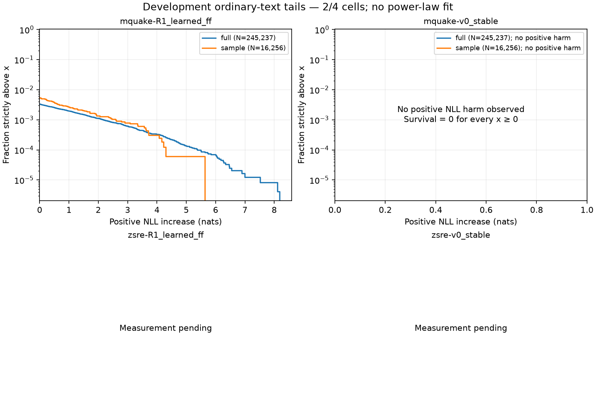

# HT-6 — full-validation and sampled development tails

Status: **partial_preview_waiting_for_chain_S**; 2/4 completed measurements.

DEC-064 labels cap fidelity as a secondary benchmark without a primary-comparison veto. This development report makes no confirmatory classifier decision. Both references remain visible even when their numerical results coincide.

Full validation is 1,931 complete 128-token windows / 245,237 predictions; 121 trailing tokens are dropped. The first 128 windows / 16,256 predictions are the fixed descriptive sample. Sample loss statistics use its separately saved rows; sample KL is derived from the matching full-vector prefix, not an independent sampled KL assay.

## R1-64g-mquake-R1_learned_ff.recipe

Checkpoint 300; overlap **pass**, maximum loss difference 1.421e-14 nats. Full coverage verified.

| Population | Reference | Measure (nats) | N | Mean signed | ES95 positive | ES99 positive | Max positive | >.01 | >.1 | >1 |
|---|---|---|---:|---:|---:|---:|---:|---:|---:|---:|
| full | capoff | NLL increase | 245237 | 0.0056009764 | 0.11446756 | 0.57233781 | 8.1875503 | 817 | 768 | 485 |
| full | capoff | KL(ref || cap) | 245237 | 0.0055436876 | 0.11087375 | 0.55436876 | 8.2425379 | 902 | 839 | 467 |
| full | original | NLL increase | 245237 | 0.0056009764 | 0.11446756 | 0.57233781 | 8.1875503 | 817 | 768 | 485 |
| full | original | KL(ref || cap) | 245237 | 0.0055436876 | 0.11087375 | 0.55436876 | 8.2425379 | 902 | 839 | 467 |
| sample | capoff | NLL increase | 16256 | 0.007530943 | 0.15313023 | 0.76565115 | 5.6402928 | 88 | 82 | 44 |
| sample | capoff | KL(ref || cap) | 16256 | 0.0076691941 | 0.15338388 | 0.76691941 | 5.5636782 | 97 | 89 | 45 |
| sample | original | NLL increase | 16256 | 0.007530943 | 0.15313023 | 0.76565115 | 5.6402928 | 88 | 82 | 44 |
| sample | original | KL(ref || cap) | 16256 | 0.0076691941 | 0.15338388 | 0.76691941 | 5.5636782 | 97 | 89 | 45 |

Against the original base, full mean signed NLL increase is 0.0056009764, versus 0.007530943 in the fixed prefix. The full maximum positive increase is 8.1875503. The worst 1% of positions contain 100% of positive loss harm.
Overlap agreement checks the same positions. The prefix and complete population have different denominators and can legitimately have different means and tails; this is not a representativeness test.
Full original-reference loss has 244,333 exact zeros, 84 negative changes, and 820 positive changes. The positive-harm zero atom includes zero and negative loss changes.

Costs: full outer phase 1298.988 s; all 2 sampled phases combined 138.931 s; attempt 1864.606 s. Allocator peak 742.72021484375 MiB is a lifetime high-water observation.

DEC-064 cap fidelity: secondary benchmarks; failure does not veto primary comparisons.

| Cell | Reference | Mean KL | KL ≤.001 | Mean signed NLL increase | NLL ≤.01 | Availability |
|---|---|---:|---|---:|---|---|
| R1-64g-mquake-R1_learned_ff.recipe | capoff | 0.0055436876 | fail | 0.0056009764 | pass | complete |
| R1-64g-mquake-R1_learned_ff.recipe | original | 0.0055436876 | fail | 0.0056009764 | pass | complete |

Population: **full**.

HT-7 concentration (descriptive; fractional top shares include zero mass):

| Reference | Near-zero target NLL change / N | Positions for half KL (fraction) | Top .1% / 1% KL share | Position Gini | Windows KL ≤.001 / N | Windows >.01 / >.1 | Top 1% / 5% / 10% window KL share | Window median / p90 / p99 / max KL |
|---|---|---|---|---|---|---|---|---|
| capoff | 244333 / 245237 | 171 (0.000697285) | 0.631015 / 1 | 0.998188 | 1612 / 1931 | 215 / 22 | 0.306813 / 0.720977 / 0.930385 | 0 / 0.013872 / 0.108869 / 0.273118 |
| original | 244333 / 245237 | 171 (0.000697285) | 0.631015 / 1 | 0.998188 | 1612 / 1931 | 215 / 22 | 0.306813 / 0.720977 / 0.930385 | 0 / 0.013872 / 0.108869 / 0.273118 |

Near-zero target-token loss change does not prove unchanged predictions or distributions. Concentration alone does not identify reader firing, a causal mechanism, or a power law.

Population: **sample**.

HT-7 concentration (descriptive; fractional top shares include zero mass):

| Reference | Near-zero target NLL change / N | Positions for half KL (fraction) | Top .1% / 1% KL share | Position Gini | Windows KL ≤.001 / N | Windows >.01 / >.1 | Top 1% / 5% / 10% window KL share | Window median / p90 / p99 / max KL |
|---|---|---|---|---|---|---|---|---|
| capoff | 16159 / 16256 | 19 (0.0011688) | 0.460493 / 1 | 0.99704 | 100 / 128 | 21 / 1 | 0.196585 / 0.528667 / 0.796943 | 0 / 0.0335543 / 0.0820399 / 0.168755 |
| original | 16159 / 16256 | 19 (0.0011688) | 0.460493 / 1 | 0.99704 | 100 / 128 | 21 / 1 | 0.196585 / 0.528667 / 0.796943 | 0 / 0.0335543 / 0.0820399 / 0.168755 |

Near-zero target-token loss change does not prove unchanged predictions or distributions. Concentration alone does not identify reader firing, a causal mechanism, or a power law.

## R1-64g-mquake-v0_stable.recipe

Checkpoint 300; overlap **pass**, maximum loss difference 1.421e-14 nats. Full coverage verified.

| Population | Reference | Measure (nats) | N | Mean signed | ES95 positive | ES99 positive | Max positive | >.01 | >.1 | >1 |
|---|---|---|---:|---:|---:|---:|---:|---:|---:|---:|
| full | capoff | NLL increase | 245237 | 0 | 0 | 0 | 0 | 0 | 0 | 0 |
| full | capoff | KL(ref || cap) | 245237 | 0 | 0 | 0 | 0 | 0 | 0 | 0 |
| full | original | NLL increase | 245237 | 0 | 0 | 0 | 0 | 0 | 0 | 0 |
| full | original | KL(ref || cap) | 245237 | 0 | 0 | 0 | 0 | 0 | 0 | 0 |
| sample | capoff | NLL increase | 16256 | 0 | 0 | 0 | 0 | 0 | 0 | 0 |
| sample | capoff | KL(ref || cap) | 16256 | 0 | 0 | 0 | 0 | 0 | 0 | 0 |
| sample | original | NLL increase | 16256 | 0 | 0 | 0 | 0 | 0 | 0 | 0 |
| sample | original | KL(ref || cap) | 16256 | 0 | 0 | 0 | 0 | 0 | 0 | 0 |

No positive loss harm; its concentration share is undefined.
Overlap agreement checks the same positions. The prefix and complete population have different denominators and can legitimately have different means and tails; this is not a representativeness test.
Full original-reference loss has 245,237 exact zeros, 0 negative changes, and 0 positive changes. The positive-harm zero atom includes zero and negative loss changes.

Costs: full outer phase 1309.054 s; all 2 sampled phases combined 170.823 s; attempt 2960.605 s. Allocator peak 755.5419921875 MiB is a lifetime high-water observation.

DEC-064 cap fidelity: secondary benchmarks; failure does not veto primary comparisons.

| Cell | Reference | Mean KL | KL ≤.001 | Mean signed NLL increase | NLL ≤.01 | Availability |
|---|---|---:|---|---:|---|---|
| R1-64g-mquake-v0_stable.recipe | capoff | 0 | pass | 0 | pass | complete |
| R1-64g-mquake-v0_stable.recipe | original | 0 | pass | 0 | pass | complete |

Population: **full**.

HT-7 concentration (descriptive; fractional top shares include zero mass):

| Reference | Near-zero target NLL change / N | Positions for half KL (fraction) | Top .1% / 1% KL share | Position Gini | Windows KL ≤.001 / N | Windows >.01 / >.1 | Top 1% / 5% / 10% window KL share | Window median / p90 / p99 / max KL |
|---|---|---|---|---|---|---|---|---|
| capoff | 245237 / 245237 | undefined (undefined) | undefined / undefined | undefined | 1931 / 1931 | 0 / 0 | undefined / undefined / undefined | 0 / 0 / 0 / 0 |
| original | 245237 / 245237 | undefined (undefined) | undefined / undefined | undefined | 1931 / 1931 | 0 / 0 | undefined / undefined / undefined | 0 / 0 / 0 / 0 |

Near-zero target-token loss change does not prove unchanged predictions or distributions. Concentration alone does not identify reader firing, a causal mechanism, or a power law.

Population: **sample**.

HT-7 concentration (descriptive; fractional top shares include zero mass):

| Reference | Near-zero target NLL change / N | Positions for half KL (fraction) | Top .1% / 1% KL share | Position Gini | Windows KL ≤.001 / N | Windows >.01 / >.1 | Top 1% / 5% / 10% window KL share | Window median / p90 / p99 / max KL |
|---|---|---|---|---|---|---|---|---|
| capoff | 16256 / 16256 | undefined (undefined) | undefined / undefined | undefined | 128 / 128 | 0 / 0 | undefined / undefined / undefined | 0 / 0 / 0 / 0 |
| original | 16256 / 16256 | undefined (undefined) | undefined / undefined | undefined | 128 / 128 | 0 / 0 | undefined / undefined / undefined | 0 / 0 / 0 / 0 |

Near-zero target-token loss change does not prove unchanged predictions or distributions. Concentration alone does not identify reader firing, a causal mechanism, or a power law.

## R1-64g-zsre-R1_learned_ff.recipe

Unavailable: awaiting_completed_result. 

## R1-64g-zsre-v0_stable.recipe

Unavailable: awaiting_completed_result. 

## Reading for the talk

DEC-054: preliminary hints at what the architecture could provide; not the coupled free energy, not a test of the one-kappa conjecture; these cells do not compare kappa treatments

The result describes how ordinary-text harm is distributed after factual edits. Report the mean beside the tail, denominators and zero mass; a low average does not bound rare consequences. These are fixed development populations with dependent positions. No power-law exponent, iid uncertainty or kappa benefit is inferred.

The figure shows strict empirical exceedance P(positive NLL increase > x) against the original base. Its vertical axis is logarithmic; zero survival falls below the plot. Steps use the count strictly above each observed x; no fitted line is shown. Missing panels remain unavailable.

